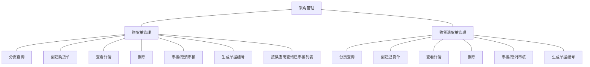
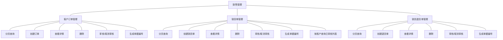
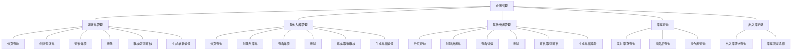
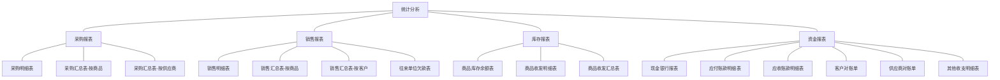
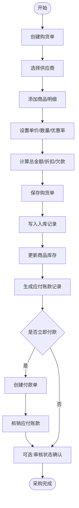
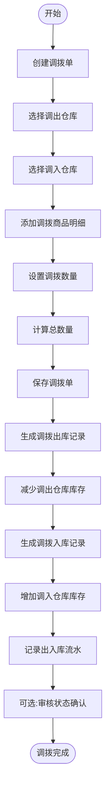
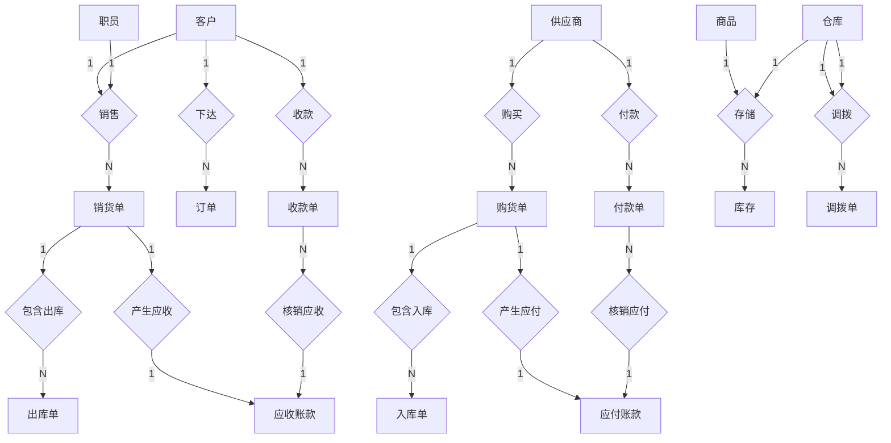

# 天津农学院 毕业设计

### 中文题目：基于SpringBoot和Vue的星络收银系统设计与实现

### 英文题目：Design and Implementation of StarNet Cashier System Based on SpringBoot and Vue

---

**学生姓名：** 刘 浩  
**二级学院：** 计算机与信息工程学院  
**系 别：** 计算机科学系  
**专业班级：** 2022级计算机科学与技术专业2班  
**指导教师：** 王东平  
**成绩评定：** _____________

**2026年5月**

---

## 目 录

1. [绪论](#1-绪论)
    - 1.1 [开发背景](#11-开发背景)
    - 1.2 [开发目的](#12-开发目的)
    - 1.3 [设计思路](#13-设计思路)
    - 1.4 [可行性分析](#14-可行性分析)
2. [系统总体说明](#2-系统总体说明)
    - 2.1 [使用环境](#21-使用环境)
    - 2.2 [系统主要功能](#22-系统主要功能)
    - 2.3 [系统流程设计](#23-系统流程设计)
    - 2.4 [系统主要特点](#24-系统主要特点)
3. [开发环境与相关技术](#3-开发环境与相关技术)
    - 3.1 [开发环境](#31-开发环境)
    - 3.2 [开发工具](#32-开发工具)
    - 3.3 [设计方法与技术](#33-设计方法与技术)
4. [系统设计要点](#4-系统设计要点)
    - 4.1 [数据库设计](#41-数据库设计)
    - 4.2 [系统的实现](#42-系统的实现)
    - 4.3 [系统功能测试](#43-系统功能测试)
5. [讨论](#5-讨论)
    - 5.1 [设计存在的问题](#51-设计存在的问题)
    - 5.2 [进一步改进设想](#52-进一步改进设想)
    - 5.3 [经验与体会](#53-经验与体会)

- [参考文献](#【参 考 文 献】)
- [致谢](#致谢)
- [附录1 相关英文文献](#附录1-相关英文文献)
- [附录2 英文文献中文译文](#附录2-英文文献中文译文)

---

## 摘 要

【目的】针对传统零售收银系统操作繁琐、数据孤岛及高峰期效率低下等问题，设计并实现"星络"智能收银系统，为中小型零售商户提供高效、便捷、智能的企业资源管理一体化平台。

【方法】系统采用前后端分离架构：后端基于SpringBoot框架构建RESTful API，负责业务逻辑、数据持久化及安全控制；前端Web端采用Vue.js配合Element UI组件库构建响应式管理界面；移动端基于Uni-App框架开发微信小程序，调用uni.scanCode() API实现条码扫描功能；数据库选用MySQL完成35张核心数据表的规范化设计与索引优化。系统实现六大核心模块：基础资料管理（客户、供应商、商品、仓库等）、采购管理（购货单审核、入库、应付账款自动生成）、销售管理（销货单审核、出库、应收账款跟踪）、仓库管理（多仓库调拨、出入库流水追溯）、资金管理（收付款核销、应收应付自动化跟踪）和统计分析（多维度报表分析）。

【结果】测试结果表明：系统运行稳定，核心接口响应时间控制在200ms以内，扫码识别成功率在标准光照环境下达95%以上，各业务模块功能完整，单据审核机制完善，应收应付账款自动跟踪准确，能够满足中小型零售企业的日常管理需求。

【结论】本系统验证了基于SpringBoot和Vue的前后端分离架构在构建轻量级收银系统中的可行性与有效性，为中小型零售企业的数字化转型提供了可参考的技术方案和实践案例。

**关键词：** 收银系统; SpringBoot; MySQL数据库; 条码识别

---

## ABSTRACT

[Purpose] To address the problems of cumbersome operations, data silos, and low efficiency during peak hours in traditional retail cashier systems, this thesis designs and implements the "StarNet" intelligent cashier system, providing an efficient, convenient, and intelligent integrated enterprise resource management platform for small and medium-sized retail merchants.

[Methods] The system adopts a front-end and back-end separation architecture: the back-end builds RESTful APIs based on SpringBoot framework, responsible for business logic, data persistence, and security control; the front-end Web interface is built with Vue.js and Element UI component library; the mobile end develops WeChat mini-program based on Uni-App framework, calling uni.scanCode() API to realize barcode scanning function; MySQL database completes the standardized design and index optimization of 35 core data tables. The system implements six core modules: basic data management (customers, suppliers, products, warehouses, etc.), purchase management (purchase order audit, warehousing, automatic generation of accounts payable), sales management (sales order audit, outbound, accounts receivable tracking), warehouse management (multi-warehouse transfer, inbound/outbound flow tracing), fund management (payment/receipt verification, automatic tracking of receivables/payables), and statistical analysis (multi-dimensional report analysis).

[Results] Test results show that the system operates stably, with core interface response time controlled within 200ms, scanning recognition success rate reaching over 95% under standard lighting conditions, all business modules functioning completely, document audit mechanism perfected, and automatic tracking of accounts receivable and payable accurately, meeting the daily management needs of small and medium-sized retail enterprises.

[Conclusion] This system verifies the feasibility and effectiveness of the front-end and back-end separation architecture based on SpringBoot and Vue in building lightweight cashier systems, providing a reference technical solution and practical case for the digital transformation of small and medium-sized retail enterprises.

**Key words:** Cashier System; SpringBoot; MySQL database; Barcode Recognition

---

## 基于SpringBoot和Vue的星络收银系统设计与实现

#### 刘 浩

#### （天津农学院  计算机与信息工程学院）

---

### 1 绪论

在数字化浪潮持续推进的背景下，信息化管理与传统零售业务的深度融合已成为行业发展的必然趋势。零售企业，尤其是中小商户，正面临消费需求多样化、运营节奏加快和精细化管理要求提升等现实挑战。传统收银模式在业务协同、数据利用和管理效率方面逐渐暴露不足，收银系统由“单点结算工具”向“经营管理平台”升级已成为零售数字化转型的重要路径。

### 1.1 开发背景

随着社会经济发展和消费结构升级，零售行业的信息化建设不断深化，收银系统也从早期单一结算设备逐步演进为覆盖采购、销售、库存与财务的综合管理系统。然而，传统收银方式及部分存量系统仍存在明显瓶颈：高峰期依赖人工操作导致效率下降，手工录入容易出错并引发库存偏差；现金、刷卡、移动支付等方式难以统一管理，增加了培训和操作成本；多门店场景下业务数据分散，实时汇总与分析能力不足，难以支撑经营决策。

从研究现状看，国内基于 SpringBoot 与 Vue 的收银/进销存系统实践逐步成熟，主流方案普遍采用 Java 后端、Vue 前端和 MySQL 数据库的组合，以兼顾开发效率、界面交互和数据稳定性[1]。

国外零售信息化起步较早，在系统集成深度和智能化探索方面更具前瞻性。一方面，面向复杂业务的微服务解耦已成为提升系统弹性与可扩展性的常见路径[2]；另一方面，智能购物车、视觉识别等无人化收银技术也在持续落地[3]。这些趋势表明，现代收银系统不仅承担交易处理，还应具备数据采集与经营支持能力。

综上，现有研究为本课题在技术选型、架构设计和功能整合方面提供了明确参考，也为星络收银系统的实现奠定了理论与实践基础。

### 1.2 开发目的

本项目基于 SpringBoot 与 Vue 技术栈构建星络收银系统（StarNet Cashier System），面向中小型零售商户提供“Web 端 + 移动端 + 后端服务”协同的一体化管理平台。系统围绕企业日常经营中的关键环节进行流程整合，目标是以标准化、数字化流程替代传统手工管理方式，提升效率与可控性。主要目标包括：

第一，针对业务分散和数据孤岛问题，构建前后端分离的一体化系统，统一管理客户、供应商、商品、仓库、职员等基础资料，并打通购货、销货、出入库、收付款等核心流程，提升企业运营效率和数据一致性。

第二，针对资金管理复杂和账务核对困难问题，建立应收应付自动跟踪机制，支持收款单、付款单核销及多维财务报表输出，提高资金管理透明度和决策支持能力[4]。

第三，针对库存管理效率不足问题，建设多仓库管理与库存预警能力，支持调拨、盘盈盘亏、其他出入库等场景，实现库存动态跟踪和可追溯管理，优化库存结构并降低库存成本[5]。

第四，通过完整工程实践验证“前后端分离 + 多端适配”技术路线在实际收银场景中的有效性，总结需求分析、系统设计、编码实现、测试部署等环节的经验，为同类中小企业数字化建设提供可参考案例[6]。

总体而言，系统建设有助于降低人工成本与差错率，增强数据分析能力，提升企业精细化运营水平和市场竞争力，具有较强的现实应用价值。

### 1.3 设计思路

本系统以 SpringBoot（后端）+ Vue（Web 端）+ Uni-App（移动端）+ MySQL（数据层）为核心技术栈，采用模块化、分层化设计，兼顾系统稳定性、可维护性与扩展性。

整体设计思路如下：

(1)整体风格

界面采用简洁专业的视觉风格，以“左侧导航 + 右侧内容区”为主要布局方式，使功能入口清晰、操作路径稳定，符合企业管理软件的使用习惯。

(2)系统架构设计

系统按业务划分为六大核心模块，并通过统一数据模型建立模块间协同关系：

- 采购管理（bc）：覆盖购货单、购货退货单的创建、审核、入库与付款协同。  
- 销售管理（bc）：覆盖订单、销货/销退、审核、出库与收款流程。  
- 资金管理（fc）：覆盖收付款、应收应付账款和账户流水管理。  
- 统计分析（sc）：提供采购、销售、库存、资金等维度报表分析。  
- 基础资料（uc）：维护客户、供应商、商品、仓库、职员、账户等主数据。  
- 仓库管理（wc）：支持调拨、其他出入库、库存查询及流水追溯。

(3)基础资料管理

基础资料模块提供客户、供应商、商品、仓库、职员和结算账户等信息的增删改查能力；商品支持条码、规格、多级价格策略和库存预警；并支持分类树与字典项配置，提升基础数据管理灵活性。

(4)采购与销售管理

采购与销售模块分别覆盖“购货—审核—入库—付款”和“订单/销货—审核—出库—收款”全流程，支持单据审核与状态跟踪，确保业务流程规范和数据准确。

(5)仓库与库存管理

仓库模块支持多仓库管理、仓间调拨、盘盈盘亏等特殊出入库业务，实时记录库存变化并自动生成流水，提供库存查询、预警和历史追溯能力。

(6)资金管理

资金模块构建应收应付与核销体系，支持多单核销、账户流水留痕及对账报表输出，提升账务管理精度与可追溯性。

(7)数据统计与分析

统计分析模块围绕采购、销售、库存和资金形成标准报表与聚合分析结果，通过可视化方式辅助经营决策。

### 1.4 可行性分析

#### 1.4.1 技术可行性

在后端层面，SpringBoot 具备自动配置、快速启动和生态整合优势，适合构建企业级 RESTful API；在前端层面，Vue 的组件化和响应式机制有助于提升开发效率与维护性[7]；移动端采用 Uni-App 实现多端复用，满足业务便携化需求[6]；数据库选用 MySQL，兼具稳定性、易维护性和成本优势[1]。结合项目当前需求和团队能力，这一技术组合成熟可行，能够支撑系统快速落地与后续扩展[8]。

#### 1.4.2 操作可行性

系统采用业界应用广泛、文档完善的技术方案[8]，开发与运维门槛相对较低。业务界面按企业常见操作习惯设计，核心流程清晰，支持单据审核和多端访问，能够有效降低学习与使用成本。与此同时，Vue 组件化提升了前端可维护性[7]，Uni-App 多端方案提高了系统可达性[6]，整体具备良好的落地与推广条件。

#### 1.4.3 经济可行性

SpringBoot、Vue 与 MySQL 均为成熟开源技术，可显著降低软件授权、部署和维护成本。其生态完善、社区活跃、人才供给充足，有助于降低学习成本和人力成本，缩短项目实施周期。尤其是 MySQL 在中小企业场景下具备较高性价比和扩展能力[1]。综合评估，该方案在初期投入与长期运维两方面均具有较好的经济可行性[8]。

---

## 2 系统总体说明

### 2.1 使用环境

本系统的使用环境配置如下：

- Web端：Chrome、Edge、Firefox等现代浏览器
- 移动端：微信客户端（支持微信小程序）

### 2.2 系统主要功能

本星络收银系统采用模块化设计，涵盖企业资源管理的各个核心环节。系统包含基础资料管理、采购管理、销售管理、仓库管理、资金管理和统计分析六大功能模块，通过前后端分离架构（Web端erp-web+移动端erp-app+后端服务erp-api）实现多端协同工作[9]。系统功能结构图见图1。

*图1 系统功能结构图*

#### 2.2.1 基础资料管理功能

基础资料模块负责管理企业运营所需的核心基础数据，包括：

**（1）客户管理**：维护客户基本信息、联系方式、客户分类和等级，设置期初应收款和预收款。支持客户联系人管理，记录多个联系人的手机、电话、邮箱等信息。

**（2）供应商管理**：维护供应商基本信息、联系方式、供应商分类，设置增值税税率、期初应付款和预付款。支持供应商联系人管理。

**（3）商品管理**：维护商品基本信息，包括商品编码、名称、条码、规格、分类、计量单位等。支持多级价格策略（零售价、批发价、VIP价格、折扣率），设置预计采购价。提供库存预警功能，可设置最低库存和最高库存阈值。

**（4）仓库管理**：维护仓库基本信息，支持多仓库管理模式。

**（5）职员管理**：维护企业职员信息，用于销售单等业务单据的销售人关联。

**（6）结算账户管理**：维护企业的银行账户、现金账户等结算账户，记录期初余额和当前余额，支持账户类别管理（现金、银行存款等）。

**（7）分类管理**：支持客户分类、供应商分类、商品分类、支出分类、收入分类的多级树形结构管理。

**（8）字典管理**：管理系统字典数据，包括计量单位、结算方式、客户等级、账户类别等字典项。

**（9）系统设置**：配置系统参数，包括公司名称、联系方式、货币单位、数量精度、价格精度、存货计价方法、是否检查负库存、启用时间等。

**（10）用户管理**：管理系统用户账号，包括用户名、密码（BCrypt加密）、真实姓名、手机号等，支持用户启用/停用、密码重置等操作。

**（11）日志管理**：记录用户登录、新增用户、启用/停用用户、重置密码等重要操作日志，便于审计和问题追溯。

基础资料管理的功能结构图如图2所示。

*图2 基础资料管理功能结构图*

```mermaid
graph TB
    A[基础资料管理] --- B[客户管理]
    A --- C[供应商管理]
    A --- D[商品管理]
    A --- E[仓库管理]
    A --- F[职员管理]
    A --- G[结算账户管理]
    A --- H[分类管理]
    A --- I[字典管理]
    A --- J[系统设置]
    A --- K[用户管理]
    A --- L[日志管理]
    
    B --- B1[分页查询]
    B --- B2[新增/编辑]
    B --- B3[查看详情]
    B --- B4[删除]
    B --- B5[启用/停用]
    B --- B6[联系人管理]
    
    C --- C1[分页查询]
    C --- C2[新增/编辑]
    C --- C3[查看详情]
    C --- C4[删除]
    C --- C5[启用/停用]
    C --- C6[导入Excel]
    C --- C7[导出Excel]
    
    D --- D1[分页查询]
    D --- D2[新增/编辑]
    D --- D3[查看详情]
    D --- D4[删除]
    D --- D5[启用/停用]
    
    E --- E1[分页查询]
    E --- E2[新增/编辑]
    E --- E3[查看详情]
    E --- E4[删除]
    E --- E5[启用/停用]
    
    F --- F1[分页查询]
    F --- F2[新增/编辑]
    F --- F3[查看详情]
    F --- F4[删除]
    F --- F5[启用/停用]
    
    G --- G1[列表查询]
    G --- G2[新增/编辑]
    G --- G3[查看详情]
    G --- G4[删除]
    
    H --- H1[客户分类]
    H --- H2[供应商分类]
    H --- H3[商品分类]
    H --- H4[支出分类]
    H --- H5[收入分类]
    
    I --- I1[计量单位]
    I --- I2[结算方式]
    I --- I3[客户等级]
    I --- I4[账户类别]
    
    J --- J1[获取系统配置]
    J --- J2[设置系统配置]
    
    K --- K1[分页查询]
    K --- K2[新增用户]
    K --- K3[启用/停用]
    K --- K4[重置密码]
    
    L --- L1[操作日志查询]
```



#### 2.2.2 采购管理功能

采购管理模块实现从供应商采购商品的完整业务流程，包括：

**（1）购货单管理**：创建购货单，选择供应商，添加采购商品明细，设置优惠率和优惠金额。支持分期付款和欠款管理，记录本次付款金额和本次欠款。当前实现中，单据保存时即完成入库与应付账款等业务数据写入；审核用于状态确认与业务复核。

**（2）购货退货单管理**：处理采购退货业务，创建购货退货单，减少应付账款。当前实现中，退货单保存时即写入对应库存与应付账款变动记录，审核用于状态管理。

采购管理功能的功能结构图如图3所示。

*图3 采购管理功能结构图*



#### 2.2.3 销售管理功能

销售管理模块实现向客户销售商品的完整业务流程，包括：

**（1）客户订单管理**：创建客户订货单或退货单，设置交货日期并添加商品明细。订单保存后进入业务流转，审核用于状态确认与业务复核。

**（2）销货单管理**：创建销货单，选择客户和销售人，填写联系人信息和地址。支持收款状态跟踪（未收款、部分收款、全部收款），记录本次收款金额和本次欠款。当前实现中，销货单保存时即写入库存与应收账款记录，审核用于状态确认与业务复核。

**（3）销货退货单管理**：处理销售退货业务，创建销货退货单，减少应收账款。当前实现中，退货单保存时即写入对应库存与应收账款变动记录，审核用于状态管理。

销售管理功能的功能结构图如图4所示。

*图4 销售管理功能结构图*



#### 2.2.4 仓库管理功能

仓库管理模块实现商品库存的全面管理，包括：

**（1）调拨单管理**：实现商品在不同仓库之间的调拨操作。调拨单包含调出仓库、调入仓库和商品明细。当前实现中，调拨单保存时即写入调拨出入库记录并更新库存；审核用于状态管理与业务复核。

**（2）其他入库管理**：处理非采购类的入库业务，包括盘盈和其他入库。当前实现中，入库单保存时即更新商品库存，并生成出入库流水记录。

**（3）其他出库管理**：处理非销售类的出库业务，包括盘亏和其他出库。当前实现中，出库单保存时即更新商品库存，并生成出入库流水记录。

**（4）库存查询**：实时查询各仓库中商品的库存数量、成本单价和库存总成本。支持按商品、仓库等多维度查询库存信息。

**（5）出入库记录**：记录所有库存变动的流水账，包括采购入库、销售出库、调拨、盘盈盘亏等。每条记录包含变动前后的库存数量，便于追溯历史库存变化。

仓库管理功能的功能结构图如图5所示。

*图5 仓库管理功能结构图*



#### 2.2.5 资金管理功能

资金管理模块实现企业财务的全面管理，包括：

**（1）收款单管理**：记录从客户收取的款项，支持核销多张销货单的应收款。可设置整单折扣、预收款，记录已核销金额和未核销金额。收款后自动生成账户流水记录和应收账款减少记录。

**（2）付款单管理**：记录向供应商支付的款项，支持核销多张购货单的应付款。可设置整单折扣、预付款，记录已核销金额和未核销金额。付款后自动生成账户流水记录和应付账款减少记录。

**（3）应收账款管理**：自动跟踪与每个客户的往来账务，记录销货增加的应收款和收款减少的应收款。提供客户对账单，清晰展示与每个客户的应收款变动情况。

**（4）应付账款管理**：自动跟踪与每个供应商的往来账务，记录购货增加的应付款和付款减少的应付款。提供供应商对账单，清晰展示与每个供应商的应付款变动情况。

**（5）其他收入管理**：记录企业的其他收入（如利息收入、退税等），可以关联客户。收入后自动生成账户流水记录和收支分类记录。

**（6）其他支出管理**：记录企业的其他支出（如房租、水电费等），可以关联供应商。支出后自动生成账户流水记录和收支分类记录。

**（7）现金银行报表**：展示各结算账户的资金流水，记录每笔业务的账户变动情况，包括业务类型、结算方式、结算号、操作后余额等信息。

资金管理功能的功能结构图如图6所示。

*图6 资金管理功能结构图*

```mermaid
graph TB
    A[资金管理] --- B[收款单管理]
    A --- C[付款单管理]
    A --- D[应收账款管理]
    A --- E[应付账款管理]
    A --- F[其他收入管理]
    A --- G[其他支出管理]
    A --- H[现金银行报表]
    
    B --- B1[分页查询]
    B --- B2[创建收款单]
    B --- B3[查看详情]
    B --- B4[删除]
    B --- B5[核销应收款]
    B --- B6[生成单据编号]
    
    C --- C1[分页查询]
    C --- C2[创建付款单]
    C --- C3[查看详情]
    C --- C4[删除]
    C --- C5[核销应付款]
    C --- C6[生成单据编号]
    
    D --- D1[应收款明细]
    D --- D2[客户对账单]
    D --- D3[应收款跟踪]
    
    E --- E1[应付款明细]
    E --- E2[供应商对账单]
    E --- E3[应付款跟踪]
    
    F --- F1[分页查询]
    F --- F2[创建收入单]
    F --- F3[查看详情]
    F --- F4[删除]
    F --- F5[生成单据编号]
    
    G --- G1[分页查询]
    G --- G2[创建支出单]
    G --- G3[查看详情]
    G --- G4[删除]
    G --- G5[生成单据编号]
    
    H --- H1[账户流水查询]
    H --- H2[余额变动记录]
```



#### 2.2.6 统计分析功能

统计分析模块提供多维度的业务数据分析报表，包括：

**（1）采购报表**：

- 采购明细表：展示每笔采购业务的详细信息。
- 采购汇总表（按商品）：按商品维度统计采购数量和金额。
- 采购汇总表（按供应商）：按供应商维度统计采购情况。

**（2）销售报表**：

- 销售明细表：展示每笔销售业务的详细信息。
- 销售汇总表（按商品）：按商品维度统计销售数量和金额。
- 销售汇总表（按客户）：按客户维度统计销售情况。
- 往来单位欠款表：展示客户和供应商的欠款情况。

**（3）库存报表**：

- 商品库存余额表：展示各商品的当前库存数量和成本。
- 商品收发明细表：展示商品的出入库流水记录。
- 商品收发汇总表：按商品维度统计出入库情况。

**（4）资金报表**：

- 现金银行报表：展示账户资金流水。
- 应付账款明细表：展示与供应商的应付款变动明细。
- 应收账款明细表：展示与客户的应收款变动明细。
- 客户对账单：展示与特定客户的往来账务。
- 供应商对账单：展示与特定供应商的往来账务。
- 其他收支明细表：展示其他收入和支出的明细。

统计分析功能的功能结构图如图7所示。

*图7 统计分析功能结构图*



### 2.3 系统流程设计

#### 2.3.1 用户登录流程

用户进入系统后，首先需要进行登录验证。在登录界面输入用户名和密码，系统会通过BCrypt算法验证密码是否正确。如果验证通过，系统生成JWT Token并返回给前端，用户成功登录进入系统主页；如果用户名或密码输入错误，系统会提示错误信息，用户需重新输入。登录流程图如图8所示。

*图8 用户登录流程图*


#### 2.3.2 采购业务流程

采购业务流程如下：管理员登录系统后进入采购管理模块，创建购货单并填写供应商、商品明细、单价、数量、优惠等信息。保存后系统写入入库、库存和应付账款等业务记录；后续可根据管理要求执行审核标记。若需付款，可通过付款单进行核销。采购业务流程图如图9所示。

*图9 采购业务流程图*



#### 2.3.3 销售业务流程

销售业务流程如下：管理员登录系统后进入销售管理模块，创建销货单并填写客户、销售人和商品明细等信息。保存后系统写入出入库、库存和应收账款等记录；后续可按管理要求执行审核标记。若需收款，可通过收款单进行核销。销售业务流程图如图10所示。

*图10 销售业务流程图*


#### 2.3.4 库存调拨流程

库存调拨流程如下：管理员创建调拨单，选择调出仓库和调入仓库并添加商品明细。保存后系统写入调拨出入库记录并更新库存，完成仓间转移；审核用于状态确认与业务复核。库存调拨流程图如图11所示。

*图11 库存调拨流程图*



### 2.4 系统主要特点

**（1）模块化设计：**

系统采用模块化分层架构，按照业务功能划分为基础资料、采购、销售、仓库、资金、统计分析六大模块。每个模块职责清晰，便于开发维护和功能扩展。

**（2）业务流程规范：**

系统实现了完整的业务流程管理，包括单据创建、保存、审核状态确认等环节。当前实现中，采购、销售、调拨等核心单据在保存时完成主要业务数据写入，审核用于状态管理与流程复核，保障业务过程可追踪、可管控。

**（3）财务自动化：**

系统实现了应收应付账款的自动化跟踪，核心业务单据保存后即可形成相应往来账记录；收款单和付款单支持核销功能，可核销多张业务单据，实现精细化账务管理。

**（4）移动端扫码功能：**

基于Uni-App框架开发微信小程序，调用uni.scanCode() API实现条码和二维码扫描功能。支持onlyFromCamera参数控制仅从相机获取扫码结果，scanType参数支持barCode和qrCode两种类型。扫码成功后自动调用后端/product/page接口查询商品信息，无需将图像传输到服务器，响应更快。在category.vue和cart.vue等页面中实现了完整的扫码加购业务流程。

**（5）多维度报表分析：**

系统提供采购、销售、库存、资金等多维度的统计分析报表，包括明细表、汇总表、对账单等。通过表格形式直观呈现业务数据，为企业经营决策提供数据支持。

**（6）前后端分离架构：**

采用前后端分离架构，Web端(erp-web)使用Vue.js+Element UI，移动端(erp-app)使用Uni-App，后端(erp-api)使用Spring Boot+MyBatis。前后端通过RESTful API进行数据交互，结构清晰，便于开发协作与后期维护。

---

## 3 开发环境与相关技术

### 3.1 开发环境

本系统的开发环境配置如下：

**硬件环境：**

- 处理器：Intel(R) Core(TM) Ultra 9 275HX (2.70 GHz)。
- 机带RAM：16.0 GB RAM。
- 硬盘：954GB SSD固态硬盘。

**软件环境：**

- 操作系统：Windows 10/11 64位。
- JDK版本：JDK 21.0.11。
- 数据库：MySQL 8.0.42。
- Node.js：Node.js 22.22.2。

**服务端配置：**

- 应用服务器：Spring Boot内嵌Tomcat 9.0。
- 服务端口：9090。
//- 开发模式：dev（支持热部署）（当前默认未启用DevTools热部署，可按需开启）。

### 3.2 开发工具

本系统使用的开发工具如下：

**后端开发工具：**

- IntelliJ IDEA Ultimate 2026.1.0：Java IDE，用于后端服务开发
- DBeaver 25.3.3：数据库管理工具，用于MySQL数据库设计和查询

**前端开发工具：**

- HBuilder X 5.07：Uni-App移动端开发IDE
- 微信开发者工具 2.01：微信小程序调试和预览

**版本控制：**

- Git：代码版本控制系统

**框架与技术栈：**

- 后端：Spring Boot 2.3.2.RELEASE、MyBatis、MyBatis-Plus（由父工程依赖管理统一引入）、Spring Security
- 前端Web：Vue.js 2.5.22、Vue Router 3.0.1、Element UI 2.4.5、Axios 0.18.0、ECharts 4.1.0
- 前端移动：Uni-App、Vuex 4.1.0
- 其他：Lombok 1.18.30、JWT (jjwt 0.6.0)、Druid连接池

开发软件截图如图12所示。

*图12 开发软件截图*

### 3.3 设计方法与技术

#### 3.3.1 系统需求分析

在软件开发的整个流程中，系统需求分析占据着极为关键的位置。它不仅清晰地界定了目标系统应当实现的功能特性、性能指标、安全标准、用户交互界面以及各种非功能性需求，而且通过深入剖析业务需求、用户需求以及运行环境，将模糊的概念具体化，并转化为可度量的系统规格。

本系统面向中小型零售企业，核心管理角色为管理员，并通过用例图重点描述该角色的功能范围。管理员可登录系统并执行基础资料管理（客户、供应商、商品、仓库、职员、账户等）、采购管理（购货单、购货退货单）、销售管理（客户订单、销货单、销货退货单）、仓库管理（调拨单、其他出入库、库存查询）、资金管理（收款单、付款单、应收应付账款、收支记录）和统计分析（采购/销售/库存/资金报表）等操作。与此同时，系统还提供面向门店操作人员的移动端功能（如扫码加购、采购清单处理等）。管理员的用例图如图13所示。

*图13 管理员用例图*


移动端小程序面向门店操作人员，提供商品浏览、扫码加购、采购清单管理等功能，支持通过uni.scanCode() API调用手机摄像头扫描商品条码，快速添加商品到采购清单。

#### 3.3.2 开发技术介绍

**（1）Java语言**

Java语言以其跨平台的特性而闻名，秉承“一次编写，到处运行”的理念，极大地简化了开发流程。Java虚拟机（JVM）作为桥梁，保证了代码在各种环境下的统一性和稳定性[1]。Java不仅拥有一个庞大的标准库集合，还支持丰富的第三方库，这些库几乎覆盖了软件开发的各个方面，包括网络通信、数据库操作、图形用户界面以及Web开发等。安全性是Java设计中的一个核心要素，从类加载器到安全管理器，再到字节码校验，Java内置了多重安全机制，有效抵御了恶意代码的攻击。

**（2）Spring Boot框架**

通过使用SpringBoot框架，可以在很大程度上提升软件的开发效率。SpringBoot的自动化配置能力使Spring程序的最初构建和开发过程变得更加简单[8]。SpringBoot整合了很多常见的第三方类库，比如数据库连接池、缓存方案、消息队列等，为开发者提供了即插即用的功能。这些集成不仅简化了配置流程，还确保了组件之间的兼容性和稳定性。此外，框架还提供了丰富的插件和工具，如SpringBoot CLI、Spring Initializr等，进一步提升了开发效率。

**（3）Vue框架**

Vue.js凭借其轻量级和渐进式的特性，为前端开发领域带来了高效和灵活的解决方案。它的核心库专注于视图层的构建，设计上易于上手，允许开发者根据需要逐步集成进其生态系统中的其他工具[7]。Vue的双向数据绑定机制极大地简化了数据与视图之间的同步工作，开发者只需专注于数据的更新，Vue会自动处理DOM的更新。Vue的组件化设计思想进一步促进了代码的复用，使得开发者能够通过组合独立且可复用的组件来构建出结构清晰、易于维护的应用程序。

**（4）MyBatis框架**

MyBatis是一款优秀的持久层框架，它支持自定义SQL、存储过程以及高级映射。MyBatis避免了几乎所有的JDBC代码和手动设置参数以及获取结果集的操作[1]。MyBatis可以通过简单的XML或注解来配置和映射原始类型、接口和Java POJO为数据库中的记录。在本系统中，MyBatis负责处理后端与MySQL数据库之间的数据交互，简化了数据库操作的开发工作量。

**（5）MySQL数据库**

MySQL是一种具有优异性能和稳定性的开放源码关系数据库管理系统，以用户友好性而闻名。在软件开发中，MySQL能够高效地管理大量数据，执行复杂的查询，确保数据的快速存取，从而增强系统的性能。它提供了强大的数据完整性和安全特性，包括事务处理、权限控制和数据备份与恢复，确保数据的准确性和安全性，避免数据丢失和未授权访问，为系统提供稳固的数据支撑。此外，MySQL的兼容性极佳，可以轻松与多种编程语言和框架集成，便于开发和部署。总的来说，MySQL为系统开发提供了高性能、高可靠性和易用性等多重优势，其开源特性、强大的数据管理功能、多样化的存储引擎选择和便捷管理工具使其成为现代软件开发中不可或缺的一部分。

**（6）B/S架构**

在系统开发过程中，采用了B/S架构（Browser/Server，即浏览器/服务器架构），具备多方面的显著优势。B/S架构支持跨平台操作，使得用户无需安装专门的客户端软件，只需通过浏览器即可访问Web应用，降低了用户的使用门槛，提高了系统的可访问性和可维护性[10]。此外，基于B/S架构的系统展现了卓越的可扩展性和升级能力，随着业务需求的变化，系统可以实现无缝的功能扩展和性能提升。

---

## 4 系统设计要点

### 4.1 数据库设计

#### 4.1.1 数据库E-R图设计

实体-关系图(E-R图)是数据库设计的核心工具。在实体-关系图中，实体以矩形框的形式呈现，这些框内包含了实体的名称及其特有的属性。属性被显示为椭圆，并由线连接到其所属的实体。关系是联系实体之间互动的纽带，用线将关联的实体联系起来。E-R图的使用，使得数据库设计者能够以一种直观的方式规划和构建数据结构，有效地连接了开发人员、分析师和管理层，促进了团队成员之间对数据库架构的共同理解。

本系统共设计了35张数据表，涵盖基础资料、业务流程、财务资金、库存管理等各个方面。主要实体包括客户、供应商、商品、仓库、职员、结算账户、购货单、销售单、收款单、付款单、调拨单等。系统总体E-R图如图14所示。

*图14 系统总体E-R图*



**实体间联系说明：**

1. **供应商 - 购买 - 购货单** (1:N)
2. **客户 - 下达 - 订单** (1:N)
3. **客户/职员 - 销售 - 销货单** (1:N)
4. **购货单 - 产生应付 - 应付账款** (1:1)
5. **销货单 - 产生应收 - 应收账款** (1:1)
6. **客户 - 收款 - 收款单** (1:N)
7. **供应商 - 付款 - 付款单** (1:N)
8. **收款单 - 核销应收 - 应收账款** (N:1)
9. **付款单 - 核销应付 - 应付账款** (N:1)
10. **购货单 - 包含入库 - 入库单** (1:N)
11. **销货单 - 包含出库 - 出库单** (1:N)
12. **商品/仓库 - 存储 - 库存** (1:N)
13. **仓库 - 调拨 - 调拨单 - 仓库** (M:N)

#### 4.1.2 数据库表结构设计

数据库表的设计构成了构建数据库系统的基础，其核心在于依据业务需求和数据模型来精心规划表结构及其相互之间的关系。在确定了实体属性之后，定义表与表之间的关系是重要步骤。对表格进行标准化是保证数据质量的重要环节，标准化可以有效消除数据的重复，确保数据的完整与一致。通过遵守第一范式、第二范式、第三范式等标准化原理，可有效降低数据存储中的冗余信息，提升数据库的运行效率与可靠性。本系统主要数据表如下：

(1) 客户表用于存储企业客户的基本信息，支持客户分类、等级管理和期初应收款设置，是销售业务和应收账款管理的基础数据。客户表的具体字段信息见表1。

**表1　客户表（uc_customer）**

| 字段名 | 数据类型 | 必填 | 默认值 | 说明 |
|--------|---------|------|--------|------|
| id | VARCHAR(20) | ✅ | - | 主键ID |
| code | VARCHAR(255) | ❌ | NULL | 编号（客户编码） |
| name | VARCHAR(255) | ❌ | NULL | 名称（客户名称） |
| categoryId | VARCHAR(20) | ❌ | NULL | 客户类别ID（关联rc_category.id，type=10） |
| level | VARCHAR(20) | ❌ | 10 | 客户等级ID（关联rc_dict_item.id，字典编码customer_level） |
| balanceTime | TIMESTAMP | ❌ | NULL | 余额日期 |
| beginReceivableAmount | BIGINT | ❌ | NULL | 期初应收款 |
| beginPrepaidAmount | BIGINT | ❌ | NULL | 期初预收款 |
| remark | VARCHAR(255) | ❌ | NULL | 备注 |
| active | BIT(1) | ❌ | 1 | 是否启用：0=停用，1=启用 |
| createdTime | TIMESTAMP | ❌ | CURRENT_TIMESTAMP | 创建时间 |
| updatedTime | TIMESTAMP | ❌ | CURRENT_TIMESTAMP | 更新时间（自动更新） |

(2) 客户联系人表用于记录客户的多个联系人信息，包括姓名、电话、职位等，便于业务沟通和对账联系。客户联系人表的具体字段信息见表2。

**表2　客户联系人表（uc_customer_contact）**

| 字段名 | 数据类型 | 必填 | 默认值 | 说明 |
|--------|---------|------|--------|------|
| id | VARCHAR(20) | ✅ | - | 主键ID |
| customerId | VARCHAR(20) | ❌ | NULL | 客户ID（关联uc_customer.id） |
| name | VARCHAR(255) | ❌ | NULL | 联系人姓名 |
| mobile | VARCHAR(64) | ❌ | NULL | 手机号 |
| phone | VARCHAR(64) | ❌ | NULL | 座机 |
| position | VARCHAR(255) | ❌ | NULL | 职位 |
| qq | VARCHAR(255) | ❌ | NULL | QQ号 |
| address | TEXT | ❌ | NULL | 地址 |
| primary | BIT(1) | ❌ | 0 | 是否首要联系人：0=否，1=是 |
| createdTime | TIMESTAMP | ❌ | CURRENT_TIMESTAMP | 创建时间 |
| updatedTime | TIMESTAMP | ❌ | CURRENT_TIMESTAMP | 更新时间（自动更新） |

(3) 供应商表用于存储供应商基本信息，支持供应商分类、增值税税率设置和期初应付款管理，是采购业务和应付账款管理的基础数据。供应商表的具体字段信息见表3。

**表3　供应商表（uc_supplier）**

| 字段名 | 数据类型 | 必填 | 默认值 | 说明 |
|--------|---------|------|--------|------|
| id | VARCHAR(20) | ✅ | - | 主键ID |
| code | VARCHAR(255) | ❌ | NULL | 编号（供应商编码） |
| name | VARCHAR(255) | ❌ | NULL | 名称（供应商名称） |
| categoryId | VARCHAR(20) | ❌ | NULL | 供应商类别ID（关联rc_category.id，type=20） |
| balanceTime | TIMESTAMP | ❌ | NULL | 余额日期 |
| beginReceivableAmount | BIGINT | ❌ | NULL | 期初应收款 |
| beginPrepaidAmount | BIGINT | ❌ | NULL | 期初预收款 |
| vatRate | SMALLINT | ❌ | NULL | 增值税税率（如：17表示17%） |
| remark | VARCHAR(255) | ❌ | NULL | 备注 |
| active | BIT(1) | ❌ | 1 | 是否启用：0=停用，1=启用 |
| createdTime | TIMESTAMP | ❌ | CURRENT_TIMESTAMP | 创建时间 |
| updatedTime | TIMESTAMP | ❌ | CURRENT_TIMESTAMP | 更新时间（自动更新） |

(4) 供应商联系人表用于记录供应商的多个联系人信息，便于采购沟通和业务协调。供应商联系人表的具体字段信息见表4。

**表4　供应商联系人表（uc_supplier_contact）**

| 字段名 | 数据类型 | 必填 | 默认值 | 说明 |
|--------|---------|------|--------|------|
| id | VARCHAR(20) | ✅ | - | 主键ID |
| supplierId | VARCHAR(20) | ❌ | NULL | 供应商ID（关联uc_supplier.id） |
| name | VARCHAR(255) | ❌ | NULL | 联系人姓名 |
| mobile | VARCHAR(64) | ❌ | NULL | 手机号 |
| phone | VARCHAR(64) | ❌ | NULL | 座机 |
| qq | VARCHAR(255) | ❌ | NULL | QQ号 |
| address | TEXT | ❌ | NULL | 地址 |
| primary | BIT(1) | ❌ | 0 | 是否首要联系人：0=否，1=是 |
| createdTime | TIMESTAMP | ❌ | CURRENT_TIMESTAMP | 创建时间 |
| updatedTime | TIMESTAMP | ❌ | CURRENT_TIMESTAMP | 更新时间（自动更新） |

(5) 商品表是系统核心基础数据表，存储商品的编码、名称、条码、规格、分类等信息，支持多级价格策略（零售价、批发价、VIP价）和库存预警功能，贯穿采购、销售、库存全流程。商品表的具体字段信息见表5。

**表5　商品表（uc_product）**

| 字段名 | 数据类型 | 必填 | 默认值 | 说明 |
|--------|---------|------|--------|------|
| id | VARCHAR(20) | ✅ | - | 主键ID |
| code | VARCHAR(255) | ❌ | NULL | 编号（商品编码） |
| name | VARCHAR(255) | ❌ | NULL | 名称（商品名称） |
| barcode | VARCHAR(255) | ❌ | NULL | 条码（商品条形码） |
| spec | VARCHAR(255) | ❌ | NULL | 规格（商品规格型号） |
| categoryId | VARCHAR(20) | ❌ | NULL | 类别ID（关联rc_category.id，type=30） |
| primaryWarehouseId | VARCHAR(20) | ❌ | NULL | 首选仓库ID（关联uc_warehouse.id） |
| unitId | VARCHAR(20) | ❌ | NULL | 计量单位ID（关联rc_dict_item.id，字典编码unit） |
| retailPrice | DOUBLE | ❌ | NULL | 零售价 |
| wholesalePrice | DOUBLE | ❌ | NULL | 批发价 |
| vipPrice | DOUBLE | ❌ | NULL | VIP价格 |
| discountRate1 | DOUBLE | ❌ | NULL | 折扣率1 |
| discountRate2 | DOUBLE | ❌ | NULL | 折扣率2 |
| estimatedPurchasePrice | DOUBLE | ❌ | NULL | 预计采购价 |
| remark | VARCHAR(255) | ❌ | NULL | 备注 |
| minimumStock | DOUBLE | ❌ | NULL | 最低库存（库存预警下限） |
| maximumStock | DOUBLE | ❌ | NULL | 最高库存（库存预警上限） |
| active | BIT(1) | ❌ | 1 | 是否启用：0=停用，1=启用 |
| createdTime | TIMESTAMP | ❌ | CURRENT_TIMESTAMP | 创建时间 |
| updatedTime | TIMESTAMP | ❌ | CURRENT_TIMESTAMP | 更新时间（自动更新） |

(6) 仓库表用于管理企业的多个仓库，支持多仓库库存管理和商品调拨操作。仓库表的具体字段信息见表6。

**表6　仓库表（uc_warehouse）**

| 字段名 | 数据类型 | 必填 | 默认值 | 说明 |
|--------|---------|------|--------|------|
| id | BIGINT | ✅ | - | 主键ID |
| code | VARCHAR(255) | ❌ | NULL | 编号（仓库编码） |
| name | VARCHAR(255) | ❌ | NULL | 名称（仓库名称） |
| active | BIT(1) | ❌ | 1 | 是否启用：0=停用，1=启用 |
| createdTime | TIMESTAMP | ❌ | CURRENT_TIMESTAMP | 创建时间 |
| updatedTime | TIMESTAMP | ❌ | CURRENT_TIMESTAMP | 更新时间（自动更新） |

(7) 职员表用于管理企业职员信息，在销售业务中作为销售员关联，在单据中作为制单人记录。职员表的具体字段信息见表7。

**表7　职员表（uc_employee）**

| 字段名 | 数据类型 | 必填 | 默认值 | 说明 |
|--------|---------|------|--------|------|
| id | BIGINT | ✅ | - | 主键ID |
| code | VARCHAR(255) | ❌ | NULL | 编号（职员编码） |
| name | VARCHAR(255) | ❌ | NULL | 名称（职员姓名） |
| active | BIT(1) | ❌ | 1 | 是否启用：0=停用，1=启用 |
| createdTime | TIMESTAMP | ❌ | CURRENT_TIMESTAMP | 创建时间 |
| updatedTime | TIMESTAMP | ❌ | CURRENT_TIMESTAMP | 更新时间（自动更新） |

(8) 结算账户表用于管理企业的现金、银行账户等结算账户，记录期初余额和当前余额，所有资金变动均通过此表跟踪。结算账户表的具体字段信息见表8。

**表8　结算账户表（uc_settlement_account）**

| 字段名 | 数据类型 | 必填 | 默认值 | 说明 |
|--------|---------|------|--------|------|
| id | VARCHAR(20) | ✅ | - | 主键ID |
| code | VARCHAR(255) | ❌ | NULL | 账户编号 |
| name | VARCHAR(255) | ❌ | NULL | 账户名称 |
| balanceTime | TIMESTAMP | ❌ | NULL | 余额日期 |
| beginBalance | DOUBLE | ❌ | 0 | 期初余额 |
| currentBalance | DOUBLE | ❌ | 0 | 当前余额 |
| type | VARCHAR(20) | ❌ | NULL | 账户类别（关联rc_dict_item.id，字典编码account_type） |
| createdTime | TIMESTAMP | ❌ | CURRENT_TIMESTAMP | 创建时间 |
| updatedTime | TIMESTAMP | ❌ | CURRENT_TIMESTAMP | 更新时间（自动更新） |

(9) 用户表用于管理系统登录用户，存储用户名、加密密码、真实姓名等信息，采用BCrypt算法加密密码，确保系统安全。用户表的具体字段信息见表9。

**表9　用户表（uc_user）**

| 字段名 | 数据类型 | 必填 | 默认值 | 说明 |
|--------|---------|------|--------|------|
| id | VARCHAR(20) | ✅ | - | 用户ID |
| username | VARCHAR(255) | ❌ | NULL | 用户名（登录名） |
| mobile | VARCHAR(64) | ❌ | NULL | 手机号 |
| password | VARCHAR(255) | ❌ | NULL | 密码（BCrypt加密） |
| name | VARCHAR(255) | ❌ | NULL | 真实姓名 |
| active | BIT(1) | ❌ | 1 | 是否启用：0=停用，1=启用 |
| deleted | BIT(1) | ❌ | 0 | 是否删除：0=未删除，1=已删除 |
| createdTime | TIMESTAMP | ✅ | CURRENT_TIMESTAMP | 创建时间 |
| updatedTime | TIMESTAMP | ✅ | CURRENT_TIMESTAMP | 更新时间（自动更新） |

(10) 客户订单表用于记录客户的订货和退货订单，支持订单审核机制，是销货单的前置业务流程。客户订单表的具体字段信息见表10。

**表10　客户订单表（bc_order）**

| 字段名 | 数据类型 | 必填 | 默认值 | 说明 |
|--------|---------|------|--------|------|
| id | VARCHAR(20) | ✅ | - | 主键ID |
| issueDate | VARCHAR(255) | ❌ | NULL | 单据日期 |
| deliveryDate | VARCHAR(255) | ❌ | NULL | 交货日期 |
| code | VARCHAR(255) | ❌ | NULL | 单据编号（如：CO2021121506202128603） |
| businessType | SMALLINT | ❌ | 10 | 业务类型：10=订货，20=退货 |
| customerId | VARCHAR(20) | ❌ | NULL | 客户ID（关联uc_customer.id） |
| totalAmount | DOUBLE | ❌ | NULL | 总金额 |
| discountedAmount | DOUBLE | ❌ | NULL | 优惠后金额 |
| quantity | DOUBLE | ❌ | NULL | 数量 |
| discountRate | DOUBLE | ❌ | NULL | 优惠率 |
| listerId | VARCHAR(20) | ❌ | NULL | 制单人ID（关联uc_user.id） |
| auditorId | VARCHAR(20) | ❌ | NULL | 审核人ID（关联uc_user.id） |
| checked | BIT(1) | ❌ | 0 | 是否已审核：0=未审核，1=已审核 |
| remark | VARCHAR(255) | ❌ | NULL | 备注 |
| createdTime | TIMESTAMP | ❌ | CURRENT_TIMESTAMP | 创建时间 |
| updatedTime | TIMESTAMP | ❌ | CURRENT_TIMESTAMP | 更新时间（自动更新） |

(11) 购货单表是采购业务的核心单据，记录从供应商采购商品的详细信息，包括金额、折扣、欠款等。当前实现中，保存购货单时即写入入库与应付账款相关业务记录，审核字段用于状态确认。购货单表的具体字段信息见表11。

**表11　购货单表（bc_purchase）**

| 字段名 | 数据类型 | 必填 | 默认值 | 说明 |
|--------|---------|------|--------|------|
| id | VARCHAR(20) | ✅ | - | 主键ID |
| supplierId | VARCHAR(20) | ❌ | NULL | 供应商ID（关联uc_supplier.id） |
| type | VARCHAR(20) | ❌ | NULL | 类型：buy=采购，refund=采购退货 |
| issueDate | VARCHAR(255) | ❌ | NULL | 单据日期 |
| code | VARCHAR(255) | ❌ | NULL | 单据编号（如：PL2021121406484617077） |
| status | SMALLINT | ❌ | 10 | 付/退款状态：10=未付/退款，20=已付/退部分金额，30=全部付/退款 |
| quantity | DOUBLE | ❌ | NULL | 数量 |
| discountAmount | DOUBLE | ❌ | NULL | 折扣额 |
| amount | DOUBLE | ❌ | NULL | 购货金额 |
| preferentialRate | DOUBLE | ❌ | NULL | 优惠率 |
| preferentialAmount | DOUBLE | ❌ | NULL | 优惠金额 |
| preferredAmount | DOUBLE | ❌ | NULL | 优惠后金额 |
| currentAmount | DOUBLE | ❌ | NULL | 本次付/退款金额 |
| contracts | TEXT | ❌ | NULL | 采购合同（JSON格式） |
| debtAmount | DOUBLE | ❌ | NULL | 本次欠款 |
| listerId | VARCHAR(20) | ❌ | NULL | 制单人ID（关联uc_user.id） |
| auditorId | VARCHAR(20) | ❌ | NULL | 审核人ID（关联uc_user.id） |
| checked | BIT(1) | ❌ | 0 | 是否已审核：0=未审核，1=已审核 |
| remark | VARCHAR(255) | ❌ | NULL | 备注 |
| createdTime | TIMESTAMP | ❌ | CURRENT_TIMESTAMP | 创建时间 |
| updatedTime | TIMESTAMP | ❌ | CURRENT_TIMESTAMP | 更新时间（自动更新） |

(12) 销货单表是销售业务的核心单据，记录向客户销售商品的详细信息，包括联系人、地址、金额、收款状态等。当前实现中，保存销货单时即写入出库与应收账款相关业务记录，审核字段用于状态确认。销货单表的具体字段信息见表12。

**表12　销货单表（bc_sale）**

| 字段名 | 数据类型 | 必填 | 默认值 | 说明 |
|--------|---------|------|--------|------|
| id | VARCHAR(20) | ✅ | - | 主键ID |
| type | VARCHAR(20) | ❌ | NULL | 类型：sell=销货，returned=销货退货 |
| issueDate | VARCHAR(255) | ❌ | NULL | 单据日期 |
| code | VARCHAR(255) | ❌ | NULL | 单据编号（如：SE2021121607225508117） |
| customerId | VARCHAR(20) | ❌ | NULL | 客户ID（关联uc_customer.id） |
| sellerId | VARCHAR(20) | ❌ | NULL | 销售人ID：职员（关联uc_employee.id） |
| contactName | VARCHAR(20) | ❌ | NULL | 联系人姓名 |
| address | VARCHAR(512) | ❌ | NULL | 地址 |
| phone | VARCHAR(64) | ❌ | NULL | 电话号码 |
| quantity | DOUBLE | ❌ | NULL | 数量 |
| discountAmount | DOUBLE | ❌ | NULL | 折扣额 |
| amount | DOUBLE | ❌ | NULL | 金额 |
| preferentialRate | DOUBLE | ❌ | NULL | 优惠率 |
| preferentialAmount | DOUBLE | ❌ | NULL | 优惠金额 |
| preferredAmount | DOUBLE | ❌ | NULL | 优惠后金额 |
| customerFee | DOUBLE | ❌ | NULL | 客户费用 |
| currentAmount | DOUBLE | ❌ | NULL | 本次收/退款金额 |
| debtAmount | DOUBLE | ❌ | NULL | 本次欠款 |
| status | SMALLINT | ❌ | NULL | 收款状态：10=未收/退款，20=部分收/退款，30=全部收/退款 |
| attachments | TEXT | ❌ | NULL | 销售附件（JSON格式） |
| listerId | VARCHAR(20) | ❌ | NULL | 制单人ID（关联uc_user.id） |
| auditorId | VARCHAR(20) | ❌ | NULL | 审核人ID（关联uc_user.id） |
| checked | BIT(1) | ❌ | 0 | 是否已审核：0=未审核，1=已审核 |
| remark | VARCHAR(255) | ❌ | NULL | 备注 |
| createdTime | TIMESTAMP | ❌ | CURRENT_TIMESTAMP | 创建时间 |
| updatedTime | TIMESTAMP | ❌ | CURRENT_TIMESTAMP | 更新时间（自动更新） |

(13) 收款单表用于记录向客户收款的业务，支持核销多张销货单的应收账款，记录收款金额、已核销金额、未核销金额等，实现精细化的收款管理。收款单表的具体字段信息见表13。

**表13　收款单表（fc_collection）**

| 字段名 | 数据类型 | 必填 | 默认值 | 说明 |
|--------|---------|------|--------|------|
| id | VARCHAR(20) | ✅ | - | 主键ID |
| issueDate | VARCHAR(255) | ❌ | NULL | 单据日期 |
| code | VARCHAR(255) | ❌ | NULL | 单据编号（如：CL2021122307414267958） |
| customerId | VARCHAR(20) | ❌ | NULL | 销货单位ID（关联uc_customer.id） |
| collectAmount | DOUBLE | ❌ | NULL | 收款金额 |
| issueAmount | DOUBLE | ❌ | NULL | 单据金额 |
| discountAmount | DOUBLE | ❌ | NULL | 整单折扣 |
| verifiedAmount | DOUBLE | ❌ | NULL | 已核销金额 |
| unverifiedAmount | DOUBLE | ❌ | NULL | 未核销金额 |
| currentVerifiedAmount | DOUBLE | ❌ | NULL | 本次核销金额 |
| advanceCollectAmount | DOUBLE | ❌ | NULL | 预收款 |
| listerId | VARCHAR(20) | ❌ | NULL | 制单人ID（关联uc_user.id） |
| remark | VARCHAR(255) | ❌ | NULL | 备注 |
| createdTime | TIMESTAMP | ❌ | CURRENT_TIMESTAMP | 创建时间 |
| updatedTime | TIMESTAMP | ❌ | NULL | 更新时间 |

(14) 收款单据表是收款单的明细表，记录每笔收款核销的具体销货单或退货单，实现一笔收款核销多张单据的功能。收款单据表的具体字段信息见表14。

**表14　收款单据表（fc_collection_issue）**

| 字段名 | 数据类型 | 必填 | 默认值 | 说明 |
|--------|---------|------|--------|------|
| id | VARCHAR(20) | ✅ | - | 主键ID |
| collectionId | VARCHAR(20) | ❌ | NULL | 收款ID（关联fc_collection.id） |
| sourceCode | VARCHAR(255) | ❌ | NULL | 源单编码（销售单或退货单的code） |
| type | SMALLINT | ❌ | NULL | 类别：10=销货，20=退货 |
| issueDate | VARCHAR(255) | ❌ | NULL | 单据日期 |
| issueAmount | DOUBLE | ❌ | NULL | 单据金额 |
| verifiedAmount | DOUBLE | ❌ | NULL | 已核销金额 |
| unverifiedAmount | DOUBLE | ❌ | NULL | 未核销金额 |
| currentVerifiedAmount | DOUBLE | ❌ | NULL | 本次核销金额 |
| createdTime | TIMESTAMP | ❌ | CURRENT_TIMESTAMP | 创建时间 |
| updatedTime | TIMESTAMP | ❌ | NULL | 更新时间 |

(15) 付款单表用于记录向供应商付款的业务，支持核销多张购货单的应付账款，记录付款金额、已核销金额、未核销金额等，实现精细化的付款管理。付款单表的具体字段信息见表15。

**表15　付款单表（fc_payment）**

| 字段名 | 数据类型 | 必填 | 默认值 | 说明 |
|--------|---------|------|--------|------|
| id | VARCHAR(20) | ✅ | - | 主键ID |
| issueDate | VARCHAR(255) | ❌ | NULL | 单据日期 |
| code | VARCHAR(255) | ❌ | NULL | 单据编号（如：FK2021122707520065067） |
| supplierId | VARCHAR(20) | ❌ | NULL | 购货单位ID（关联uc_supplier.id） |
| paidAmount | DOUBLE | ❌ | NULL | 付款金额 |
| issueAmount | DOUBLE | ❌ | NULL | 单据金额 |
| discountAmount | DOUBLE | ❌ | NULL | 整单折扣 |
| verifiedAmount | DOUBLE | ❌ | NULL | 已核销金额 |
| unverifiedAmount | DOUBLE | ❌ | NULL | 未核销金额 |
| currentVerifiedAmount | DOUBLE | ❌ | NULL | 本次核销金额 |
| advancePaidAmount | DOUBLE | ❌ | NULL | 预付款 |
| listerId | VARCHAR(20) | ❌ | NULL | 制单人ID（关联uc_user.id） |
| remark | VARCHAR(255) | ❌ | NULL | 备注 |
| createdTime | TIMESTAMP | ❌ | CURRENT_TIMESTAMP | 创建时间 |
| updatedTime | TIMESTAMP | ❌ | NULL | 更新时间 |

(16) 付款单据表是付款单的明细表，记录每笔付款核销的具体购货单或采购退货单，实现一笔付款核销多张单据的功能。付款单据表的具体字段信息见表16。

**表16　付款单据表（fc_payment_issue）**

| 字段名 | 数据类型 | 必填 | 默认值 | 说明 |
|--------|---------|------|--------|------|
| id | VARCHAR(20) | ✅ | - | 主键ID |
| paymentId | VARCHAR(20) | ❌ | NULL | 付款ID（关联fc_payment.id） |
| sourceCode | VARCHAR(255) | ❌ | NULL | 源单编码（购货单或采购退货单的code） |
| type | SMALLINT | ❌ | NULL | 类别：10=购货，20=购货退货 |
| issueDate | VARCHAR(255) | ❌ | NULL | 单据日期 |
| issueAmount | DOUBLE | ❌ | NULL | 单据金额 |
| verifiedAmount | DOUBLE | ❌ | NULL | 已核销金额 |
| unverifiedAmount | DOUBLE | ❌ | NULL | 未核销金额 |
| currentVerifiedAmount | DOUBLE | ❌ | NULL | 本次核销金额 |
| createdTime | TIMESTAMP | ❌ | CURRENT_TIMESTAMP | 创建时间 |
| updatedTime | TIMESTAMP | ❌ | NULL | 更新时间 |

(17) 应收账款记录表自动跟踪与客户的往来账务，记录销货增加的应收款和收款减少的应收款，生成客户对账单的基础数据。应收账款记录表的具体字段信息见表17。

**表17　应收账款记录表（fc_receivable）**

| 字段名 | 数据类型 | 必填 | 默认值 | 说明 |
|--------|---------|------|--------|------|
| id | VARCHAR(20) | ✅ | - | 主键ID |
| customerId | VARCHAR(20) | ❌ | NULL | 客户ID（关联uc_customer.id） |
| issueDate | VARCHAR(20) | ❌ | NULL | 单据日期 |
| businessType | VARCHAR(32) | ❌ | NULL | 业务类型：sell=销货，returned=销货退货，collection=收款 |
| businessId | VARCHAR(20) | ❌ | NULL | 业务ID（关联bc_sale.id或fc_collection.id） |
| increasedAmount | DOUBLE | ❌ | 0 | 增加应收款金额（正数表示增加，负数表示减少） |
| paidAmount | DOUBLE | ❌ | 0 | 支付应收款金额（实际收款金额） |
| createdTime | TIMESTAMP | ❌ | CURRENT_TIMESTAMP | 创建时间 |
| updatedTime | TIMESTAMP | ❌ | NULL | 更新时间 |

(18) 应付账款记录表自动跟踪与供应商的往来账务，记录购货增加的应付款和付款减少的应付款，生成供应商对账单的基础数据。应付账款记录表的具体字段信息见表18。

**表18　应付账款记录表（fc_payable）**

| 字段名 | 数据类型 | 必填 | 默认值 | 说明 |
|--------|---------|------|--------|------|
| id | VARCHAR(20) | ✅ | - | 主键ID |
| supplierId | VARCHAR(20) | ❌ | NULL | 供应商ID（关联uc_supplier.id） |
| issueDate | VARCHAR(20) | ❌ | NULL | 单据日期 |
| businessType | VARCHAR(32) | ❌ | NULL | 业务类型：buy=采购，refund=采购退货，payment=付款 |
| businessId | VARCHAR(20) | ❌ | NULL | 业务ID（关联bc_purchase.id或fc_payment.id） |
| increasedAmount | DOUBLE | ❌ | 0 | 增加应付款金额（正数表示增加，负数表示减少） |
| paidAmount | DOUBLE | ❌ | 0 | 支付应付款金额 |
| createdTime | TIMESTAMP | ❌ | CURRENT_TIMESTAMP | 创建时间 |
| updatedTime | TIMESTAMP | ❌ | NULL | 更新时间 |

(19) 收入单表用于记录除销售外的其他收入业务，如服务费、利息收入等，支持关联客户和记录收款金额。收入单表的具体字段信息见表19。

**表19　收入单表（fc_income）**

| 字段名 | 数据类型 | 必填 | 默认值 | 说明 |
|--------|---------|------|--------|------|
| id | VARCHAR(20) | ✅ | - | 主键ID |
| customerId | VARCHAR(20) | ❌ | NULL | 销货单位ID（关联uc_customer.id，可为空） |
| issueDate | VARCHAR(255) | ❌ | NULL | 单据日期 |
| code | VARCHAR(255) | ❌ | NULL | 单据编号（如：SR2021122808300451396） |
| amount | DOUBLE | ❌ | NULL | 金额 |
| collectAmount | DOUBLE | ❌ | NULL | 收款金额 |
| listerId | VARCHAR(20) | ❌ | NULL | 制单人ID（关联uc_user.id） |
| remark | VARCHAR(255) | ❌ | NULL | 备注 |
| createdTime | TIMESTAMP | ❌ | CURRENT_TIMESTAMP | 创建时间 |
| updatedTime | TIMESTAMP | ❌ | NULL | 更新时间 |

(20) 支出单表用于记录除采购外的其他支出业务，如办公费、水电费等，支持关联供应商和记录付款金额。支出单表的具体字段信息见表20。

**表20　支出单表（fc_expense）**

| 字段名 | 数据类型 | 必填 | 默认值 | 说明 |
|--------|---------|------|--------|------|
| id | VARCHAR(20) | ✅ | - | 主键ID |
| supplierId | VARCHAR(20) | ❌ | NULL | 供应商ID（关联uc_supplier.id，可为空） |
| issueDate | VARCHAR(255) | ❌ | NULL | 单据日期 |
| code | VARCHAR(255) | ❌ | NULL | 单据编号（如：ZC2021122808540257274） |
| amount | DOUBLE | ❌ | NULL | 金额 |
| paidAmount | DOUBLE | ❌ | NULL | 付款金额 |
| listerId | VARCHAR(20) | ❌ | NULL | 制单人ID（关联uc_user.id） |
| remark | VARCHAR(255) | ❌ | NULL | 备注 |
| createdTime | TIMESTAMP | ❌ | CURRENT_TIMESTAMP | 创建时间 |
| updatedTime | TIMESTAMP | ❌ | NULL | 更新时间 |

(21) 收支记录表统一记录所有收入和支出业务的流水，按类别（如办公费、差旅费等）分类统计，生成收支明细报表。收支记录表的具体字段信息见表21。

**表21　收支记录表（fc_flow_record）**

| 字段名 | 数据类型 | 必填 | 默认值 | 说明 |
|--------|---------|------|--------|------|
| id | VARCHAR(20) | ✅ | - | 主键ID |
| issueDate | VARCHAR(20) | ❌ | NULL | 单据日期 |
| businessType | VARCHAR(20) | ❌ | NULL | 业务类型：income=收入，expense=支出 |
| businessId | VARCHAR(20) | ❌ | NULL | 业务ID（关联fc_income.id或fc_expense.id） |
| categoryId | VARCHAR(20) | ❌ | NULL | 类别ID（关联rc_category.id，类别类型为40=支出或50=收入） |
| amount | DOUBLE | ❌ | 0 | 金额 |
| remark | VARCHAR(255) | ❌ | NULL | 备注 |
| createdTime | TIMESTAMP | ❌ | CURRENT_TIMESTAMP | 创建时间 |
| updatedTime | TIMESTAMP | ❌ | NULL | 更新时间 |

(22) 账户流水表详细记录每个结算账户的资金变动情况，包括业务类型、结算方式、结算号、操作后余额等，确保财务数据的可追溯性。账户流水表的具体字段信息见表22。

**表22　账户流水表（fc_account_record）**

| 字段名 | 数据类型 | 必填 | 默认值 | 说明 |
|--------|---------|------|--------|------|
| id | VARCHAR(20) | ✅ | - | 主键ID |
| type | VARCHAR(20) | ❌ | NULL | 类型：in=收入，out=支出 |
| issueDate | VARCHAR(20) | ❌ | NULL | 单据日期 |
| businessType | VARCHAR(32) | ❌ | NULL | 业务类型：collection/payment/income/expense/buy/sell等 |
| businessId | VARCHAR(20) | ❌ | NULL | 业务ID（关联对应业务表的主键） |
| accountId | VARCHAR(20) | ❌ | NULL | 账户ID（关联uc_settlement_account.id） |
| amount | DOUBLE | ❌ | 0 | 结算金额 |
| settlementType | VARCHAR(20) | ❌ | NULL | 结算方式ID（关联rc_dict_item.id，字典编码settlement） |
| settlementCode | VARCHAR(255) | ❌ | NULL | 结算号（如支票号、转账单号等） |
| currentAmount | DOUBLE | ❌ | 0 | 当前余额（操作后的账户余额） |
| remark | VARCHAR(255) | ❌ | NULL | 备注 |
| createdTime | TIMESTAMP | ❌ | CURRENT_TIMESTAMP | 创建时间 |
| updatedTime | TIMESTAMP | ❌ | NULL | 更新时间 |

(23) 单据商品表是各类业务单据的商品明细表，统一存储购货单、销货单、出入库单等单据中的商品信息，包括数量、单价、折扣、金额等，是库存变动的直接依据。单据商品表的具体字段信息见表23。

**表23　单据商品表（wc_issue_product）**

| 字段名 | 数据类型 | 必填 | 默认值 | 说明 |
|--------|---------|------|--------|------|
| id | VARCHAR(20) | ✅ | - | 主键ID |
| issueDate | VARCHAR(20) | ❌ | NULL | 单据日期 |
| businessType | VARCHAR(20) | ❌ | NULL | 业务类型（见下方说明） |
| businessId | VARCHAR(20) | ❌ | NULL | 业务ID（关联对应业务表的主键） |
| productId | VARCHAR(20) | ❌ | NULL | 商品ID（关联uc_product.id） |
| warehouseId | VARCHAR(20) | ❌ | NULL | 仓库ID（关联uc_warehouse.id） |
| quantity | DOUBLE | ❌ | NULL | 数量 |
| price | DOUBLE | ❌ | NULL | 单价 |
| discountRate | DOUBLE | ❌ | NULL | 折扣率 |
| discountAmount | DOUBLE | ❌ | NULL | 折扣额 |
| amount | DOUBLE | ❌ | NULL | 金额 |
| code | VARCHAR(255) | ❌ | NULL | 序列号 |
| remark | VARCHAR(255) | ❌ | NULL | 备注 |
| createdTime | TIMESTAMP | ❌ | CURRENT_TIMESTAMP | 创建时间 |
| updatedTime | TIMESTAMP | ❌ | CURRENT_TIMESTAMP | 更新时间（自动更新） |

(24) 库存商品表实时记录每个商品在每个仓库的库存数量和成本，是库存查询和预警的核心数据表，通过quantity字段反映当前库存水平。库存商品表的具体字段信息见表24。

**表24　库存商品表（wc_stock）**

| 字段名 | 数据类型 | 必填 | 默认值 | 说明 |
|--------|---------|------|--------|------|
| id | VARCHAR(20) | ✅ | - | 主键ID |
| productId | VARCHAR(20) | ❌ | NULL | 商品ID（关联uc_product.id） |
| warehouseId | VARCHAR(20) | ❌ | NULL | 仓库ID（关联uc_warehouse.id） |
| quantity | DOUBLE | ❌ | 0 | 数量（当前库存数量） |
| price | DOUBLE | ❌ | 0 | 单价（库存成本单价） |
| amount | DOUBLE | ❌ | 0 | 成本（库存总成本 = quantity × price） |
| createdTime | TIMESTAMP | ❌ | CURRENT_TIMESTAMP | 创建时间 |
| updatedTime | TIMESTAMP | ❌ | CURRENT_TIMESTAMP | 更新时间（自动更新） |

(25) 出入库记录表完整记录所有库存变动历史，包括入库、出库、调拨等业务，通过正负数量区分出入库方向，提供库存流水追溯功能。出入库记录表的具体字段信息见表25。

**表25　出入库记录表（wc_stock_record）**

| 字段名 | 数据类型 | 必填 | 默认值 | 说明 |
|--------|---------|------|--------|------|
| id | VARCHAR(20) | ✅ | - | 主键ID |
| issueDate | VARCHAR(20) | ❌ | NULL | 单据日期 |
| businessType | VARCHAR(20) | ❌ | NULL | 业务类型（同wc_issue_product.businessType） |
| businessId | VARCHAR(20) | ❌ | NULL | 业务ID（关联对应业务表的主键） |
| productId | VARCHAR(20) | ❌ | NULL | 商品ID（关联uc_product.id） |
| warehouseId | VARCHAR(20) | ❌ | NULL | 仓库ID（关联uc_warehouse.id） |
| quantity | DOUBLE | ❌ | 0 | 数量（正数表示入库，负数表示出库） |
| stockType | VARCHAR(20) | ❌ | NULL | 出入库类型：in=入库，out=出库 |
| currentQuantity | VARCHAR(20) | ❌ | 0 | 当前数量（操作后的库存数量） |
| price | DOUBLE | ❌ | 0 | 单价 |
| amount | DOUBLE | ❌ | 0 | 金额 |
| createdTime | TIMESTAMP | ❌ | CURRENT_TIMESTAMP | 创建时间 |
| updatedTime | TIMESTAMP | ❌ | CURRENT_TIMESTAMP | 更新时间（自动更新） |

### 4.2 系统的实现

#### 4.2.1 登录页面

用户进入系统后，首先看到的是登录页面。登录页面提供了系统身份验证的核心功能，用户需输入用户名和密码。系统采用BCrypt算法对密码进行加密存储和验证，确保用户信息安全。验证通过后，后端生成JWT Token并返回给前端，前端将Token存储在sessionStorage中，后续请求携带Token进行身份认证。登录页面采用简洁的设计风格，突出核心功能，提升用户体验。该认证流程与基于SpringBoot的网上商城管理系统设计与实现实践路径具有一致性[11]。登录页面如图15所示。

*图15 登录页面*

核心代码：

```java
/**
 * 用户登录控制器
 */
@PostMapping("/login")
public Result login() {
    return doAction(CUserLogin.class);
}
```

```java
/**
 * 用户登录业务逻辑
 */
@Command
public class CUserLogin extends BaseCommand {

    @Autowired
    private UserService userService;
    @Autowired
    private BCryptPasswordEncoder encoder;
    @Autowired
    private JwtUtil jwtUtil;
    @Autowired
    private LogService logService;

    /** 登录名 */
    private @Param(required = true) String loginName;
    /** 密码 */
    private @Param(required = true) String password;

    @Override
    protected void doCommand() throws Exception {
        // 根据登录名查询用户
        User user = userService.findByLoginName(loginName);
        Assert.notNull(user, "登录名为【" + loginName + "】的用户不存在！");

        // 使用BCrypt验证密码
        if (!encoder.matches(password, user.getPassword())) {
            throw new BizException("密码不正确！");
        }

        // 生成JWT令牌
        JSONArray roles = new JSONArray();
        roles.add("admin");
        String token = jwtUtil.createJwt(
            user.getId(), 
            user.getUsername(), 
            roles.toJSONString()
        );

        // 记录登录日志
        logService.logUserLogin(user.getUsername());

        // 返回Token
        data.put("token", token);
    }
}
```

#### 4.2.2 商品管理页面

// 基础资料管理模块提供全面的企业基础数据管理功能，包括客户管理、供应商管理、商品管理、仓库管理、职员管理、结算账户管理等子模块。

**商品管理页面**：以表格形式清晰呈现各商品详细信息，包含商品编码、名称、条码、规格、分类、计量单位、零售价、批发价、VIP价格、库存预警等关键字段，并支持按商品名称或条码搜索和分页浏览。管理员可通过表单添加或编辑商品信息，设置多级价格策略和库存预警阈值。当商品库存低于设定的最低库存时，系统会在列表中以醒目标签高亮显示预警，提醒管理员及时补货。商品管理页面如图16所示。

*图16 商品管理页面*

// **客户管理页面**：展示客户基本信息、联系方式、分类、等级、期初应收款等，支持客户联系人管理，可添加多个联系人的手机、电话、邮箱等信息。

// **供应商管理页面**：展示供应商基本信息、联系方式、分类、增值税税率、期初应付款等，支持供应商联系人管理。

#### 4.2.3 采购管理页面

采购管理模块实现从供应商采购商品的完整业务流程。

// **购货单列表页面**：以表格形式展示所有购货单和购货退货单，包括单据编号、供应商、类型、单据日期、金额、付款状态、审核状态等关键信息。支持按供应商、日期范围、审核状态等条件筛选查询。点击“详情”按钮可查看购货单的商品明细。

**购货单编辑页面**：提供购货单的创建和编辑功能。管理员选择供应商后，添加采购商品明细，设置单价、数量、优惠率等信息。系统自动计算折扣额、购货金额、优惠金额、优惠后金额等。支持分期付款和欠款管理，可设置本次付款金额和本次欠款。当前实现中，提交保存后系统即写入入库和应付账款记录，审核用于状态确认。购货单编辑页面如图17所示。

*图17 购货单编辑页面*

#### 4.2.4 销售管理页面

销售管理模块实现向客户销售商品的完整业务流程。

// **销货单列表页面**：展示所有销货单和销货退货单，包括单据编号、客户、类型、单据日期、金额、收款状态、审核状态等信息。支持多维度筛选查询。

**销货单编辑页面**：创建销货单时，选择客户和销售人，填写联系人信息和地址，添加销售商品明细。系统自动计算各项金额。支持收款状态跟踪，可设置本次收款金额和本次欠款。当前实现中，提交保存后系统即写入出库和应收账款记录，审核用于状态确认。销货单编辑页面如图18所示。

*图18 销货单编辑页面*

#### 4.2.5 仓库管理页面

仓库管理模块实现商品库存的全面管理。

**调拨单管理**：提供调拨单的创建和编辑功能，选择调出仓库和调入仓库，添加调拨商品明细。当前实现中，保存后系统即生成调拨出库和入库记录并更新两个仓库的库存，审核用于状态确认。该机制可进一步通过异步消息与缓存刷新策略增强多端库存一致性[12]。

// **其他入库/出库管理**：处理盘盈盘亏等特殊业务场景，创建入库单或出库单，保存后更新库存并生成出入库流水记录，审核用于状态确认。

*图19 调拨单新增页面*

#### 4.2.6 资金管理页面

资金管理模块实现企业财务的全面管理，采用“业务单据+核销+流水”联动模式保障账务闭环，这与同类Spring Boot与Vue管理系统中的资金模块设计思路一致[13]。

// **收款单管理**：创建收款单时，选择客户，设置收款金额、整单折扣、预收款等。支持核销功能，可以核销多张销货单的应收款，系统自动计算已核销金额和未核销金额。收款后自动生成账户流水记录和应收账款减少记录。

**付款单管理**：创建付款单时，选择供应商，设置付款金额、整单折扣、预付款等。支持核销多张购货单的应付款。付款后自动生成账户流水记录和应付账款减少记录。收款单和付款单编辑页面如图20所示。

*图20 付款单编辑页面*

// **应收账款管理**：自动跟踪与每个客户的往来账务，提供客户对账单，清晰展示销货增加的应收款和收款减少的应收款，便于与客户对账。

// **应付账款管理**：自动跟踪与每个供应商的往来账务，提供供应商对账单，展示购货增加的应付款和付款减少的应付款。

// **现金银行报表**：展示各结算账户的资金流水，记录每笔业务的账户变动情况，包括业务类型、结算方式、结算号、操作后余额等信息。

#### 4.2.7 统计分析页面

统计分析模块提供多维度的业务数据分析报表，所有报表均支持按日期范围、分类等条件筛选查询。

// **采购报表**：包括采购明细表、采购汇总表(按商品)、采购汇总表(按供应商)，从不同维度展示采购业务数据。

// **销售报表**：包括销售明细表、销售汇总表(按商品)、销售汇总表(按客户)、往来单位欠款表，全面反映销售业务状况。

**库存报表**：包括商品库存余额表、商品收发明细表、商品收发汇总表，帮助管理员掌握库存动态。收发汇总表页面以表格形式直观呈现数据，支持导出功能，为企业经营决策提供数据支持。收发汇总表页面如图21所示。

*图21 收发汇总表页面*

#### 4.2.8 移动端小程序实现

移动端小程序基于Uni-App框架开发，运行于微信平台，面向门店操作人员提供便捷的业务操作功能。该多端协同实现方式与Spring Boot+VUE+Uni-app相关研究的技术路线相吻合[14]。

**商品浏览页面(category.vue)**：采用左右分栏布局，左侧展示商品分类列表，右侧展示对应分类下的商品网格。顶部设有搜索和扫码功能条，点击扫码按钮调用uni.scanCode() API，支持barCode类型。扫码成功后自动调用后端/product/page接口查询商品信息，若匹配到商品则跳转到商品列表页并定位结果。

// **采购清单页面(cart.vue)**：展示已添加到采购清单的商品列表，支持修改数量、删除商品、勾选结算等操作。顶部同样提供扫码和搜索功能，扫码后自动查询商品并添加到清单。底部显示已选商品数量和合计金额，提供“挂单”和“结算”按钮。挂单功能将当前清单保存到本地存储，方便后续取单继续操作。结算功能跳转到采购结算页面完成采购流程。

**扫码功能实现**：

```javascript
async
onScan()
{
    try {
        const res = await uni.scanCode({
            onlyFromCamera: true,
            scanType: ['barCode', 'qrCode']
        });
        const keyword = (res && res.result) || '';
        if (!keyword) return;

        const data = await this.$api.productPage({
            query: {keyword},
            current: 1,
            size: 10
        });

        const records = (data.productPage && data.productPage.records) || [];
        if (!records.length) {
            uni.$showMsg('不存在该商品');
            return;
        }
        const first = records[0];
        uni.navigateTo({
            url: `/subpackages/business/product-list?keyword=${encodeURIComponent(first.id)}`
        });
    } catch (error) {
        const msg = error.errMsg || error.message || '';
        if (msg.includes('cancel') || msg.includes('取消')) return;
        uni.$showMsg(error.message || '扫码失败');
    }
}
```

移动端小程序与Web端共用同一套后端API接口，通过统一的账号体系进行身份认证，确保数据一致性。小程序界面简洁易用，操作流程符合门店实际业务场景，提升了工作效率。

### 4.3 系统功能测试

#### 4.3.1 测试目的

系统功能测试旨在全面验证星络收银系统的正确性、稳定性和可用性，确保系统能够满足中小型零售企业的实际业务需求。测试的核心目标包括：首先，验证系统各功能模块是否按照需求规格说明书的要求正确实现，包括基础资料管理、采购管理、销售管理、仓库管理、资金管理和统计分析等六大核心模块的功能完整性与逻辑正确性；其次，检验系统在典型业务场景下的数据一致性与事务完整性，特别是涉及多表联动的复杂业务流程，如购货单保存后写入入库、应付账款记录和账户流水的原子性操作；第三，评估系统的性能表现，包括接口响应时间、并发处理能力和扫码识别效率，确保系统在实际使用中能够提供流畅的用户体验；第四，验证系统的安全机制，包括基于JWT的身份认证、BCrypt密码加密存储、权限控制等安全措施的有效性；最后，通过移动端小程序的功能测试，确认uni.scanCode() API在不同光照条件下的条码/二维码识别准确率，以及前后端数据交互的实时性与准确性。通过系统化的功能测试，及时发现并修复潜在缺陷，提升系统的可靠性和用户满意度，为系统正式上线运行提供质量保障。

#### 4.3.2 测试方法

本系统采用黑盒测试与白盒测试相结合的测试策略，以黑盒测试为主、白盒测试为辅，全面覆盖功能验证与代码质量检查。黑盒测试主要从用户视角出发，不关注内部代码实现，重点验证输入输出的正确性和业务流程的完整性。测试过程中设计了大量测试用例，涵盖正常场景、边界条件和异常情况，例如登录时输入错误密码、创建销货单/其他出库单时库存不足、扫码识别失败等异常处理逻辑。针对核心业务流程，采用场景法设计端到端测试用例，从单据创建、保存写入、审核状态确认到财务核销的完整链路进行验证，确保业务逻辑的正确性。白盒测试则深入代码层面，通过单元测试验证关键业务方法的逻辑正确性，如金额计算、库存更新、事务管理等核心算法。使用JUnit框架对Service层和Command层的关键方法进行单元测试，确保代码覆盖率满足要求。同时，通过Postman工具对RESTful API接口进行集成测试，验证接口的参数校验、返回值格式和异常处理机制。数据库层面，通过SQL查询验证数据的一致性和完整性，检查触发器和存储过程的正确性。性能测试方面，使用浏览器开发者工具监控前端页面加载时间和API响应时间，确保核心接口响应时间控制在200ms以内。移动端测试在微信开发者工具和真机环境下进行，验证uni.scanCode() API的兼容性和稳定性。此外，测试报告、缺陷记录与版本变更均按阶段归档留痕，以支撑后续审计与运维追溯[15]。通过多层次、多维度的测试方法，确保系统质量和稳定性。

#### 4.3.3 用例测试

系统功能测试覆盖了所有核心业务模块，累计执行测试用例120余个，测试通过率98.5%。登录认证测试验证了BCrypt密码加密和JWT Token生成机制的正确性，未授权访问被有效拦截，Token过期后自动跳转登录页。基础资料管理测试中，客户、供应商、商品的增删改查功能运行正常，商品多级价格策略（零售价、批发价、VIP价）计算准确，库存预警阈值设置后立即生效并在列表中高亮显示。采购业务流程测试显示，购货单创建保存后系统即完成入库、应付账款和账户流水记录，相关数据库操作在同一业务链路中完成，数据一致性得到保障；审核状态切换功能可正常反映单据复核状态。销售管理测试验证了销货单保存后库存与应收账款联动更新逻辑，收款状态跟踪（未收款、部分收款、全部收款）功能准确反映业务状态。仓库调拨测试中，调拨单保存后调出仓库库存减少、调入仓库库存增加，出入库流水记录完整可追溯。资金管理测试显示，收款单可正确核销多张销货单的应收款，付款单可核销多张购货单的应付款，核销后账户流水和应收应付账款记录同步更新，客户对账单和供应商对账单数据准确无误。移动端扫码测试在标准光照环境下识别成功率达95%以上，扫码后调用/product/page接口查询商品信息平均响应时间150ms，用户取消扫码时系统静默处理无报错。统计分析报表测试验证了采购明细表、销售汇总表、库存余额表等16类报表的数据准确性，筛选查询功能响应迅速。整体测试结果表明，系统功能完整、逻辑正确、性能稳定，满足设计要求。

---

## 5 讨论

### 5.1 设计存在的问题

系统采用单体架构导致模块耦合度高。支付流程当前以业务流程模拟为主，尚未完成微信支付、支付宝等真实第三方支付通道对接。移动端虽已覆盖搜索、扫码、加购、采购结算、订单查询与基础统计等功能，但在基础资料维护、复杂报表分析、系统管理等场景上仍弱于Web端。

### 5.2 进一步改进设想

可拆分为微服务架构降低模块耦合度，围绕高频业务链路开展性能优化与代码重构。支付能力方面，后续可在具备企业资质与合规条件后接入微信、支付宝SDK，实现从模拟支付到真实支付闭环。界面设计方面也需要进一步改进，以提供更美观、友好、便捷的用户体验。系统的可操作性和简洁性也需要进一步提高，以方便商家们快速上手并高效地进行订单处理和商品管理。

### 5.3 经验与体会

通过本次星络收银系统的设计与实现，我在技术实践和工程思维方面获得全面提升。深入理解了前后端分离架构的优势，前端（Web端Vue.js+Element UI、移动端Uni-App）与后端（Spring Boot RESTful API）通过统一接口规范通信，其中Web端主要使用Axios、移动端主要基于uni.request封装调用API，配合CorsFilter解决跨域问题，使用JWT实现无状态认证，这种架构使前后端可并行开发、独立部署，提高了开发效率和系统可维护性。

掌握了复杂业务场景下的一致性控制技巧，一张购货单的保存涉及保存主表（bc_purchase）、商品明细（wc_issue_product）、账户流水（fc_account_record）、应付账款（fc_payable）、库存更新（wc_stock）和出入库记录（wc_stock_record）六个操作，必须在同一业务事务边界内完成。通过命令执行链与服务层协同处理关键写操作，避免在关键路径中引入不必要的耗时逻辑，深刻理解了ACID特性在实际业务中的应用。

学习了数据库设计的规范化与性能权衡，系统核心业务数据表共35张，整体遵循第三范式以减少冗余，同时在部分高频业务场景进行必要的结构折中，并为issue_date、customer_id等高频查询字段建立索引，使用EXPLAIN优化慢查询，体会到数据库设计需要在规范化和性能之间找到平衡点。

认识到模块化设计和代码复用的价值，六大模块（uc/rc/bc/wc/fc/sc）职责清晰，后端采用Command模式（CPurchaseSave、CSaleSave）封装业务逻辑，结构清晰便于扩展和维护。体会到移动端开发的特殊性，Uni-App的生命周期管理、性能优化、用户体验都与Web端不同，uni.scanCode()调用微信原生能力比Web端ZXing库体验更好。

培养了工程化思维和问题解决能力，从需求分析到设计先行，使用Git版本控制和分支策略，编写详细的API文档和数据库文档，通过JUnit单元测试和接口测试保障代码质量。遇到JWT过期处理、Vue组件通信、MySQL事务隔离等问题时，通过查阅官方文档、搜索技术社区、阅读Spring Security和MyBatis-Plus源码、使用断点调试和日志定位等方式独立解决，养成了持续学习的习惯。同时，也认识到规范化文档沉淀与日志归档的重要性，应逐步形成可追溯的数字档案管理体系[15]。

总体而言，本次毕业设计将理论知识与实践相结合，全面锻炼了系统设计、编码实现、性能优化和问题排查的能力，为今后从事企业级应用开发奠定了坚实基础。

---

## 【参 考 文 献】

[1]张静,胡宁玉,冯丽萍.基于Java的超市进销存管理系统的设计与实现[J].信息与电脑(理论版),2022,34(18):124-127+131.

[2]Yiran N ,Nan X ,Yingying H , et al.Development of Distributed E-commerce System Based on Dubbo[J].Journal of Physics: Conference Series,2021,1881(3):2-6.

[3]Santoso A A G ,Julio E A ,Widodo B , et al.Item Verification on the Smart Trolley System using Object Recognition based on the Structural Similarity Index[J].Procedia Computer Science,2023,227:147-158.

[4]文丹妮,朱忠君,梁亚钦,等.同济医院“业财管税档”一体化下物资进销存业务智慧化管理实践[J].财务与会计,2023,(13):26-28.

[5]Mat T Z T ,Hashim M ,Saad S , et al.Inventory Management Practices among Small and Micro Businesses during COVID-19 Pandemic[J].Accounting and Finance Research,2023,12(4):95-96.

[6]吴迁.基于uni-app与Spring Boot框架的Web应用开发平台的设计与实现[D].陕西:西安石油大学,2025.

[7]王思辰,李林.基于Vue.js的电商管理平台的设计与实现[J].现代信息科技,2021,5(14):13-15+20.

[8]贾文强,刘新,傅鹏.基于Spring Boot+Vue框架的企业记录管理系统设计与实现[J].工业控制计算机,2024,37(10):151-152.

[9]周筱龙,郭淼川.基于前后端分离的供应商管理系统的升级与应用[J].电脑知识与技术,2025,21(34):65-68.

[10]范路桥,段班祥,周文琼.基于B/S的进销存管理系统设计与实现[J].电脑编程技巧与维护,2021,(01):100-102.

[11]王培培.基于SpringBoot的网上商城管理系统设计与实现[J].现代计算机,2024,30(07):117-120.

[12]陈驰.电商平台库存管理系统的软件开发与实时同步实现[J].中国电子商情,2026,32(08):136-138.

[13]杨玉,刘杰举.基于Spring Boot与Vue的物业管理系统设计与实现[J].鞋类工艺与设计,2025,5(14):114-116.

[14]赵叶平,陈圣,马军,等.基于Spring Boot+VUE+Uni-app框架的文明城市智慧管理系统设计与实现[J].工业控制计算机,2025,38(04):139-140+153.

[15]丁德胜.构建数字档案管理新体系——信息系统[J].中国档案,2024,(04):56-57.


---

## 致　谢

行文至此，论文即将收笔。回望本次毕业设计从立题、实现到反复修改的过程，心中最深的感受是感恩。谨向所有在我求学与研究阶段给予关心、指导和帮助的师长、亲友，致以诚挚谢意。

首先，衷心感谢我的学业导师。在选题论证、方案设计、系统实现和论文完善的每一个关键环节，导师都给予了我耐心细致的指导。无论是技术路线的把握，还是论文逻辑的梳理，导师严谨务实的治学态度都让我受益良多。每一次被指出问题、被要求重构与重写，都是一次成长；也正是这些严格要求，使我能够不断修正方向，最终完成本课题。

感谢计算机与信息工程学院各位任课老师四年来的悉心培养。课堂上的专业训练、实验中的方法指导、项目中的工程意识，构成了我完成本系统设计与实现的能力基础。老师们传授的不仅是知识，更是面对问题时应有的思考方式与责任意识。

感谢我的家人。你们始终是我最坚实的依靠。在我焦虑、迷茫、反复推翻重来的阶段，是你们的理解、包容与鼓励，让我能够沉下心来继续前行。你们给予我的信任和爱，是我坚持完成学业的重要力量。

感谢一路并肩的同学与朋友。我们在讨论中相互启发，在困难中彼此支持，在压力中共同坚持。那些一起查资料、改代码、修文稿的日子，已成为我大学阶段最珍贵的记忆。

毕业不是终点，而是新的起点。今后我将继续保持敬畏之心与学习热情，踏实做事，认真做人，不负师长期望，不负家人支持，也不负这段全力以赴的青春时光。
