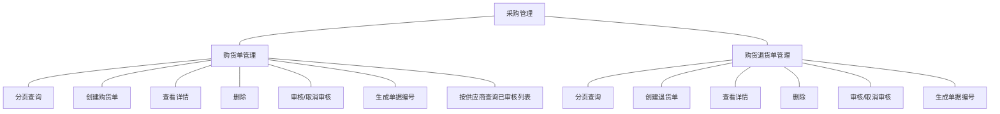
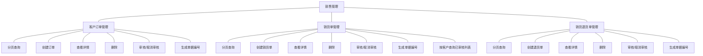
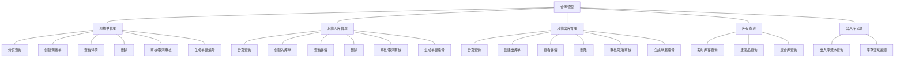
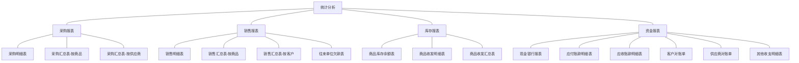
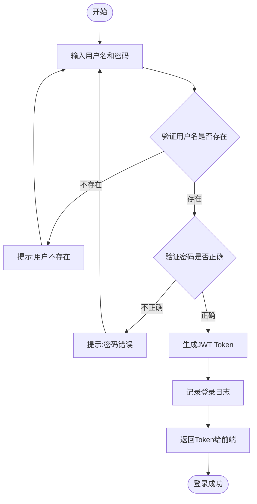
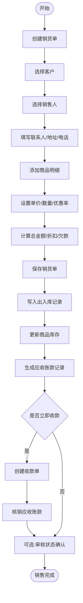
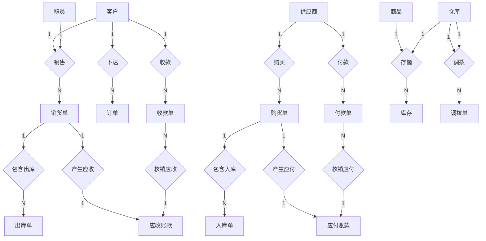

# 天津农学院 毕业设计

### 中文题目：基于SpringBoot和Vue的星络收银系统设计与实现

### 英文题目：Design and Implementation of StarNet Cashier System Based on SpringBoot and Vue

---

**学生姓名：** 刘 浩  
**二级学院：** 计算机与信息工程学院  
**系 别：** 计算机科学系  
**专业班级：** 2022级计算机科学与技术专业2班  
**指导教师：** 王东平  
**成绩评定：** _____________

**2026年5月**

---

## 目 录

1. [绪论](#1-绪论)
    - 1.1 [开发背景](#11-开发背景)
    - 1.2 [开发目的](#12-开发目的)
    - 1.3 [设计思路](#13-设计思路)
    - 1.4 [可行性分析](#14-可行性分析)
2. [系统总体说明](#2-系统总体说明)
    - 2.1 [使用环境](#21-使用环境)
    - 2.2 [系统主要功能](#22-系统主要功能)
    - 2.3 [系统流程设计](#23-系统流程设计)
    - 2.4 [系统主要特点](#24-系统主要特点)
3. [开发环境与相关技术](#3-开发环境与相关技术)
    - 3.1 [开发环境](#31-开发环境)
    - 3.2 [开发工具](#32-开发工具)
    - 3.3 [设计方法与技术](#33-设计方法与技术)
4. [系统设计要点](#4-系统设计要点)
    - 4.1 [数据库设计](#41-数据库设计)
    - 4.2 [系统的实现](#42-系统的实现)
    - 4.3 [系统功能测试](#43-系统功能测试)
5. [讨论](#5-讨论)
    - 5.1 [设计存在的问题](#51-设计存在的问题)
    - 5.2 [进一步改进设想](#52-进一步改进设想)
    - 5.3 [经验与体会](#53-经验与体会)

- [参考文献](#【参 考 文 献】)
- [致谢](#致谢)
- [附录1 相关英文文献](#附录1-相关英文文献)
- [附录2 英文文献中文译文](#附录2-英文文献中文译文)

---

## 摘 要

为了解决传统零售收银系统操作复杂、数据孤岛以及高峰期工作效率低的问题，“星络”智能收银系统应运而生，面向中小微零售商家提供一款高效、便捷、智能化的企业资源管理系统。该系统的前后端分离，在后端使用Spring Boot开发RESTful API，进行业务处理、数据存储以及安全性防护；前端Web端基于Vue.js结合Element UI制作一个动态的管理系统页面；移动端通过Uni-App编写微信小程序，利用uni.scanCode()方法实现扫码；数据库使用MySQL来建立35张核心的数据表并且进行相应的索引优化。此系统包含六个主要部分：基础信息管理（客户、供应商、商品、仓库等）、采购管理（购货单审核、入库、应付账款自动生成）、销售管理（销货单审核、出库、应收账款追踪）、仓库管理（多个仓库间调拨、出入库记录查询）、财务管理（收款付款抵消、应收应付自动监测）以及数据分析（多种报表展示）。经过测试，该系统稳定可靠，主要接口响应速度都在200毫秒之内，扫码识别率在良好的光线下超过95%，各个功能正常可用，单据审核合理有效，应收应付账款自动跟踪准确无误，可以满足小型零售企业的一般要求。本文证明了基于Spring Boot和Vue的前后端分离的设计方式对于建设小型收银系统是切实可行并且有效的，对小型零售企业数字化升级具有一定的指导意义。

**关键词：** 收银系统; SpringBoot; MySQL数据库; 条码识别

---

## ABSTRACT

This thesis will design and implement the intelligent cashier system called the StarNet, which will be an efficient, easy-to-use, and intelligent integrated enterprise resource management platform to small and medium-sized retail merchants to overcome the problem of cumbersome operation, data silos and poor performance at peak times in the traditional retail cashier systems. The system has a front-end and back-end separation design: the back-end uses the SpringBoot framework to build RESTful APIs to manage business logic, data persistence, and security control; the front-end Web interface uses Vue.js and Element UI component library; the mobile end creates WeChat mini-program using Uni-App framework, by invoking the API of uni.scanCode to achieve the function of scanning barcodes; 35 core data tables are standardized and indexed in MySQL database. Six core modules are implemented by the system, which includes basic data management (customers, suppliers, products, warehouses, etc.), purchase management (purchase order audit, warehousing, automatic generation of accounts payable), sales management (sales order audit, outbound, tracking of accounts receivable), warehouse management (multi-warehouse transfer, inbound/outbound flow tracing), fund management (payment/ receipt validation, automatic tracking of receivables/payables) and statistical analysis (multi-dimensional report analysis). According to test results, the system is stable in its operation, the response time of the core interfaces is limited up to 200 ms, the scanning recognition rate is more than 95 percent with standard lighting, all business modules are working properly, the document audit mechanism is developed, and automatic tracking of accounts receivable and payable are done correctly, all of these satisfy the daily management requirements of small and medium-sized retail companies. This system confirms the viability and utility of front-end/back-end separation design using SpringBoot and Vue in developing lightweight cashier systems that give a benchmark solution and practical example of the digitization of small and medium-sized retail businesses.

**Key words:** Cashier System; SpringBoot; MySQL database; Barcode Recognition

---

## 基于SpringBoot和Vue的星络收银系统设计与实现

#### 刘 浩

#### （天津农学院  计算机与信息工程学院）

---

### 1 绪论

随着数字化时代的到来，信息化管理和传统零售业务的融合是大势所趋。而零售业特别是中小企业所面临的消费者需求多元化、经营日益频繁以及对精细化管理的要求越来越高。传统的收银方式在业务协作上、数据应用上和工作效率上都出现了问题，收银系统从单一的结账工具发展成为经营管理平台，是零售业进行数字化改革的一条可行的道路。

### 1.1 开发背景

随着社会经济的发展以及消费者需求的变化，零售行业对于信息技术的应用日益广泛，而收银系统也由最初的单纯的结算工具发展到包括采购、销售、库存以及财务管理等在内的全方位管理系统。但是传统的收银模式以及一些旧有系统却有着明显的弊端之处，在高峰时段需要大量的人工操作造成工作效率低下，手工录入易出错并且会造成库存误差；而现金、刷卡、移动支付等多种支付方式无法统一处理增加了培训和使用的难度；对于多个店铺而言其业务信息分布在各个地方不能及时总结分析不利于企业管理者进行决策。

从目前情况来看，在国内使用Spring Boot与Vue进行开发收银/进销存系统的应用已经比较普及，大部分项目都是利用Java后端、Vue前端以及MySQL数据库实现，在保证开发速度的同时也具有良好的用户体验以及稳定的数据存储能力[1]。

国外零售信息化发展较早，在系统集成程度以及智能化研究上更为超前。一方面，针对复杂业务进行微服务拆分是提升系统弹性和可扩展性的一种常用手段[2]；另一方面，智能购物车、视觉识别无人结账等也已经逐步实现[3]。这说明目前的收银系统除了完成交易外，还需要有数据收集以及对商家经营起到一定作用。

据以上内容得出，当前的研究成果为本文的技术选择、架构设计以及功能集成等起到很好的借鉴作用，也对星络收银系统的实现起到一定的指导意义。

### 1.2 开发目的

本项目是基于Spring Boot以及Vue开发的一款星络收银系统（StarNet Cashier System）针对中小微型企业提供的“WEB端+APP端+后台”的一体化管理系统。系统以企业的日常运营工作为核心进行流程优化，旨在用统一、规范的操作流程取代传统的手工操作，提高工作效率并且便于控制。主要有以下几点目标：

第一，对于业务分散以及数据孤岛的问题，开发前后端分离的一体化系统，对客户、供应商、商品、仓库、职员等基本资料进行集中化管理并连接购货、销货、出入库、收付款等工作流，提高企业的整体工作效率及数据一致性。

第二，解决资金管理复杂以及账务核对繁琐问题，实现应收应付自动跟踪功能，提供收款单、付款单核销和多种财务报表打印等功能，便于企业进行财务管理并给予管理者有效帮助[4]。

第三，为解决库存管理水平较低的问题，建立多仓库管理和库存预警功能，支持调拨、盘盈盘亏、其他出入库等情况，做到对库存及时监控以及可追溯管理，提高库存水平并且减少库存成本[5]。

第四，通过对完整的工程项目进行，“前后端分离+多端适配”的方式，在真实的收银环境中进行应用，进行需求分析、系统设计、代码编写、测试上线等工作，给类似的小型企业数字化转型起到借鉴作用[6]。

总体而言，系统的建立可以节约大量的人力成本以及减少错误发生几率，提高数据分析的能力，使企业管理更加细致化并且更具有竞争优势，在现实中有着很高的实用价值。

### 1.3 设计思路

本系统基于SpringBoot（后端）、Vue（Web端）、Uni-App（移动端）、MySQL（数据库）进行开发，采用模块化、分层架构设计，保证系统的高可用性、易维护性和可扩展性等。设计理念为：

(1)整体风格

界面采用简洁专业的视觉风格，以“左侧导航 + 右侧内容区”为主要布局方式，使功能入口清晰、操作路径稳定，符合企业管理软件的使用习惯。

(2)系统架构设计

系统根据功能分为六个主要部分，在此基础上利用统一的数据模型进行各部分之间的联系。

- 采购管理（bc）：包括购货单、购货退货单的制作、审核、入库以及付款等业务流程协调工作。  
- 销售管理（bc）：覆盖订单、销货/销退、审核、出库与收款流程。  
- 资金管理（fc）：覆盖收付款、应收应付账款和账户流水管理。  
- 统计分析（sc）：提供采购、销售、库存、资金等维度报表分析。  
- 基础资料（uc）：维护客户、供应商、商品、仓库、职员、账户等主数据。  
- 仓库管理（wc）：支持调拨、其他出入库、库存查询及流水追溯。

(3)基础资料管理

基础资料部分为客户、供应商、商品、仓库、职员及结算账户等信息增加、删除、修改、查询功能；商品具有条码、规格、多种定价方式以及库存警戒线等功能；同时有分类树以及字典项设置，便于基础数据管理。

(4)采购与销售管理

采购与销售模块分别覆盖“购货—审核—入库—付款”和“订单/销货—审核—出库—收款”全流程，支持单据审核与状态跟踪，确保业务流程规范和数据准确。

(5)仓库与库存管理

仓库模块支持多仓库管理、仓间调拨、盘盈盘亏等特殊出入库业务，实时记录库存变化并自动生成流水，提供库存查询、预警和历史追溯能力。

(6)资金管理

资金模块构建应收应付与核销体系，支持多单核销、账户流水留痕及对账报表输出，提升账务管理精度与可追溯性。

(7)数据统计与分析

统计分析模块围绕采购、销售、库存和资金形成标准报表与聚合分析结果，通过可视化方式辅助经营决策。

### 1.4 可行性分析

#### 1.4.1 技术可行性

对于后端方面，Spring Boot有自动配置、快速启动以及良好的生态系统等优点，有利于开发企业级RESTful API；而在前端使用Vue进行开发可以提高开发效率及可维护性[7]；移动端采用Uni-App实现多端复用以适应业务移动化的需求[6]；数据库选择MySQL因其稳定、易维护并且成本较低的特点[1]。根据项目实际情况及团队情况，此方案合理有效，可使项目迅速上线并有良好发展前景[8]。

#### 1.4.2 操作可行性

系统使用业界常用、文档齐全的技术方案[8]，开发及维护简单易上手。业务页面符合一般企业的使用习惯，逻辑简洁明了，有单据审核以及多端访问的功能，有利于减少使用者的学习成本和使用成本。同时Vue组件化提高了前端可维护性[7]，Uni-App多端方案增加了系统的可用性[6]，总体来看具有较好的实施性和推广性。

#### 1.4.3 经济可行性

Spring Boot、Vue以及MySQL都是成熟的开源技术，能够大大节约软件购买费用、部署开支以及维护成本等。此外它们拥有良好的生态环境，有丰富的资源可供利用，可以减少学习成本、人力成本，加快项目进度。而MySQL对于中小企业来说也有很高的性价比以及良好的拓展性[1]。因此从总体来看，此方案在前期投资以及后期运营上都是比较经济实惠[8]。

---

## 2 系统总体说明

### 2.1 使用环境

本系统的使用环境配置如下：

- Web端：Chrome、Edge、Firefox等现代浏览器
- 移动端：微信客户端（支持微信小程序）

### 2.2 系统主要功能

本星络收银系统采用模块化设计，涵盖企业资源管理的各个核心环节。系统包含基础资料管理、采购管理、销售管理、仓库管理、资金管理和统计分析六大功能模块，通过前后端分离架构（Web端erp-web+移动端erp-app+后端服务erp-api）实现多端协同工作[9]。系统功能结构图见图1。

*图1 系统功能结构图*

#### 2.2.1 基础资料管理功能

基础资料模块负责管理企业运营所需的核心基础数据，包括：

**（1）客户管理**：维护客户基本信息、联系方式、客户分类及等级，设置期初应收款项以及预收款。支持客户联系人管理，可添加多个联系人的手机号码、电话号码、电子邮件等。

**（2）供应商管理**：维护供应商基本信息、联系方式、供应商分类，设置增值税税率、期初应付款以及预付款。支持供应商联系人管理。

**（3）商品管理**：维护商品相关信息，如商品编号、名称、条形码、规格、种类、计量单位等。支持多种价格策略（零售价、批发价、VIP价格、折扣率）设定预期进价，有库存警报功能，可以设置最小库存量以及最大库存量。

**（4）仓库管理**：维护仓库基本信息，支持多仓库管理模式。

**（5）职员管理**：维护企业职员信息，在销售单等相关业务单据中与销售人员进行关联。

**（6）结算账户管理**：维护企业银行账户、现金账户等各类结算账户，记录期初余额及当前余额，支持账户类型管理（现金、银行存款等）。

**（7）分类管理**：支持客户分类、供应商分类、商品分类、支出分类、收入分类的分类管理。

**（8）字典管理**：对系统中字典进行维护，如计量单位、结算方式、客户等级、账户类型等字典项。

**（9）系统设置**：设置系统参数，如公司名称、联系方式、币种、数量精度、价格精度、存货计价方式、是否检查负库存、启用日期等。

**（10）用户管理**：对系统中用户账户进行管理，如用户名、密码（使用BCrypt进行加密）、真实姓名、电话号码等，可以对用户的启用/禁用以及重置密码等操作。

**（11）日志管理**：记录用户登录、增加用户、启用或停用用户以及重置密码等重要操作的日志用于审计及问题追踪。

基础资料管理的功能结构图如图2所示。

*图2 基础资料管理功能结构图*

```mermaid
graph TB
    A[基础资料管理] --- B[客户管理]
    A --- C[供应商管理]
    A --- D[商品管理]
    A --- E[仓库管理]
    A --- F[职员管理]
    A --- G[结算账户管理]
    A --- H[分类管理]
    A --- I[字典管理]
    A --- J[系统设置]
    A --- K[用户管理]
    A --- L[日志管理]
    
    B --- B1[分页查询]
    B --- B2[新增/编辑]
    B --- B3[查看详情]
    B --- B4[删除]
    B --- B5[启用/停用]
    B --- B6[联系人管理]
    
    C --- C1[分页查询]
    C --- C2[新增/编辑]
    C --- C3[查看详情]
    C --- C4[删除]
    C --- C5[启用/停用]
    C --- C6[导入Excel]
    C --- C7[导出Excel]
    
    D --- D1[分页查询]
    D --- D2[新增/编辑]
    D --- D3[查看详情]
    D --- D4[删除]
    D --- D5[启用/停用]
    
    E --- E1[分页查询]
    E --- E2[新增/编辑]
    E --- E3[查看详情]
    E --- E4[删除]
    E --- E5[启用/停用]
    
    F --- F1[分页查询]
    F --- F2[新增/编辑]
    F --- F3[查看详情]
    F --- F4[删除]
    F --- F5[启用/停用]
    
    G --- G1[列表查询]
    G --- G2[新增/编辑]
    G --- G3[查看详情]
    G --- G4[删除]
    
    H --- H1[客户分类]
    H --- H2[供应商分类]
    H --- H3[商品分类]
    H --- H4[支出分类]
    H --- H5[收入分类]
    
    I --- I1[计量单位]
    I --- I2[结算方式]
    I --- I3[客户等级]
    I --- I4[账户类别]
    
    J --- J1[获取系统配置]
    J --- J2[设置系统配置]
    
    K --- K1[分页查询]
    K --- K2[新增用户]
    K --- K3[启用/停用]
    K --- K4[重置密码]
    
    L --- L1[操作日志查询]
```



#### 2.2.2 采购管理功能

采购管理模块实现从供应商采购商品的完整业务流程，包括：

**（1）购货单管理**：创建购货单，选择供应商，添加采购商品明细，设置优惠率和优惠金额。支持分期付款和欠款管理，记录本次付款金额和本次欠款。当前实现中，单据保存时即完成入库与应付账款等业务数据写入；审核用于状态确认与业务复核。

**（2）购货退货单管理**：处理采购退货业务，创建购货退货单，减少应付账款。当前实现中，退货单保存时即写入对应库存与应付账款变动记录，审核用于状态管理。

采购管理功能的功能结构图如图3所示。

*图3 采购管理功能结构图*



#### 2.2.3 销售管理功能

销售管理模块实现向客户销售商品的完整业务流程，包括：

**（1）客户订单管理**：建立客户订货单或者客户退货单，在系统中设定交货期以及填写商品信息等，保存之后流转到业务中，审核用于对业务进行确认及二次核查。

**（2）销货单管理**：新建销货单，选择客户以及销售人员，填写联系方式及地址等信息。支持查看是否已收款（未收款、部分收款、已全部收款），记录此次收款金额及此次剩余欠款。目前实现上，销货单保存的同时就写入库存以及应收账款中，审核用于确认状态以及业务复核。

**（3）销货退货单管理**：处理销售退货业务，生成销货退货单据，减少应收账款，在现有功能中，销货退货单保存的同时也保存相应的库存以及应收账款的变化情况，审核用于状态控制。

销售管理功能的功能结构图如图4所示。

*图4 销售管理功能结构图*



#### 2.2.4 仓库管理功能

仓库管理模块实现商品库存的全面管理，包括：

**（1）调拨单管理**：实现商品在不同仓库之间的调拨操作。调拨单包含调出仓库、调入仓库和商品明细。当前实现中，调拨单保存时即写入调拨出入库记录并更新库存；审核用于状态管理与业务复核。

**（2）其他入库管理**：处理非采购类的入库业务，例如盘盈以及其他入库等，在当前系统中，入库单保存的同时会相应增加商品库存并且生成出入库流水账。

**（3）其他出库管理**：处理非销售类的出库业务，如盘亏等其他出库，在系统中，出库单保存的同时会减少商品的库存并生成出入库流水记录。

**（4）库存查询**：查看每个仓库的商品数量、成本单价以及库存总价值。可以按商品或者仓库等多种方式进行库存查询。

**（5）出入库记录**：记载所有库存变动情况，如采购入库、销售出库、调拨、盘盈盘亏等。每一笔都有变动前后库存数量，可以查到以前库存变化情况。

仓库管理功能的功能结构图如图5所示。

*图5 仓库管理功能结构图*



#### 2.2.5 资金管理功能

资金管理模块实现企业财务的全面管理，包括：

**（1）收款单管理**：记录从客户收取款项，支持核销多张销货单的应收款。可以设定整单折扣、预收款，记录已核销金额以及未核销金额。收款后自动生成账户流水及应收账款减少。

**（2）付款单管理**：登记对供应商付款情况，可以抵扣多张购货单上的应付账款。可以设置整单折扣、预付款，记录已抵扣金额以及未抵扣金额。付款以后系统会自动生成一个银行流水以及一个应付账款减少。

**（3）应收账款管理**：自动跟踪与每一个客户的交易情况，记录销货带来的应收以及收款导致的应收减少，生成客户对账单，显示与各个客户应收的变化。

**（4）应付账款管理**：自动跟踪与每个供应商的往来账务，记录购货增加的应付款和付款减少的应付款。提供供应商对账单，清晰展示与每个供应商的应付款变动情况。

**（5）其他收入管理**：记录企业的其他收入（如利息收入、退税等），可以关联客户。收入后自动生成账户流水记录和收支分类记录。

**（6）其他支出管理**：记录企业的其他支出（如房租、水电费等），可以关联供应商。支出后自动生成账户流水记录和收支分类记录。

**（7）现金银行报表**：展示各结算账户的资金流水，记录每笔业务的账户变动情况，包括业务类型、结算方式、结算号、操作后余额等信息。

资金管理功能的功能结构图如图6所示。

*图6 资金管理功能结构图*

```mermaid
graph TB
    A[资金管理] --- B[收款单管理]
    A --- C[付款单管理]
    A --- D[应收账款管理]
    A --- E[应付账款管理]
    A --- F[其他收入管理]
    A --- G[其他支出管理]
    A --- H[现金银行报表]
    
    B --- B1[分页查询]
    B --- B2[创建收款单]
    B --- B3[查看详情]
    B --- B4[删除]
    B --- B5[核销应收款]
    B --- B6[生成单据编号]
    
    C --- C1[分页查询]
    C --- C2[创建付款单]
    C --- C3[查看详情]
    C --- C4[删除]
    C --- C5[核销应付款]
    C --- C6[生成单据编号]
    
    D --- D1[应收款明细]
    D --- D2[客户对账单]
    D --- D3[应收款跟踪]
    
    E --- E1[应付款明细]
    E --- E2[供应商对账单]
    E --- E3[应付款跟踪]
    
    F --- F1[分页查询]
    F --- F2[创建收入单]
    F --- F3[查看详情]
    F --- F4[删除]
    F --- F5[生成单据编号]
    
    G --- G1[分页查询]
    G --- G2[创建支出单]
    G --- G3[查看详情]
    G --- G4[删除]
    G --- G5[生成单据编号]
    
    H --- H1[账户流水查询]
    H --- H2[余额变动记录]
```



#### 2.2.6 统计分析功能

统计分析模块提供多维度的业务数据分析报表，包括：

**（1）采购报表**：

- 采购明细表：展示每笔采购业务的详细信息。
- 采购汇总表（按商品）：按商品维度统计采购数量和金额。
- 采购汇总表（按供应商）：按供应商维度统计采购情况。

**（2）销售报表**：

- 销售明细表：展示每笔销售业务的详细信息。
- 销售汇总表（按商品）：按商品维度统计销售数量和金额。
- 销售汇总表（按客户）：按客户维度统计销售情况。
- 往来单位欠款表：展示客户和供应商的欠款情况。

**（3）库存报表**：

- 商品库存余额表：展示各商品的当前库存数量和成本。
- 商品收发明细表：展示商品的出入库流水记录。
- 商品收发汇总表：按商品维度统计出入库情况。

**（4）资金报表**：

- 现金银行报表：展示账户资金流水。
- 应付账款明细表：展示与供应商的应付款变动明细。
- 应收账款明细表：展示与客户的应收款变动明细。
- 客户对账单：展示与特定客户的往来账务。
- 供应商对账单：展示与特定供应商的往来账务。
- 其他收支明细表：展示其他收入和支出的明细。

统计分析功能的功能结构图如图7所示。

*图7 统计分析功能结构图*



### 2.3 系统流程设计

#### 2.3.1 用户登录流程

用户进入系统后，首先需要进行登录验证。在登录界面输入用户名和密码，系统会通过BCrypt算法验证密码是否正确。如果验证通过，系统生成JWT Token并返回给前端，用户成功登录进入系统主页；如果用户名或密码输入错误，系统会提示错误信息，用户需重新输入。登录流程图如图8所示。

*图8 用户登录流程图*



#### 2.3.2 采购业务流程

采购业务流程如下：管理员登录系统后进入采购管理模块，创建购货单并填写供应商、商品明细、单价、数量、优惠等信息。保存后系统写入入库、库存和应付账款等业务记录；后续可根据管理要求执行审核标记。若需付款，可通过付款单进行核销。采购业务流程图如图9所示。

*图9 采购业务流程图*


#### 2.3.3 销售业务流程

销售业务流程如下：管理员登录系统后进入销售管理模块，创建销货单并填写客户、销售人和商品明细等信息。保存后系统写入出入库、库存和应收账款等记录；后续可按管理要求执行审核标记。若需收款，可通过收款单进行核销。销售业务流程图如图10所示。

*图10 销售业务流程图*



#### 2.3.4 库存调拨流程

库存调拨流程如下：管理员创建调拨单，选择调出仓库和调入仓库并添加商品明细。保存后系统写入调拨出入库记录并更新库存，完成仓间转移；审核用于状态确认与业务复核。库存调拨流程图如图11所示。

*图11 库存调拨流程图*


### 2.4 系统主要特点

**（1）模块化设计：**

系统采用模块化分层结构，根据业务功能划分为基础资料、采购、销售、仓库、资金、统计分析六个部分。各部分有明确分工，有利于开发、管理和增加新功能等。

**（2）业务流程规范：**

系统实现了整个业务流程操作，包括单据新建、保存、审核状态确认等内容，在现有实现中，如采购、销售、调拨等主要单据保存时记录大部分信息，而审核仅起到状态管理和复核作用，以便业务可追溯、可控。

**（3）财务自动化：**

系统支持对企业的应收应付进行自动化的管理，在核心业务单据保存之后就会生成相应的往来账；同时支持收款单、付款单的核销操作，可以一次性核销多个业务单据，方便快捷。

**（4）移动端扫码功能：**

基于Uni-App框架开发微信小程序，使用uni.scanCode() API实现条码、二维码扫描。支持onlyFromCamera参数用于指定只从摄像头读取扫码内容，scanType参数可选值为barCode或者qrCode。扫描完成之后会自动向后端发起请求/product/page获取商品详情，不需要上传图片至服务器，速度更快，在category.vue、cart.vue等页面上均已完成扫码添加购物车功能。

**（5）多维度报表分析：**

系统提供采购、销售、库存、资金等方面的各种统计报表，如明细表、汇总表、对账单等，以表格形式展示相关信息便于企业进行相关工作。

**（6）前后端分离架构：**

采用前后端分离架构，Web端（erp-web）使用Vue.js+Element UI，移动端（erp-app）使用Uni-App，后端（erp-api）使用Spring Boot+MyBatis。前后端通过RESTful API进行通信，清晰易懂，有利于后续开发及维护工作。

---

## 3 开发环境与相关技术

### 3.1 开发环境

本系统的开发环境配置如下：

**硬件环境：**

- 处理器：Intel(R) Core(TM) Ultra 9 275HX (2.70 GHz)。
- 机带RAM：16.0 GB RAM。
- 硬盘：954GB SSD固态硬盘。

**软件环境：**

- 操作系统：Windows 10/11 64位。
- JDK版本：JDK 21.0.11。
- 数据库：MySQL 8.0.42。
- Node.js：Node.js 22.22.2。

**服务端配置：**

- 应用服务器：Spring Boot内嵌Tomcat 9.0。
- 服务端口：9090。
//- 开发模式：dev（支持热部署）（当前默认未启用DevTools热部署，可按需开启）。

### 3.2 开发工具

本系统使用的开发工具如下：

**后端开发工具：**

- IntelliJ IDEA Ultimate 2026.1.0：Java IDE，用于后端服务开发
- DBeaver 25.3.3：数据库管理工具，用于MySQL数据库设计和查询

**前端开发工具：**

- HBuilder X 5.07：Uni-App移动端开发IDE
- 微信开发者工具 2.01：微信小程序调试和预览

**版本控制：**

- Git：代码版本控制系统

**框架与技术栈：**

- 后端：Spring Boot 2.3.2.RELEASE、MyBatis、MyBatis-Plus（由父工程依赖管理统一引入）、Spring Security
- 前端Web：Vue.js 2.5.22、Vue Router 3.0.1、Element UI 2.4.5、Axios 0.18.0、ECharts 4.1.0
- 前端移动：Uni-App、Vuex 4.1.0
- 其他：Lombok 1.18.30、JWT (jjwt 0.6.0)、Druid连接池

开发软件截图如图12所示。

*图12 开发软件截图*

### 3.3 设计方法与技术

#### 3.3.1 系统需求分析

在整个软件开发生命周期里，系统需求分析起到至关重要的作用，它明确指出了所要开发的目标系统应具备的功能性要求、性能要求、安全性要求、用户界面及各种非功能性需求等，通过对业务需求、用户需求、运行环境进行详细研究后，把这些抽象的要求具体化并形成可量化的系统规格。

本系统主要针对中小型企业，主要角色是管理员。管理员可以进入系统后进行基本信息管理（客户、供应商、商品、仓库、职员、帐户等）、采购管理（购货单、购货退货单）、销售管理（客户订单、销货单、销货退货单）、仓库管理（调拨单、其他出入库、库存查询）、财务管理（收款单、付款单、应收应付账款、收支记录）以及报表分析（采购/销售/库存/财务报表）。与此同时，系统还提供面向门店操作人员的移动端功能（如扫码加购、采购清单处理等）。管理员的用例图如图13所示。

*图13 管理员用例图*

```mermaid
graph TB
    Admin([管理员])
    
    subgraph 基础资料管理
        A1[客户管理]
        A2[供应商管理]
        A3[商品管理]
        A4[仓库管理]
        A5[职员管理]
        A6[结算账户管理]
        A7[分类管理]
        A8[字典管理]
        A9[用户管理]
        A10[系统设置]
    end
    
    subgraph 采购管理
        B1[购货单管理]
        B2[购货退货单管理]
    end
    
    subgraph 销售管理
        C1[客户订单管理]
        C2[销货单管理]
        C3[销货退货单管理]
    end
    
    subgraph 仓库管理
        D1[调拨单管理]
        D2[其他入库管理]
        D3[其他出库管理]
        D4[库存查询]
        D5[出入库记录]
    end
    
    subgraph 资金管理
        E1[收款单管理]
        E2[付款单管理]
        E3[应收账款管理]
        E4[应付账款管理]
        E5[其他收入管理]
        E6[其他支出管理]
        E7[现金银行报表]
    end
    
    subgraph 统计分析
        F1[采购报表]
        F2[销售报表]
        F3[库存报表]
        F4[资金报表]
    end
    
    Admin --> A1
    Admin --> A2
    Admin --> A3
    Admin --> A4
    Admin --> A5
    Admin --> A6
    Admin --> A7
    Admin --> A8
    Admin --> A9
    Admin --> A10
    
    Admin --> B1
    Admin --> B2
    
    Admin --> C1
    Admin --> C2
    Admin --> C3
    
    Admin --> D1
    Admin --> D2
    Admin --> D3
    Admin --> D4
    Admin --> D5
    
    Admin --> E1
    Admin --> E2
    Admin --> E3
    Admin --> E4
    Admin --> E5
    Admin --> E6
    Admin --> E7
    
    Admin --> F1
    Admin --> F2
    Admin --> F3
    Admin --> F4
```



移动端小程序面向门店操作人员，提供商品浏览、扫码加购、采购清单管理等功能，支持通过uni.scanCode() API调用手机摄像头扫描商品条码，快速添加商品到采购清单。

#### 3.3.2 开发技术介绍

**（1）Java语言**

Java语言以平台无关性著称，遵循“一次编写，到处运行”，极大地降低开发成本。Java虚拟机(JVM)起到纽带作用，使得代码可以在不同环境下保持一致性和鲁棒性[1]。Java具有庞大的标准库，同时也有大量的第三方库，几乎涉及所有方面，例如网络编程、数据库访问、图形界面以及Web开发等。安全性是Java设计重点，从类加载器到安全管理器，再到字节码校验，Java有多种方式防范恶意代码。

**（2）Spring Boot框架**

利用SpringBoot可以大大提高开发速度，在很大程度上简化开发工作量。SpringBoot自动配置使得基于Spring的应用初始化以及开发更为便捷[8]。SpringBoot集成了大量的常用的第三方库，例如数据库连接池、缓存方案、消息队列等，提供开箱即用的服务。这既降低了配置复杂度也保证各个部分良好协作。另外，SpringBoot有大量的扩展组件及工具，如SpringBoot CLI、Spring Initializr等，也大大提高了开发效率。

**（3）Vue框架**

Vue.js由于其轻量化以及渐进性特点给前端带来了一套简单而高效的方案，在其核心库主要是实现视图部分，而且很简洁，便于学习者快速融入到Vue生态圈当中完成更多功能[7]。Vue的数据双向绑定大大减轻了开发人员的数据与视图之间的交互工作量，只需要关注数据的变化，Vue就会自动帮我们完成对DOM的操作。Vue的组件化也极大的提高代码复用率，让开发者可以使用一个个相对独立并且可以复用的小模块组合成一个复杂但是又容易管理的应用程序。

**（4）MyBatis框架**

MyBatis是一款优秀的持久层框架，它支持自定义SQL、存储过程以及高级映射。MyBatis避免了几乎所有的JDBC代码和手动设置参数以及获取结果集的操作[1]。MyBatis可以通过简单的XML或注解来配置和映射原始类型、接口和Java POJO为数据库中的记录。在本系统中，MyBatis负责处理后端与MySQL数据库之间的数据交互，简化了数据库操作的开发工作量。

**（5）MySQL数据库**

MySQL是一个拥有良好性能以及稳定性的开源关系型数据库管理系统，以其易用性而受到欢迎，在软件开发过程中，MySQL可以很好地处理大数据量的工作，可以进行复杂的查询操作并且使数据可以快速读出，提高整个系统的效率，同时提供了完善的数据一致性以及安全性保障机制，如事务支持、权限管理以及数据备份和恢复等，保证了数据的一致性和安全性，防止数据丢失或者非法访问，给系统提供坚实的数据基础，另外MySQL还具有优秀的可移植性，很容易和其他各种编程语言及框架对接，方便开发和部署，因此可以说，MySQL给软件开发带来高效性、可靠性和便捷性等方面的益处，由于它是免费开源的，而且有着出色的数据管理和丰富的存储引擎以及良好的管理界面等原因，所以现在已成为当今软件开发的一个重要组成部分。

**（6）B/S架构**

在系统开发中，采用B/S架构（Browser/Server，即浏览器/服务器架构）具有诸多优点。B/S架构支持跨平台，用户不需要安装专门的客户端软件，只需要使用浏览器就可以浏览网站的应用程序，降低用户使用难度，使系统更易被接受，也便于后期维护与发展[10]。而且基于B/S架构的系统有很好的伸缩性和可升级性，当业务变化时，能够平滑地增加新的功能或者提高效率等。

---

## 4 系统设计要点

### 4.1 数据库设计

#### 4.1.1 数据库E-R图设计

实体-关系图(E-R图)是数据库设计的核心工具。在实体-关系图中，实体以矩形框的形式呈现，这些框内包含了实体的名称及其特有的属性。属性被显示为椭圆，并由线连接到其所属的实体。关系是联系实体之间互动的纽带，用线将关联的实体联系起来。E-R图的使用，使得数据库设计者能够以一种直观的方式规划和构建数据结构，有效地连接了开发人员、分析师和管理层，促进了团队成员之间对数据库架构的共同理解。

本系统共设计了35张数据表，涵盖基础资料、业务流程、财务资金、库存管理等各个方面。主要实体包括客户、供应商、商品、仓库、职员、结算账户、购货单、销售单、收款单、付款单、调拨单等。系统总体E-R图如图14所示。

*图14 系统总体E-R图*



**实体间联系说明：**

1. **供应商 - 购买 - 购货单** (1:N)
2. **客户 - 下达 - 订单** (1:N)
3. **客户/职员 - 销售 - 销货单** (1:N)
4. **购货单 - 产生应付 - 应付账款** (1:1)
5. **销货单 - 产生应收 - 应收账款** (1:1)
6. **客户 - 收款 - 收款单** (1:N)
7. **供应商 - 付款 - 付款单** (1:N)
8. **收款单 - 核销应收 - 应收账款** (N:1)
9. **付款单 - 核销应付 - 应付账款** (N:1)
10. **购货单 - 包含入库 - 入库单** (1:N)
11. **销货单 - 包含出库 - 出库单** (1:N)
12. **商品/仓库 - 存储 - 库存** (1:N)
13. **仓库 - 调拨 - 调拨单 - 仓库** (M:N)

#### 4.1.2 数据库表结构设计

数据库表的设计构成了构建数据库系统的基础，其核心在于依据业务需求和数据模型来精心规划表结构及其相互之间的关系。在确定了实体属性之后，定义表与表之间的关系是重要步骤。对表格进行标准化是保证数据质量的重要环节，标准化可以有效消除数据的重复，确保数据的完整与一致。通过遵守第一范式、第二范式、第三范式等标准化原理，可有效降低数据存储中的冗余信息，提升数据库的运行效率与可靠性。本系统主要数据表如下：

(1) 客户表用于存储企业客户的基本信息，支持客户分类、等级管理和期初应收款设置，是销售业务和应收账款管理的基础数据。客户表的具体字段信息见表1。

**表1　客户表（uc_customer）**

| 字段名 | 数据类型 | 必填 | 默认值 | 说明 |
|--------|---------|------|--------|------|
| id | VARCHAR(20) | ✅ | - | 主键ID |
| code | VARCHAR(255) | ❌ | NULL | 编号（客户编码） |
| name | VARCHAR(255) | ❌ | NULL | 名称（客户名称） |
| categoryId | VARCHAR(20) | ❌ | NULL | 客户类别ID（关联rc_category.id，type=10） |
| level | VARCHAR(20) | ❌ | 10 | 客户等级ID（关联rc_dict_item.id，字典编码customer_level） |
| balanceTime | TIMESTAMP | ❌ | NULL | 余额日期 |
| beginReceivableAmount | BIGINT | ❌ | NULL | 期初应收款 |
| beginPrepaidAmount | BIGINT | ❌ | NULL | 期初预收款 |
| remark | VARCHAR(255) | ❌ | NULL | 备注 |
| active | BIT(1) | ❌ | 1 | 是否启用：0=停用，1=启用 |
| createdTime | TIMESTAMP | ❌ | CURRENT_TIMESTAMP | 创建时间 |
| updatedTime | TIMESTAMP | ❌ | CURRENT_TIMESTAMP | 更新时间（自动更新） |

(2) 客户联系人表用于记录客户的多个联系人信息，包括姓名、电话、职位等，便于业务沟通和对账联系。客户联系人表的具体字段信息见表2。

**表2　客户联系人表（uc_customer_contact）**

| 字段名 | 数据类型 | 必填 | 默认值 | 说明 |
|--------|---------|------|--------|------|
| id | VARCHAR(20) | ✅ | - | 主键ID |
| customerId | VARCHAR(20) | ❌ | NULL | 客户ID（关联uc_customer.id） |
| name | VARCHAR(255) | ❌ | NULL | 联系人姓名 |
| mobile | VARCHAR(64) | ❌ | NULL | 手机号 |
| phone | VARCHAR(64) | ❌ | NULL | 座机 |
| position | VARCHAR(255) | ❌ | NULL | 职位 |
| qq | VARCHAR(255) | ❌ | NULL | QQ号 |
| address | TEXT | ❌ | NULL | 地址 |
| primary | BIT(1) | ❌ | 0 | 是否首要联系人：0=否，1=是 |
| createdTime | TIMESTAMP | ❌ | CURRENT_TIMESTAMP | 创建时间 |
| updatedTime | TIMESTAMP | ❌ | CURRENT_TIMESTAMP | 更新时间（自动更新） |

(3) 供应商表用于存储供应商基本信息，支持供应商分类、增值税税率设置和期初应付款管理，是采购业务和应付账款管理的基础数据。供应商表的具体字段信息见表3。

**表3　供应商表（uc_supplier）**

| 字段名 | 数据类型 | 必填 | 默认值 | 说明 |
|--------|---------|------|--------|------|
| id | VARCHAR(20) | ✅ | - | 主键ID |
| code | VARCHAR(255) | ❌ | NULL | 编号（供应商编码） |
| name | VARCHAR(255) | ❌ | NULL | 名称（供应商名称） |
| categoryId | VARCHAR(20) | ❌ | NULL | 供应商类别ID（关联rc_category.id，type=20） |
| balanceTime | TIMESTAMP | ❌ | NULL | 余额日期 |
| beginReceivableAmount | BIGINT | ❌ | NULL | 期初应收款 |
| beginPrepaidAmount | BIGINT | ❌ | NULL | 期初预收款 |
| vatRate | SMALLINT | ❌ | NULL | 增值税税率（如：17表示17%） |
| remark | VARCHAR(255) | ❌ | NULL | 备注 |
| active | BIT(1) | ❌ | 1 | 是否启用：0=停用，1=启用 |
| createdTime | TIMESTAMP | ❌ | CURRENT_TIMESTAMP | 创建时间 |
| updatedTime | TIMESTAMP | ❌ | CURRENT_TIMESTAMP | 更新时间（自动更新） |

(4) 供应商联系人表用于记录供应商的多个联系人信息，便于采购沟通和业务协调。供应商联系人表的具体字段信息见表4。

**表4　供应商联系人表（uc_supplier_contact）**

| 字段名 | 数据类型 | 必填 | 默认值 | 说明 |
|--------|---------|------|--------|------|
| id | VARCHAR(20) | ✅ | - | 主键ID |
| supplierId | VARCHAR(20) | ❌ | NULL | 供应商ID（关联uc_supplier.id） |
| name | VARCHAR(255) | ❌ | NULL | 联系人姓名 |
| mobile | VARCHAR(64) | ❌ | NULL | 手机号 |
| phone | VARCHAR(64) | ❌ | NULL | 座机 |
| qq | VARCHAR(255) | ❌ | NULL | QQ号 |
| address | TEXT | ❌ | NULL | 地址 |
| primary | BIT(1) | ❌ | 0 | 是否首要联系人：0=否，1=是 |
| createdTime | TIMESTAMP | ❌ | CURRENT_TIMESTAMP | 创建时间 |
| updatedTime | TIMESTAMP | ❌ | CURRENT_TIMESTAMP | 更新时间（自动更新） |

(5) 商品表是系统核心基础数据表，存储商品的编码、名称、条码、规格、分类等信息，支持多级价格策略（零售价、批发价、VIP价）和库存预警功能，贯穿采购、销售、库存全流程。商品表的具体字段信息见表5。

**表5　商品表（uc_product）**

| 字段名 | 数据类型 | 必填 | 默认值 | 说明 |
|--------|---------|------|--------|------|
| id | VARCHAR(20) | ✅ | - | 主键ID |
| code | VARCHAR(255) | ❌ | NULL | 编号（商品编码） |
| name | VARCHAR(255) | ❌ | NULL | 名称（商品名称） |
| barcode | VARCHAR(255) | ❌ | NULL | 条码（商品条形码） |
| spec | VARCHAR(255) | ❌ | NULL | 规格（商品规格型号） |
| categoryId | VARCHAR(20) | ❌ | NULL | 类别ID（关联rc_category.id，type=30） |
| primaryWarehouseId | VARCHAR(20) | ❌ | NULL | 首选仓库ID（关联uc_warehouse.id） |
| unitId | VARCHAR(20) | ❌ | NULL | 计量单位ID（关联rc_dict_item.id，字典编码unit） |
| retailPrice | DOUBLE | ❌ | NULL | 零售价 |
| wholesalePrice | DOUBLE | ❌ | NULL | 批发价 |
| vipPrice | DOUBLE | ❌ | NULL | VIP价格 |
| discountRate1 | DOUBLE | ❌ | NULL | 折扣率1 |
| discountRate2 | DOUBLE | ❌ | NULL | 折扣率2 |
| estimatedPurchasePrice | DOUBLE | ❌ | NULL | 预计采购价 |
| remark | VARCHAR(255) | ❌ | NULL | 备注 |
| minimumStock | DOUBLE | ❌ | NULL | 最低库存（库存预警下限） |
| maximumStock | DOUBLE | ❌ | NULL | 最高库存（库存预警上限） |
| active | BIT(1) | ❌ | 1 | 是否启用：0=停用，1=启用 |
| createdTime | TIMESTAMP | ❌ | CURRENT_TIMESTAMP | 创建时间 |
| updatedTime | TIMESTAMP | ❌ | CURRENT_TIMESTAMP | 更新时间（自动更新） |

(6) 仓库表用于管理企业的多个仓库，支持多仓库库存管理和商品调拨操作。仓库表的具体字段信息见表6。

**表6　仓库表（uc_warehouse）**

| 字段名 | 数据类型 | 必填 | 默认值 | 说明 |
|--------|---------|------|--------|------|
| id | BIGINT | ✅ | - | 主键ID |
| code | VARCHAR(255) | ❌ | NULL | 编号（仓库编码） |
| name | VARCHAR(255) | ❌ | NULL | 名称（仓库名称） |
| active | BIT(1) | ❌ | 1 | 是否启用：0=停用，1=启用 |
| createdTime | TIMESTAMP | ❌ | CURRENT_TIMESTAMP | 创建时间 |
| updatedTime | TIMESTAMP | ❌ | CURRENT_TIMESTAMP | 更新时间（自动更新） |

(7) 职员表用于管理企业职员信息，在销售业务中作为销售员关联，在单据中作为制单人记录。职员表的具体字段信息见表7。

**表7　职员表（uc_employee）**

| 字段名 | 数据类型 | 必填 | 默认值 | 说明 |
|--------|---------|------|--------|------|
| id | BIGINT | ✅ | - | 主键ID |
| code | VARCHAR(255) | ❌ | NULL | 编号（职员编码） |
| name | VARCHAR(255) | ❌ | NULL | 名称（职员姓名） |
| active | BIT(1) | ❌ | 1 | 是否启用：0=停用，1=启用 |
| createdTime | TIMESTAMP | ❌ | CURRENT_TIMESTAMP | 创建时间 |
| updatedTime | TIMESTAMP | ❌ | CURRENT_TIMESTAMP | 更新时间（自动更新） |

(8) 结算账户表用于管理企业的现金、银行账户等结算账户，记录期初余额和当前余额，所有资金变动均通过此表跟踪。结算账户表的具体字段信息见表8。

**表8　结算账户表（uc_settlement_account）**

| 字段名 | 数据类型 | 必填 | 默认值 | 说明 |
|--------|---------|------|--------|------|
| id | VARCHAR(20) | ✅ | - | 主键ID |
| code | VARCHAR(255) | ❌ | NULL | 账户编号 |
| name | VARCHAR(255) | ❌ | NULL | 账户名称 |
| balanceTime | TIMESTAMP | ❌ | NULL | 余额日期 |
| beginBalance | DOUBLE | ❌ | 0 | 期初余额 |
| currentBalance | DOUBLE | ❌ | 0 | 当前余额 |
| type | VARCHAR(20) | ❌ | NULL | 账户类别（关联rc_dict_item.id，字典编码account_type） |
| createdTime | TIMESTAMP | ❌ | CURRENT_TIMESTAMP | 创建时间 |
| updatedTime | TIMESTAMP | ❌ | CURRENT_TIMESTAMP | 更新时间（自动更新） |

(9) 用户表用于管理系统登录用户，存储用户名、加密密码、真实姓名等信息，采用BCrypt算法加密密码，确保系统安全。用户表的具体字段信息见表9。

**表9　用户表（uc_user）**

| 字段名 | 数据类型 | 必填 | 默认值 | 说明 |
|--------|---------|------|--------|------|
| id | VARCHAR(20) | ✅ | - | 用户ID |
| username | VARCHAR(255) | ❌ | NULL | 用户名（登录名） |
| mobile | VARCHAR(64) | ❌ | NULL | 手机号 |
| password | VARCHAR(255) | ❌ | NULL | 密码（BCrypt加密） |
| name | VARCHAR(255) | ❌ | NULL | 真实姓名 |
| active | BIT(1) | ❌ | 1 | 是否启用：0=停用，1=启用 |
| deleted | BIT(1) | ❌ | 0 | 是否删除：0=未删除，1=已删除 |
| createdTime | TIMESTAMP | ✅ | CURRENT_TIMESTAMP | 创建时间 |
| updatedTime | TIMESTAMP | ✅ | CURRENT_TIMESTAMP | 更新时间（自动更新） |

(10) 客户订单表用于记录客户的订货和退货订单，支持订单审核机制，是销货单的前置业务流程。客户订单表的具体字段信息见表10。

**表10　客户订单表（bc_order）**

| 字段名 | 数据类型 | 必填 | 默认值 | 说明 |
|--------|---------|------|--------|------|
| id | VARCHAR(20) | ✅ | - | 主键ID |
| issueDate | VARCHAR(255) | ❌ | NULL | 单据日期 |
| deliveryDate | VARCHAR(255) | ❌ | NULL | 交货日期 |
| code | VARCHAR(255) | ❌ | NULL | 单据编号（如：CO2021121506202128603） |
| businessType | SMALLINT | ❌ | 10 | 业务类型：10=订货，20=退货 |
| customerId | VARCHAR(20) | ❌ | NULL | 客户ID（关联uc_customer.id） |
| totalAmount | DOUBLE | ❌ | NULL | 总金额 |
| discountedAmount | DOUBLE | ❌ | NULL | 优惠后金额 |
| quantity | DOUBLE | ❌ | NULL | 数量 |
| discountRate | DOUBLE | ❌ | NULL | 优惠率 |
| listerId | VARCHAR(20) | ❌ | NULL | 制单人ID（关联uc_user.id） |
| auditorId | VARCHAR(20) | ❌ | NULL | 审核人ID（关联uc_user.id） |
| checked | BIT(1) | ❌ | 0 | 是否已审核：0=未审核，1=已审核 |
| remark | VARCHAR(255) | ❌ | NULL | 备注 |
| createdTime | TIMESTAMP | ❌ | CURRENT_TIMESTAMP | 创建时间 |
| updatedTime | TIMESTAMP | ❌ | CURRENT_TIMESTAMP | 更新时间（自动更新） |

(11) 购货单表是采购业务的核心单据，记录从供应商采购商品的详细信息，包括金额、折扣、欠款等。当前实现中，保存购货单时即写入入库与应付账款相关业务记录，审核字段用于状态确认。购货单表的具体字段信息见表11。

**表11　购货单表（bc_purchase）**

| 字段名 | 数据类型 | 必填 | 默认值 | 说明 |
|--------|---------|------|--------|------|
| id | VARCHAR(20) | ✅ | - | 主键ID |
| supplierId | VARCHAR(20) | ❌ | NULL | 供应商ID（关联uc_supplier.id） |
| type | VARCHAR(20) | ❌ | NULL | 类型：buy=采购，refund=采购退货 |
| issueDate | VARCHAR(255) | ❌ | NULL | 单据日期 |
| code | VARCHAR(255) | ❌ | NULL | 单据编号（如：PL2021121406484617077） |
| status | SMALLINT | ❌ | 10 | 付/退款状态：10=未付/退款，20=已付/退部分金额，30=全部付/退款 |
| quantity | DOUBLE | ❌ | NULL | 数量 |
| discountAmount | DOUBLE | ❌ | NULL | 折扣额 |
| amount | DOUBLE | ❌ | NULL | 购货金额 |
| preferentialRate | DOUBLE | ❌ | NULL | 优惠率 |
| preferentialAmount | DOUBLE | ❌ | NULL | 优惠金额 |
| preferredAmount | DOUBLE | ❌ | NULL | 优惠后金额 |
| currentAmount | DOUBLE | ❌ | NULL | 本次付/退款金额 |
| contracts | TEXT | ❌ | NULL | 采购合同（JSON格式） |
| debtAmount | DOUBLE | ❌ | NULL | 本次欠款 |
| listerId | VARCHAR(20) | ❌ | NULL | 制单人ID（关联uc_user.id） |
| auditorId | VARCHAR(20) | ❌ | NULL | 审核人ID（关联uc_user.id） |
| checked | BIT(1) | ❌ | 0 | 是否已审核：0=未审核，1=已审核 |
| remark | VARCHAR(255) | ❌ | NULL | 备注 |
| createdTime | TIMESTAMP | ❌ | CURRENT_TIMESTAMP | 创建时间 |
| updatedTime | TIMESTAMP | ❌ | CURRENT_TIMESTAMP | 更新时间（自动更新） |

(12) 销货单表是销售业务的核心单据，记录向客户销售商品的详细信息，包括联系人、地址、金额、收款状态等。当前实现中，保存销货单时即写入出库与应收账款相关业务记录，审核字段用于状态确认。销货单表的具体字段信息见表12。

**表12　销货单表（bc_sale）**

| 字段名 | 数据类型 | 必填 | 默认值 | 说明 |
|--------|---------|------|--------|------|
| id | VARCHAR(20) | ✅ | - | 主键ID |
| type | VARCHAR(20) | ❌ | NULL | 类型：sell=销货，returned=销货退货 |
| issueDate | VARCHAR(255) | ❌ | NULL | 单据日期 |
| code | VARCHAR(255) | ❌ | NULL | 单据编号（如：SE2021121607225508117） |
| customerId | VARCHAR(20) | ❌ | NULL | 客户ID（关联uc_customer.id） |
| sellerId | VARCHAR(20) | ❌ | NULL | 销售人ID：职员（关联uc_employee.id） |
| contactName | VARCHAR(20) | ❌ | NULL | 联系人姓名 |
| address | VARCHAR(512) | ❌ | NULL | 地址 |
| phone | VARCHAR(64) | ❌ | NULL | 电话号码 |
| quantity | DOUBLE | ❌ | NULL | 数量 |
| discountAmount | DOUBLE | ❌ | NULL | 折扣额 |
| amount | DOUBLE | ❌ | NULL | 金额 |
| preferentialRate | DOUBLE | ❌ | NULL | 优惠率 |
| preferentialAmount | DOUBLE | ❌ | NULL | 优惠金额 |
| preferredAmount | DOUBLE | ❌ | NULL | 优惠后金额 |
| customerFee | DOUBLE | ❌ | NULL | 客户费用 |
| currentAmount | DOUBLE | ❌ | NULL | 本次收/退款金额 |
| debtAmount | DOUBLE | ❌ | NULL | 本次欠款 |
| status | SMALLINT | ❌ | NULL | 收款状态：10=未收/退款，20=部分收/退款，30=全部收/退款 |
| attachments | TEXT | ❌ | NULL | 销售附件（JSON格式） |
| listerId | VARCHAR(20) | ❌ | NULL | 制单人ID（关联uc_user.id） |
| auditorId | VARCHAR(20) | ❌ | NULL | 审核人ID（关联uc_user.id） |
| checked | BIT(1) | ❌ | 0 | 是否已审核：0=未审核，1=已审核 |
| remark | VARCHAR(255) | ❌ | NULL | 备注 |
| createdTime | TIMESTAMP | ❌ | CURRENT_TIMESTAMP | 创建时间 |
| updatedTime | TIMESTAMP | ❌ | CURRENT_TIMESTAMP | 更新时间（自动更新） |

(13) 收款单表用于记录向客户收款的业务，支持核销多张销货单的应收账款，记录收款金额、已核销金额、未核销金额等，实现精细化的收款管理。收款单表的具体字段信息见表13。

**表13　收款单表（fc_collection）**

| 字段名 | 数据类型 | 必填 | 默认值 | 说明 |
|--------|---------|------|--------|------|
| id | VARCHAR(20) | ✅ | - | 主键ID |
| issueDate | VARCHAR(255) | ❌ | NULL | 单据日期 |
| code | VARCHAR(255) | ❌ | NULL | 单据编号（如：CL2021122307414267958） |
| customerId | VARCHAR(20) | ❌ | NULL | 销货单位ID（关联uc_customer.id） |
| collectAmount | DOUBLE | ❌ | NULL | 收款金额 |
| issueAmount | DOUBLE | ❌ | NULL | 单据金额 |
| discountAmount | DOUBLE | ❌ | NULL | 整单折扣 |
| verifiedAmount | DOUBLE | ❌ | NULL | 已核销金额 |
| unverifiedAmount | DOUBLE | ❌ | NULL | 未核销金额 |
| currentVerifiedAmount | DOUBLE | ❌ | NULL | 本次核销金额 |
| advanceCollectAmount | DOUBLE | ❌ | NULL | 预收款 |
| listerId | VARCHAR(20) | ❌ | NULL | 制单人ID（关联uc_user.id） |
| remark | VARCHAR(255) | ❌ | NULL | 备注 |
| createdTime | TIMESTAMP | ❌ | CURRENT_TIMESTAMP | 创建时间 |
| updatedTime | TIMESTAMP | ❌ | NULL | 更新时间 |

(14) 收款单据表是收款单的明细表，记录每笔收款核销的具体销货单或退货单，实现一笔收款核销多张单据的功能。收款单据表的具体字段信息见表14。

**表14　收款单据表（fc_collection_issue）**

| 字段名 | 数据类型 | 必填 | 默认值 | 说明 |
|--------|---------|------|--------|------|
| id | VARCHAR(20) | ✅ | - | 主键ID |
| collectionId | VARCHAR(20) | ❌ | NULL | 收款ID（关联fc_collection.id） |
| sourceCode | VARCHAR(255) | ❌ | NULL | 源单编码（销售单或退货单的code） |
| type | SMALLINT | ❌ | NULL | 类别：10=销货，20=退货 |
| issueDate | VARCHAR(255) | ❌ | NULL | 单据日期 |
| issueAmount | DOUBLE | ❌ | NULL | 单据金额 |
| verifiedAmount | DOUBLE | ❌ | NULL | 已核销金额 |
| unverifiedAmount | DOUBLE | ❌ | NULL | 未核销金额 |
| currentVerifiedAmount | DOUBLE | ❌ | NULL | 本次核销金额 |
| createdTime | TIMESTAMP | ❌ | CURRENT_TIMESTAMP | 创建时间 |
| updatedTime | TIMESTAMP | ❌ | NULL | 更新时间 |

(15) 付款单表用于记录向供应商付款的业务，支持核销多张购货单的应付账款，记录付款金额、已核销金额、未核销金额等，实现精细化的付款管理。付款单表的具体字段信息见表15。

**表15　付款单表（fc_payment）**

| 字段名 | 数据类型 | 必填 | 默认值 | 说明 |
|--------|---------|------|--------|------|
| id | VARCHAR(20) | ✅ | - | 主键ID |
| issueDate | VARCHAR(255) | ❌ | NULL | 单据日期 |
| code | VARCHAR(255) | ❌ | NULL | 单据编号（如：FK2021122707520065067） |
| supplierId | VARCHAR(20) | ❌ | NULL | 购货单位ID（关联uc_supplier.id） |
| paidAmount | DOUBLE | ❌ | NULL | 付款金额 |
| issueAmount | DOUBLE | ❌ | NULL | 单据金额 |
| discountAmount | DOUBLE | ❌ | NULL | 整单折扣 |
| verifiedAmount | DOUBLE | ❌ | NULL | 已核销金额 |
| unverifiedAmount | DOUBLE | ❌ | NULL | 未核销金额 |
| currentVerifiedAmount | DOUBLE | ❌ | NULL | 本次核销金额 |
| advancePaidAmount | DOUBLE | ❌ | NULL | 预付款 |
| listerId | VARCHAR(20) | ❌ | NULL | 制单人ID（关联uc_user.id） |
| remark | VARCHAR(255) | ❌ | NULL | 备注 |
| createdTime | TIMESTAMP | ❌ | CURRENT_TIMESTAMP | 创建时间 |
| updatedTime | TIMESTAMP | ❌ | NULL | 更新时间 |

(16) 付款单据表是付款单的明细表，记录每笔付款核销的具体购货单或采购退货单，实现一笔付款核销多张单据的功能。付款单据表的具体字段信息见表16。

**表16　付款单据表（fc_payment_issue）**

| 字段名 | 数据类型 | 必填 | 默认值 | 说明 |
|--------|---------|------|--------|------|
| id | VARCHAR(20) | ✅ | - | 主键ID |
| paymentId | VARCHAR(20) | ❌ | NULL | 付款ID（关联fc_payment.id） |
| sourceCode | VARCHAR(255) | ❌ | NULL | 源单编码（购货单或采购退货单的code） |
| type | SMALLINT | ❌ | NULL | 类别：10=购货，20=购货退货 |
| issueDate | VARCHAR(255) | ❌ | NULL | 单据日期 |
| issueAmount | DOUBLE | ❌ | NULL | 单据金额 |
| verifiedAmount | DOUBLE | ❌ | NULL | 已核销金额 |
| unverifiedAmount | DOUBLE | ❌ | NULL | 未核销金额 |
| currentVerifiedAmount | DOUBLE | ❌ | NULL | 本次核销金额 |
| createdTime | TIMESTAMP | ❌ | CURRENT_TIMESTAMP | 创建时间 |
| updatedTime | TIMESTAMP | ❌ | NULL | 更新时间 |

(17) 应收账款记录表自动跟踪与客户的往来账务，记录销货增加的应收款和收款减少的应收款，生成客户对账单的基础数据。应收账款记录表的具体字段信息见表17。

**表17　应收账款记录表（fc_receivable）**

| 字段名 | 数据类型 | 必填 | 默认值 | 说明 |
|--------|---------|------|--------|------|
| id | VARCHAR(20) | ✅ | - | 主键ID |
| customerId | VARCHAR(20) | ❌ | NULL | 客户ID（关联uc_customer.id） |
| issueDate | VARCHAR(20) | ❌ | NULL | 单据日期 |
| businessType | VARCHAR(32) | ❌ | NULL | 业务类型：sell=销货，returned=销货退货，collection=收款 |
| businessId | VARCHAR(20) | ❌ | NULL | 业务ID（关联bc_sale.id或fc_collection.id） |
| increasedAmount | DOUBLE | ❌ | 0 | 增加应收款金额（正数表示增加，负数表示减少） |
| paidAmount | DOUBLE | ❌ | 0 | 支付应收款金额（实际收款金额） |
| createdTime | TIMESTAMP | ❌ | CURRENT_TIMESTAMP | 创建时间 |
| updatedTime | TIMESTAMP | ❌ | NULL | 更新时间 |

(18) 应付账款记录表自动跟踪与供应商的往来账务，记录购货增加的应付款和付款减少的应付款，生成供应商对账单的基础数据。应付账款记录表的具体字段信息见表18。

**表18　应付账款记录表（fc_payable）**

| 字段名 | 数据类型 | 必填 | 默认值 | 说明 |
|--------|---------|------|--------|------|
| id | VARCHAR(20) | ✅ | - | 主键ID |
| supplierId | VARCHAR(20) | ❌ | NULL | 供应商ID（关联uc_supplier.id） |
| issueDate | VARCHAR(20) | ❌ | NULL | 单据日期 |
| businessType | VARCHAR(32) | ❌ | NULL | 业务类型：buy=采购，refund=采购退货，payment=付款 |
| businessId | VARCHAR(20) | ❌ | NULL | 业务ID（关联bc_purchase.id或fc_payment.id） |
| increasedAmount | DOUBLE | ❌ | 0 | 增加应付款金额（正数表示增加，负数表示减少） |
| paidAmount | DOUBLE | ❌ | 0 | 支付应付款金额 |
| createdTime | TIMESTAMP | ❌ | CURRENT_TIMESTAMP | 创建时间 |
| updatedTime | TIMESTAMP | ❌ | NULL | 更新时间 |

(19) 收入单表用于记录除销售外的其他收入业务，如服务费、利息收入等，支持关联客户和记录收款金额。收入单表的具体字段信息见表19。

**表19　收入单表（fc_income）**

| 字段名 | 数据类型 | 必填 | 默认值 | 说明 |
|--------|---------|------|--------|------|
| id | VARCHAR(20) | ✅ | - | 主键ID |
| customerId | VARCHAR(20) | ❌ | NULL | 销货单位ID（关联uc_customer.id，可为空） |
| issueDate | VARCHAR(255) | ❌ | NULL | 单据日期 |
| code | VARCHAR(255) | ❌ | NULL | 单据编号（如：SR2021122808300451396） |
| amount | DOUBLE | ❌ | NULL | 金额 |
| collectAmount | DOUBLE | ❌ | NULL | 收款金额 |
| listerId | VARCHAR(20) | ❌ | NULL | 制单人ID（关联uc_user.id） |
| remark | VARCHAR(255) | ❌ | NULL | 备注 |
| createdTime | TIMESTAMP | ❌ | CURRENT_TIMESTAMP | 创建时间 |
| updatedTime | TIMESTAMP | ❌ | NULL | 更新时间 |

(20) 支出单表用于记录除采购外的其他支出业务，如办公费、水电费等，支持关联供应商和记录付款金额。支出单表的具体字段信息见表20。

**表20　支出单表（fc_expense）**

| 字段名 | 数据类型 | 必填 | 默认值 | 说明 |
|--------|---------|------|--------|------|
| id | VARCHAR(20) | ✅ | - | 主键ID |
| supplierId | VARCHAR(20) | ❌ | NULL | 供应商ID（关联uc_supplier.id，可为空） |
| issueDate | VARCHAR(255) | ❌ | NULL | 单据日期 |
| code | VARCHAR(255) | ❌ | NULL | 单据编号（如：ZC2021122808540257274） |
| amount | DOUBLE | ❌ | NULL | 金额 |
| paidAmount | DOUBLE | ❌ | NULL | 付款金额 |
| listerId | VARCHAR(20) | ❌ | NULL | 制单人ID（关联uc_user.id） |
| remark | VARCHAR(255) | ❌ | NULL | 备注 |
| createdTime | TIMESTAMP | ❌ | CURRENT_TIMESTAMP | 创建时间 |
| updatedTime | TIMESTAMP | ❌ | NULL | 更新时间 |

(21) 收支记录表统一记录所有收入和支出业务的流水，按类别（如办公费、差旅费等）分类统计，生成收支明细报表。收支记录表的具体字段信息见表21。

**表21　收支记录表（fc_flow_record）**

| 字段名 | 数据类型 | 必填 | 默认值 | 说明 |
|--------|---------|------|--------|------|
| id | VARCHAR(20) | ✅ | - | 主键ID |
| issueDate | VARCHAR(20) | ❌ | NULL | 单据日期 |
| businessType | VARCHAR(20) | ❌ | NULL | 业务类型：income=收入，expense=支出 |
| businessId | VARCHAR(20) | ❌ | NULL | 业务ID（关联fc_income.id或fc_expense.id） |
| categoryId | VARCHAR(20) | ❌ | NULL | 类别ID（关联rc_category.id，类别类型为40=支出或50=收入） |
| amount | DOUBLE | ❌ | 0 | 金额 |
| remark | VARCHAR(255) | ❌ | NULL | 备注 |
| createdTime | TIMESTAMP | ❌ | CURRENT_TIMESTAMP | 创建时间 |
| updatedTime | TIMESTAMP | ❌ | NULL | 更新时间 |

(22) 账户流水表详细记录每个结算账户的资金变动情况，包括业务类型、结算方式、结算号、操作后余额等，确保财务数据的可追溯性。账户流水表的具体字段信息见表22。

**表22　账户流水表（fc_account_record）**

| 字段名 | 数据类型 | 必填 | 默认值 | 说明 |
|--------|---------|------|--------|------|
| id | VARCHAR(20) | ✅ | - | 主键ID |
| type | VARCHAR(20) | ❌ | NULL | 类型：in=收入，out=支出 |
| issueDate | VARCHAR(20) | ❌ | NULL | 单据日期 |
| businessType | VARCHAR(32) | ❌ | NULL | 业务类型：collection/payment/income/expense/buy/sell等 |
| businessId | VARCHAR(20) | ❌ | NULL | 业务ID（关联对应业务表的主键） |
| accountId | VARCHAR(20) | ❌ | NULL | 账户ID（关联uc_settlement_account.id） |
| amount | DOUBLE | ❌ | 0 | 结算金额 |
| settlementType | VARCHAR(20) | ❌ | NULL | 结算方式ID（关联rc_dict_item.id，字典编码settlement） |
| settlementCode | VARCHAR(255) | ❌ | NULL | 结算号（如支票号、转账单号等） |
| currentAmount | DOUBLE | ❌ | 0 | 当前余额（操作后的账户余额） |
| remark | VARCHAR(255) | ❌ | NULL | 备注 |
| createdTime | TIMESTAMP | ❌ | CURRENT_TIMESTAMP | 创建时间 |
| updatedTime | TIMESTAMP | ❌ | NULL | 更新时间 |

(23) 单据商品表是各类业务单据的商品明细表，统一存储购货单、销货单、出入库单等单据中的商品信息，包括数量、单价、折扣、金额等，是库存变动的直接依据。单据商品表的具体字段信息见表23。

**表23　单据商品表（wc_issue_product）**

| 字段名 | 数据类型 | 必填 | 默认值 | 说明 |
|--------|---------|------|--------|------|
| id | VARCHAR(20) | ✅ | - | 主键ID |
| issueDate | VARCHAR(20) | ❌ | NULL | 单据日期 |
| businessType | VARCHAR(20) | ❌ | NULL | 业务类型（见下方说明） |
| businessId | VARCHAR(20) | ❌ | NULL | 业务ID（关联对应业务表的主键） |
| productId | VARCHAR(20) | ❌ | NULL | 商品ID（关联uc_product.id） |
| warehouseId | VARCHAR(20) | ❌ | NULL | 仓库ID（关联uc_warehouse.id） |
| quantity | DOUBLE | ❌ | NULL | 数量 |
| price | DOUBLE | ❌ | NULL | 单价 |
| discountRate | DOUBLE | ❌ | NULL | 折扣率 |
| discountAmount | DOUBLE | ❌ | NULL | 折扣额 |
| amount | DOUBLE | ❌ | NULL | 金额 |
| code | VARCHAR(255) | ❌ | NULL | 序列号 |
| remark | VARCHAR(255) | ❌ | NULL | 备注 |
| createdTime | TIMESTAMP | ❌ | CURRENT_TIMESTAMP | 创建时间 |
| updatedTime | TIMESTAMP | ❌ | CURRENT_TIMESTAMP | 更新时间（自动更新） |

(24) 库存商品表实时记录每个商品在每个仓库的库存数量和成本，是库存查询和预警的核心数据表，通过quantity字段反映当前库存水平。库存商品表的具体字段信息见表24。

**表24　库存商品表（wc_stock）**

| 字段名 | 数据类型 | 必填 | 默认值 | 说明 |
|--------|---------|------|--------|------|
| id | VARCHAR(20) | ✅ | - | 主键ID |
| productId | VARCHAR(20) | ❌ | NULL | 商品ID（关联uc_product.id） |
| warehouseId | VARCHAR(20) | ❌ | NULL | 仓库ID（关联uc_warehouse.id） |
| quantity | DOUBLE | ❌ | 0 | 数量（当前库存数量） |
| price | DOUBLE | ❌ | 0 | 单价（库存成本单价） |
| amount | DOUBLE | ❌ | 0 | 成本（库存总成本 = quantity × price） |
| createdTime | TIMESTAMP | ❌ | CURRENT_TIMESTAMP | 创建时间 |
| updatedTime | TIMESTAMP | ❌ | CURRENT_TIMESTAMP | 更新时间（自动更新） |

(25) 出入库记录表完整记录所有库存变动历史，包括入库、出库、调拨等业务，通过正负数量区分出入库方向，提供库存流水追溯功能。出入库记录表的具体字段信息见表25。

**表25　出入库记录表（wc_stock_record）**

| 字段名 | 数据类型 | 必填 | 默认值 | 说明 |
|--------|---------|------|--------|------|
| id | VARCHAR(20) | ✅ | - | 主键ID |
| issueDate | VARCHAR(20) | ❌ | NULL | 单据日期 |
| businessType | VARCHAR(20) | ❌ | NULL | 业务类型（同wc_issue_product.businessType） |
| businessId | VARCHAR(20) | ❌ | NULL | 业务ID（关联对应业务表的主键） |
| productId | VARCHAR(20) | ❌ | NULL | 商品ID（关联uc_product.id） |
| warehouseId | VARCHAR(20) | ❌ | NULL | 仓库ID（关联uc_warehouse.id） |
| quantity | DOUBLE | ❌ | 0 | 数量（正数表示入库，负数表示出库） |
| stockType | VARCHAR(20) | ❌ | NULL | 出入库类型：in=入库，out=出库 |
| currentQuantity | VARCHAR(20) | ❌ | 0 | 当前数量（操作后的库存数量） |
| price | DOUBLE | ❌ | 0 | 单价 |
| amount | DOUBLE | ❌ | 0 | 金额 |
| createdTime | TIMESTAMP | ❌ | CURRENT_TIMESTAMP | 创建时间 |
| updatedTime | TIMESTAMP | ❌ | CURRENT_TIMESTAMP | 更新时间（自动更新） |

### 4.2 系统的实现

#### 4.2.1 登录页面

用户进入系统之后，会看到一个登录页面，在这个页面上主要是为了实现系统的身份认证功能，需要输入用户名及密码，系统使用BCrypt算法对密码进行加密存储以及校验工作，保证用户的安全性。当校验成功以后，后端会生成一个JWT Token并返回到前端，前端把Token存放在sessionStorage里面，在每次发起请求的时候都需要带上这个Token用于身份认证。登录页面设计简单明了，突出重点便于用户操作使用，此过程同基于SpringBoot的网上商城管理系统的设计与实现的过程基本一致[11]。登录页面如图15所示。

*图15 登录页面*

核心代码：

```java
/**
 * 用户登录控制器
 */
@PostMapping("/login")
public Result login() {
    return doAction(CUserLogin.class);
}
```

```java
/**
 * 用户登录业务逻辑
 */
@Command
public class CUserLogin extends BaseCommand {

    @Autowired
    private UserService userService;
    @Autowired
    private BCryptPasswordEncoder encoder;
    @Autowired
    private JwtUtil jwtUtil;
    @Autowired
    private LogService logService;

    /** 登录名 */
    private @Param(required = true) String loginName;
    /** 密码 */
    private @Param(required = true) String password;

    @Override
    protected void doCommand() throws Exception {
        // 根据登录名查询用户
        User user = userService.findByLoginName(loginName);
        Assert.notNull(user, "登录名为【" + loginName + "】的用户不存在！");

        // 使用BCrypt验证密码
        if (!encoder.matches(password, user.getPassword())) {
            throw new BizException("密码不正确！");
        }

        // 生成JWT令牌
        JSONArray roles = new JSONArray();
        roles.add("admin");
        String token = jwtUtil.createJwt(
            user.getId(), 
            user.getUsername(), 
            roles.toJSONString()
        );

        // 记录登录日志
        logService.logUserLogin(user.getUsername());

        // 返回Token
        data.put("token", token);
    }
}
```

#### 4.2.2 商品管理页面

// 基础资料管理模块提供全面的企业基础数据管理功能，包括客户管理、供应商管理、商品管理、仓库管理、职员管理、结算账户管理等子模块。

**商品管理页面**：以表格形式清晰呈现各商品详细信息，包含商品编码、名称、条码、规格、分类、计量单位、零售价、批发价、VIP价格、库存预警等关键字段，并支持按商品名称或条码搜索和分页浏览。管理员可通过表单添加或编辑商品信息，设置多级价格策略和库存预警阈值。当商品库存低于设定的最低库存时，系统会在列表中以醒目标签高亮显示预警，提醒管理员及时补货。商品管理页面如图16所示。

*图16 商品管理页面*

// **客户管理页面**：展示客户基本信息、联系方式、分类、等级、期初应收款等，支持客户联系人管理，可添加多个联系人的手机、电话、邮箱等信息。

// **供应商管理页面**：展示供应商基本信息、联系方式、分类、增值税税率、期初应付款等，支持供应商联系人管理。

#### 4.2.3 采购管理页面

采购管理模块实现从供应商采购商品的完整业务流程。

// **购货单列表页面**：以表格形式展示所有购货单和购货退货单，包括单据编号、供应商、类型、单据日期、金额、付款状态、审核状态等关键信息。支持按供应商、日期范围、审核状态等条件筛选查询。点击“详情”按钮可查看购货单的商品明细。

**购货单编辑页面**：提供购货单的创建和编辑功能。管理员选择供应商后，添加采购商品明细，设置单价、数量、优惠率等信息。系统自动计算折扣额、购货金额、优惠金额、优惠后金额等。支持分期付款和欠款管理，可设置本次付款金额和本次欠款。当前实现中，提交保存后系统即写入入库和应付账款记录，审核用于状态确认。购货单编辑页面如图17所示。

*图17 购货单编辑页面*

#### 4.2.4 销售管理页面

销售管理模块实现向客户销售商品的完整业务流程。

// **销货单列表页面**：展示所有销货单和销货退货单，包括单据编号、客户、类型、单据日期、金额、收款状态、审核状态等信息。支持多维度筛选查询。

**销货单编辑页面**：创建销货单时，选择客户和销售人，填写联系人信息和地址，添加销售商品明细。系统自动计算各项金额。支持收款状态跟踪，可设置本次收款金额和本次欠款。当前实现中，提交保存后系统即写入出库和应收账款记录，审核用于状态确认。销货单编辑页面如图18所示。

*图18 销货单编辑页面*

#### 4.2.5 仓库管理页面

仓库管理模块实现商品库存的全面管理。

**调拨单管理**：支持调拨单新建、编辑操作，选择调出仓库以及调入仓库，填写调拨商品信息，在目前实现方式下，保存之后系统自动生成调拨出库及入库记录，并对两个仓库库存进行更新，审核用于状态确认，后续可以采用异步消息以及缓存刷新优化多端库存一致性问题[12]。

// **其他入库/出库管理**：处理盘盈盘亏等特殊业务场景，创建入库单或出库单，保存后更新库存并生成出入库流水记录，审核用于状态确认。

*图19 调拨单新增页面*

#### 4.2.6 资金管理页面

资金管理模块实现企业财务的全面管理，采用“业务单据+核销+流水”联动模式保障账务闭环，这与同类Spring Boot与Vue管理系统中的资金模块设计思路一致[13]。

// **收款单管理**：创建收款单时，选择客户，设置收款金额、整单折扣、预收款等。支持核销功能，可以核销多张销货单的应收款，系统自动计算已核销金额和未核销金额。收款后自动生成账户流水记录和应收账款减少记录。

**付款单管理**：创建付款单时，选择供应商，设置付款金额、整单折扣、预付款等。支持核销多张购货单的应付款。付款后自动生成账户流水记录和应付账款减少记录。收款单和付款单编辑页面如图20所示。

*图20 付款单编辑页面*

// **应收账款管理**：自动跟踪与每个客户的往来账务，提供客户对账单，清晰展示销货增加的应收款和收款减少的应收款，便于与客户对账。

// **应付账款管理**：自动跟踪与每个供应商的往来账务，提供供应商对账单，展示购货增加的应付款和付款减少的应付款。

// **现金银行报表**：展示各结算账户的资金流水，记录每笔业务的账户变动情况，包括业务类型、结算方式、结算号、操作后余额等信息。

#### 4.2.7 统计分析页面

统计分析模块提供多维度的业务数据分析报表，所有报表均支持按日期范围、分类等条件筛选查询。

// **采购报表**：包括采购明细表、采购汇总表(按商品)、采购汇总表(按供应商)，从不同维度展示采购业务数据。

// **销售报表**：包括销售明细表、销售汇总表(按商品)、销售汇总表(按客户)、往来单位欠款表，全面反映销售业务状况。

**库存报表**：包括商品库存余额表、商品收发明细表、商品收发汇总表，帮助管理员掌握库存动态。收发汇总表页面以表格形式直观呈现数据，支持导出功能，为企业经营决策提供数据支持。收发汇总表页面如图21所示。

*图21 收发汇总表页面*

#### 4.2.8 移动端小程序实现

移动端小程序基于uni-app框架开发，在微信上运行，为门店工作人员提供便捷的操作功能。同时，移动端小程序和web端共享一套后端API接口，使用相同的账号完成登录验证工作保证数据的一致性。小程序页面简单易用，符合门店的工作内容，提高工作效率。这种多端协同的方法和Spring Boot + VUE + Uni-app的相关研究成果是一致的[14]。

**商品浏览页面(category.vue)**：商品浏览页面(category.vue)：采用左右分栏布局，左侧是商品分类列表，右侧是对应分类的商品网格，在上方有搜索以及扫码功能栏，点击扫码会触发uni.scanCode()方法，支持barCode和qrCode类型，在扫码完成之后会请求后端/product/page获取商品信息，如果找到了相应的商品，则进入商品列表并且定位到该商品的位置。

// **采购清单页面(cart.vue)**：展示已添加到采购清单的商品列表，支持修改数量、删除商品、勾选结算等操作。顶部同样提供扫码和搜索功能，扫码后自动查询商品并添加到清单。底部显示已选商品数量和合计金额，提供“挂单”和“结算”按钮。挂单功能将当前清单保存到本地存储，方便后续取单继续操作。结算功能跳转到采购结算页面完成采购流程。

**扫码功能实现**：

```javascript
async
onScan()
{
    try {
        const res = await uni.scanCode({
            onlyFromCamera: true,
            scanType: ['barCode', 'qrCode']
        });
        const keyword = (res && res.result) || '';
        if (!keyword) return;

        const data = await this.$api.productPage({
            query: {keyword},
            current: 1,
            size: 10
        });

        const records = (data.productPage && data.productPage.records) || [];
        if (!records.length) {
            uni.$showMsg('不存在该商品');
            return;
        }
        const first = records[0];
        uni.navigateTo({
            url: `/subpackages/business/product-list?keyword=${encodeURIComponent(first.id)}`
        });
    } catch (error) {
        const msg = error.errMsg || error.message || '';
        if (msg.includes('cancel') || msg.includes('取消')) return;
        uni.$showMsg(error.message || '扫码失败');
    }
}
```

移动端小程序与Web端共用同一套后端API接口，通过统一的账号体系进行身份认证，确保数据一致性。小程序界面简洁易用，操作流程符合门店实际业务场景，提升了工作效率。

### 4.3 系统功能测试

#### 4.3.1 测试目的

系统功能测试是针对星络收银系统进行全面检查以保证其正确性、可靠性和可用性，使该系统可以满足中小型企业的需求而开展的一种活动。系统功能测试主要目的有以下几点：一是检查各个功能点是否符合需求规格说明书中规定要求，即对系统中的基础资料管理、采购管理、销售管理、仓库管理、资金管理和统计分析等功能模块进行功能正确性和逻辑正确性的测试；二是检查系统对于常见业务情况的数据一致性及事务一致性问题，尤其是涉及到多个表之间联动的操作，例如购货单保存之后入库、应付账款和账户流水都是一次性完成的操作；三是考察系统的性能，包括接口响应速度、并发处理能力以及扫码速度等方面，保证系统在真实环境中给用户带来良好体验；四是检查系统的安全性，比如基于JWT的登录校验，BCrypt加密存储密码，权限管理等是否有效；五是在移动端小程序上进行功能测试，判断uni.scanCode()接口在各种光线条件下对条形码或二维码扫描准确率，还有前后端通信及时性和准确性。通过对整个系统的功能测试找出所有可能存在的问题并且解决它们提高系统的质量和用户的满意度从而保证系统正常运行。

#### 4.3.2 测试方法

本系统采取黑盒测试与白盒测试相结合的方式，在黑盒测试基础上增加白盒测试，全方位覆盖功能及代码质量。黑盒测试是从用户的角度出发，不需要了解程序内部的具体情况，着重考察输入输出是否准确以及整个业务流程是否合理，在测试中设计大量测试用例，包括正常情况、边界值以及各种异常情况，比如登录时输入错误密码、创建销货单或其他出库单时库存不足、扫码识别失败等异常处理机制；对于重要的业务流程，采用场景法编写端到端的测试用例，从单据生成、保存写入、审核确认到财务核销的全过程进行测试，保证业务逻辑正确性；而白盒测试是对代码本身的测试，通过对关键业务方法进行单元测试来验证其逻辑是否正确，例如金额计算、库存更新、事务处理等重要算法，使用JUnit对Service层和Command层的关键方法进行单元测试，保证代码覆盖率达标，另外，还利用Postman对接口进行集成测试，检查接口参数有效性、返回值格式以及异常处理等情况，在数据库上，通过SQL语句检验数据正确性和完整性，核查触发器和存储过程是否正常工作，在性能测试上，用浏览器开发者工具查看前端页面加载及API返回时间，使主要接口响应时间不超过200毫秒，在移动端使用微信开发者工具和个人手机进行测试，验证uni.scanCode()方法的兼容性和稳定性，最后，所有测试报告、问题跟踪以及版本变更都及时保存以便日后审核或者维护使用[15]，从而保证系统的质量和可靠性。

#### 4.3.3 用例测试

系统功能测试包括系统内各个主要功能点，共涉及120多个测试用例，测试通过率为98.5%。登录认证测试验证了BCrypt密码加密以及JWT Token生成的正确性，非法用户无法访问系统，当Token失效时会重定向到登录页面。基础资料管理测试中，客户、供应商、商品的增删改查功能均能正常使用，商品有多级价格策略（零售价、批发价、VIP价）计算正确，在设置库存预警时立即生效并且在列表中以醒目方式标出。采购业务流程测试显示，录入一张购货单并保存后系统即完成了入库、应付账款及账户流水的操作，这些操作都在同一个事务内完成，保证了一致性；而审核状态改变也能够及时反映出该张购货单是否已被审核。销售管理测试验证了销货单保存后库存以及应收账款的变化情况，收款状态追踪（未收款、部分收款、已收款）也能够准确地反应实际情况。仓库调拨测试中，保存一条调拨记录后出库仓库的商品数量减少，入库仓库的商品数量增加，同时出入库流水也能被完整记录并可追溯。资金管理测试显示，一张收款单可以抵消数张销货单所对应的应收款，一张付款单也可以抵消数张购货单所对应的应付款，抵消后账户流水和应收应付账户的变化都是一致的；此外客户的对账单以及供应商的对账单也都是一致的。移动端扫码测试在正常光线条件下识别率高达95%以上，在扫码之后调用/product/page接口获取商品详情平均耗时约150毫秒，在用户取消扫码之后程序不会有任何提示也不会出现任何错误信息。统计报表测试证明了采购明细表、销售汇总表、库存余额表等共计16张报表内容的准确性，筛选查询等功能也十分流畅。总体来看，该项目的功能完善、合理、高效，符合预期目标。

---

## 5 讨论

### 5.1 设计存在的问题

系统采用单体架构造成各模块间耦合度过大；支付过程主要是对业务流程进行模仿，未实现微信支付、支付宝等外部第三方支付接口接入；在手机端已经实现搜索、扫码、加入购物车、采购结算、查看订单以及部分基础数据统计功能，但是在基础信息管理、复杂报表展示及系统设置等方面还是不如网页版。

### 5.2 进一步改进设想

可拆分为微服务架构降低模块耦合度，围绕高频业务链路开展性能优化与代码重构；支付能力方面，后续可在具备企业资质与合规条件后接入微信、支付宝SDK，实现从模拟支付到真实支付闭环；界面设计方面也需要进一步改进，以提供更美观、友好、便捷的用户体验；系统的可操作性和简洁性也需要进一步提高，以方便商家们快速上手并高效地进行订单处理和商品管理。

### 5.3 经验与体会

通过对星络收银系统的开发，使我对于技术以及工程思维都有很大提高，在此过程中更加深刻体会到前后端分离的优势，前端（Web端Vue.js+Element UI、移动端Uni-App）与后端（Spring Boot RESTful API）之间由一个标准接口进行交互，而Web端主要采用 Axios、移动端则主要以uni.request的形式来请求API，在此过程中利用CorsFilter解决跨域问题，采用JWT实现无状态登录，这样可以做到前后端并行开发、独立部署，大大提升开发效率及系统的可维护性。

掌握复杂的业务场景下一致性控制的方法，在一张购货单的保存过程中需要进行保存主表(bc_purchase)、商品明细(wc_issue_product)、账户流水(fc_account_record)、应付账款(fc_payable)、库存更新(wc_stock)以及出入库记录(wc_stock_record)的操作，都必须在一个业务事务里面完成。利用命令执行链与服务层合作解决重要的写入操作，不在重要流程上增加过多的时间开销，理解了ACID特性在真实的业务中是如何被使用的。

学习数据库设计中的规范化与性能权衡，系统核心业务数据表共有35张，总体上采用第三范式降低冗余度，在某些高频率业务操作上适当做出妥协并且给一些如issue_date、customer_id等常用查询字段加索引，使用EXPLAIN分析慢查询，体会到数据库设计需要兼顾规范化和性能这两者之间的关系。

认识到了模块化设计以及代码重用的重要性，六个模块（uc/rc/bc/wc/fc/sc）各司其职，后台使用Command模式（CPurchaseSave、CSaleSave）包装业务逻辑，结构简洁利于后期开发及维护。体会到移动端开发的特殊性，Uni-App的生命周期管理、性能优化、用户体验都与Web端不同，uni.scanCode()调用微信原生能力比Web端ZXing库体验更好。

培养了工程化思维和问题解决能力，从需求分析到设计先行，使用Git版本控制和分支策略，编写详细的API文档和数据库文档，通过JUnit单元测试和接口测试保障代码质量。遇到JWT过期处理、Vue组件通信、MySQL事务隔离等问题时，通过查阅官方文档、搜索技术社区、阅读Spring Security和MyBatis-Plus源码、使用断点调试和日志定位等方式独立解决，养成了持续学习的习惯。同时，也认识到规范化文档沉淀与日志归档的重要性，应逐步形成可追溯的数字档案管理体系[15]。

总体而言，本次毕业设计将理论知识与实践相结合，全面锻炼了系统设计、编码实现、性能优化和问题排查的能力，为今后从事企业级应用开发奠定了坚实基础。

---

## 【参 考 文 献】

[1]张静,胡宁玉,冯丽萍.基于Java的超市进销存管理系统的设计与实现[J].信息与电脑(理论版),2022,34(18):124-127+131.

[2]Yiran N ,Nan X ,Yingying H , et al.Development of Distributed E-commerce System Based on Dubbo[J].Journal of Physics: Conference Series,2021,1881(3):2-6.

[3]Santoso A A G ,Julio E A ,Widodo B , et al.Item Verification on the Smart Trolley System using Object Recognition based on the Structural Similarity Index[J].Procedia Computer Science,2023,227:147-158.

[4]文丹妮,朱忠君,梁亚钦,等.同济医院“业财管税档”一体化下物资进销存业务智慧化管理实践[J].财务与会计,2023,(13):26-28.

[5]Mat T Z T ,Hashim M ,Saad S , et al.Inventory Management Practices among Small and Micro Businesses during COVID-19 Pandemic[J].Accounting and Finance Research,2023,12(4):95-96.

[6]吴迁.基于uni-app与Spring Boot框架的Web应用开发平台的设计与实现[D].陕西:西安石油大学,2025.

[7]王思辰,李林.基于Vue.js的电商管理平台的设计与实现[J].现代信息科技,2021,5(14):13-15+20.

[8]贾文强,刘新,傅鹏.基于Spring Boot+Vue框架的企业记录管理系统设计与实现[J].工业控制计算机,2024,37(10):151-152.

[9]周筱龙,郭淼川.基于前后端分离的供应商管理系统的升级与应用[J].电脑知识与技术,2025,21(34):65-68.

[10]范路桥,段班祥,周文琼.基于B/S的进销存管理系统设计与实现[J].电脑编程技巧与维护,2021,(01):100-102.

[11]王培培.基于SpringBoot的网上商城管理系统设计与实现[J].现代计算机,2024,30(07):117-120.

[12]陈驰.电商平台库存管理系统的软件开发与实时同步实现[J].中国电子商情,2026,32(08):136-138.

[13]杨玉,刘杰举.基于Spring Boot与Vue的物业管理系统设计与实现[J].鞋类工艺与设计,2025,5(14):114-116.

[14]赵叶平,陈圣,马军,等.基于Spring Boot+VUE+Uni-app框架的文明城市智慧管理系统设计与实现[J].工业控制计算机,2025,38(04):139-140+153.

[15]丁德胜.构建数字档案管理新体系——信息系统[J].中国档案,2024,(04):56-57.


---

## 致　谢

行文至此，论文即将收笔。回望本次毕业设计从立题、实现到反复修改的过程，心中最深的感受是感恩。谨向所有在我求学与研究阶段给予关心、指导和帮助的师长、亲友，致以诚挚谢意。

首先，衷心感谢我的学业导师。在选题论证、方案设计、系统实现和论文完善的每一个关键环节，导师都给予了我耐心细致的指导。无论是技术路线的把握，还是论文逻辑的梳理，导师严谨务实的治学态度都让我受益良多。每一次被指出问题、被要求重构与重写，都是一次成长；也正是这些严格要求，使我能够不断修正方向，最终完成本课题。

感谢计算机与信息工程学院各位任课老师四年来的悉心培养。课堂上的专业训练、实验中的方法指导、项目中的工程意识，构成了我完成本系统设计与实现的能力基础。老师们传授的不仅是知识，更是面对问题时应有的思考方式与责任意识。

感谢我的家人。你们始终是我最坚实的依靠。在我焦虑、迷茫、反复推翻重来的阶段，是你们的理解、包容与鼓励，让我能够沉下心来继续前行。你们给予我的信任和爱，是我坚持完成学业的重要力量。

感谢一路并肩的同学与朋友。我们在讨论中相互启发，在困难中彼此支持，在压力中共同坚持。那些一起查资料、改代码、修文稿的日子，已成为我大学阶段最珍贵的记忆。

毕业不是终点，而是新的起点。今后我将继续保持敬畏之心与学习热情，踏实做事，认真做人，不负师长期望，不负家人支持，也不负这段全力以赴的青春时光。
