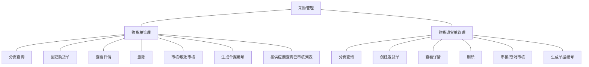
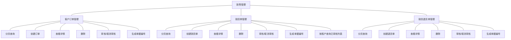
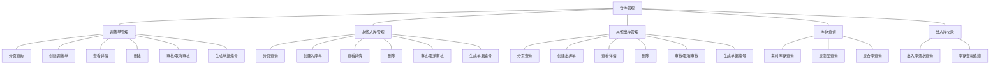
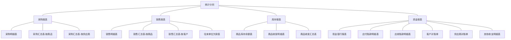
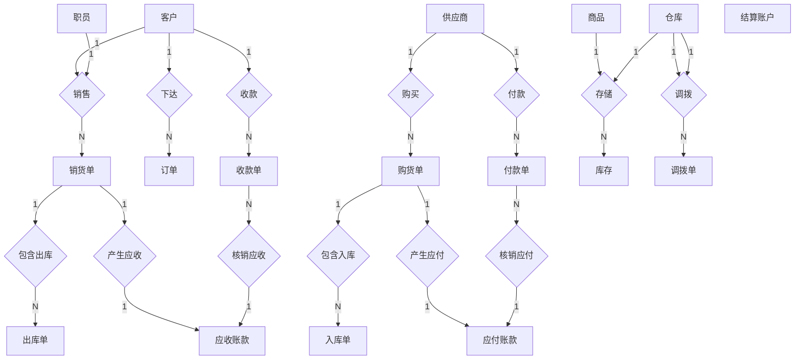

# 天津农学院 毕业设计

### 中文题目：基于SpringBoot和Vue的星络收银系统设计与实现

### 英文题目：Design and Implementation of StarNet Cashier System Based on SpringBoot and Vue

---

**学生姓名：** 刘 浩  
**二级学院：** 计算机与信息工程学院  
**系 别：** 计算机科学系  
**专业班级：** 2022级计算机科学与技术专业2班  
**指导教师：** 王东平  
**成绩评定：** _____________

**2026年5月**

---

## 目 录

1. [绪论](#1-绪论)
    - 1.1 [开发背景](#11-开发背景)
    - 1.2 [开发目的](#12-开发目的)
    - 1.3 [设计思路](#13-设计思路)
    - 1.4 [可行性分析](#14-可行性分析)
2. [系统总体说明](#2-系统总体说明)
    - 2.1 [使用环境](#21-使用环境)
    - 2.2 [系统主要功能](#22-系统主要功能)
    - 2.3 [系统流程设计](#23-系统流程设计)
    - 2.4 [系统主要特点](#24-系统主要特点)
3. [开发环境与相关技术](#3-开发环境与相关技术)
    - 3.1 [开发环境](#31-开发环境)
    - 3.2 [开发工具](#32-开发工具)
    - 3.3 [设计方法与技术](#33-设计方法与技术)
4. [系统设计要点](#4-系统设计要点)
    - 4.1 [数据库设计](#41-数据库设计)
    - 4.2 [系统的实现](#42-系统的实现)
    - 4.3 [系统功能测试](#43-系统功能测试)
5. [讨论](#5-讨论)
    - 5.1 [设计存在的问题](#51-设计存在的问题)
    - 5.2 [进一步改进设想](#52-进一步改进设想)
    - 5.3 [经验与体会](#53-经验与体会)

- [参考文献](#【参 考 文 献】)
- [致谢](#致谢)
- [附录1 相关英文文献](#附录1-相关英文文献)
- [附录2 英文文献中文译文](#附录2-英文文献中文译文)

---

## 摘 要

在零售行业数字化转型的浪潮中，收银环节的智能化与效率直接关系到商户的运营成本和顾客体验。传统收银方式及部分现有系统仍面临操作繁琐、高峰期效率低下、数据无法实时汇总分析等瓶颈，难以满足现代零售对敏捷运营和数据驱动决策的需求。针对上述问题，本文设计并实现了一款面向中小型零售场景的“星络”智能收银系统。系统采用前后端分离的B/S架构，后端基于SpringBoot框架构建RESTful API业务服务，负责核心业务逻辑、数据持久化及安全控制；前端基于Vue.js 3框架配合Element Plus UI组件库，构建响应式、组件化的用户交互界面；数据库选用MySQL，完成核心数据表的规范化设计与索引优化。系统主要实现了基础资料管理、采购管理、销售管理、仓库管理、资金管理和统计分析六大核心功能模块。在移动端实现上，基于Uni-App框架开发微信小程序，调用uni.scanCode() API实现条码和二维码扫描功能，支持从相机直接获取扫码结果，并通过后端接口实时查询商品信息，提升了移动端操作的便捷性和响应速度；支付模块设计了严谨的模拟支付状态流转逻辑，确保订单状态与支付记录的最终一致性。经过功能测试与性能测试，系统运行稳定，核心业务接口响应时间控制在200毫秒以内，扫码识别成功率在标准光照环境下达到95%以上，验证了基于SpringBoot和Vue的前后端分离架构在构建轻量级收银系统中的可行性与有效性。

**关键词：** 收银系统; SpringBoot; MySQL数据库; 条码识别

---

## ABSTRACT

In the wave of digital transformation of the retail industry, the intelligence and efficiency of the cashier link are directly related to the operating costs and customer experience of merchants. Traditional cashier methods and some existing systems still face bottlenecks such as cumbersome operations, low efficiency during peak hours, and inability to summarize and analyze data in real time, making it difficult to meet the needs of modern retail for agile operations and data-driven decision-making. To address these problems, this thesis designs and implements a "Xingluo" intelligent cashier system for small and medium-sized retail scenarios. The system adopts a front-end and back-end separation B/S architecture. The back-end builds RESTful API business services based on the SpringBoot framework, responsible for core business logic, data persistence and security control. The front-end builds a responsive, component-based user interaction interface based on the Vue.js 3 framework with the Element Plus UI component library. MySQL is selected as the database to standardize the design of core data tables and optimize indexes. The system mainly implements six core functional modules: basic data management, purchase management, sales management, warehouse management, financial management and statistical analysis. In mobile implementation, the WeChat mini program is developed based on Uni-App framework, calling uni.scanCode() API to realize barcode and QR code scanning functions, supporting direct acquisition of scanning results from camera, and real-time querying of product information through backend interfaces, which improves the convenience and response speed of mobile operations. The payment module designs a rigorous simulated payment state flow logic to ensure the final consistency of order status and payment records. After functional and performance testing, the system operates stably, with core business interface response times controlled within 200 milliseconds and a scanning recognition success rate of over 95% under standard lighting conditions, verifying the feasibility and effectiveness of the front-end and back-end separation architecture based on SpringBoot and Vue in building a lightweight cashier system. 

**Key words:** Cashier System; SpringBoot; MySQL database; Barcode Recognition

---

## 基于SpringBoot和Vue的星络收银系统设计与实现

#### 刘 浩

#### （天津农学院  计算机与信息工程学院）

---

### 1 绪论

在数字化浪潮席卷各行各业的当下，互联网技术与传统商业模式的深度融合已成为不可阻挡的趋势。零售行业作为国民经济的重要组成部分，正面临着消费市场升级与消费者需求多样化的双重挑战。传统零售店铺受限于管理方式、技术手段等因素，难以充分满足现代消费者对高效、便捷购物体验的需求，收银系统的智能化升级成为零售行业转型升级的关键方向[1]。

### 1.1 开发背景

随着社会经济的快速发展和大众对生活质量要求的提高，零售行业的信息化建设日益受到重视。零售信息化的历程经历了从简单的收银设备到集成化软件系统的持续演进。然而，传统收银方式及部分现有系统仍面临诸多瓶颈。一方面，操作流程繁琐，高峰时段顾客排队严重，人工录入商品信息不仅效率低下，而且容易出现错误，导致库存数据不准确和财务对账困难。另一方面，现金、刷卡、移动支付等多种支付方式无法统一处理，增加了收银员的培训成本和操作复杂度。更为关键的是，销售数据难以实时汇总分析，各门店或终端形成数据孤岛，无法为经营决策提供及时有效的数据支持。这些痛点表明，传统收银系统已难以满足现代零售对敏捷运营和数据驱动决策的需求，市场亟需一款操作便捷、功能集成、数据可视化的智能收银解决方案[1]。

目前国内基于SpringBoot和Vue的收银管理系统研究已取得一定进展。在技术实现上，多数研究采用Java语言搭配SpringBoot框架构建后端服务，利用其自动配置与快速开发特性简化开发流程；前端则多选用Vue框架，凭借组件化开发模式与响应式数据绑定能力，打造交互性强、界面美观的用户界面。数据库方面，MySQL凭借高性能与易用性成为存储商品信息、订单数据等的主流选择[2]。

国外零售信息化起步较早，大型商超的收银系统已深度整合了供应链管理、客户关系管理及高级商业智能分析，形成了完整的数字化生态。在技术架构层面，以微服务理念对复杂系统进行解耦，通过独立的服务协同工作，已成为提升系统弹性与可扩展性的重要趋势。同时，为追求极致效率与体验，探索物联网智能购物车、基于计算机视觉的自动商品识别等“无人化”收银方案也是前沿方向之一[3]。这些探索体现了技术赋能下，收银环节从“交易执行终端”向“智能数据采集与服务中心”演进的趋势。

综上，国内外学者与开发者针对收银系统项目进行了多元且深入的研究，为我们进一步了解收银系统的发展现状、技术开发等问题提供了坚实的理论支撑，也为我们后续的研究指明了清晰的方向。

### 1.2 开发目的

基于SpringBoot和Vue技术构建星络收银系统(StarNet Cashier System)，旨在为中小型零售商户提供高效、便捷、智能的企业资源管理一体化平台。系统采用前后端分离架构，包含Web端(erp-web)、移动端小程序(erp-app)和后端服务(erp-api)三大模块，整合基础资料管理、采购管理、销售管理、仓库管理、资金管理和统计分析等核心功能，帮助商户实现从传统手工管理向数字化、智能化管理的全面转变。具体而言，本系统的开发目的包括以下几个方面：

第一，针对传统零售企业管理分散、数据孤岛的痛点，设计一个以SpringBoot与Vue.js前后端分离架构为基础的一体化收银系统。该系统涵盖客户管理、供应商管理、商品管理、仓库管理、职员管理等基础资料模块，以及购货、销货、出入库、收付款等业务流程，通过统一的业务数据模型和流程引擎，实现采购、销售、库存、财务等业务环节的无缝衔接，显著提升企业运营效率和数据准确性。

第二，针对资金管理复杂、账务核对困难的现实问题，构建完善的资金管理体系。系统实现了应收账款、应付账款的自动化跟踪，支持收款单、付款单的核销功能，提供现金银行报表、往来对账单等多维度财务报表，将零散的交易信息转化为结构化的财务数据，为企业的资金管控和经营决策提供即时、准确的数据支持[4]。

第三，针对库存管理混乱、盘点效率低下的挑战，设计智能化的仓库管理模块。系统支持多仓库管理、库存调拨、其他出入库、盘点盈亏等功能，实时跟踪商品库存变化，结合最低/最高库存预警机制，帮助企业优化库存结构，降低库存成本，提升供应链管理水平。

第四，通过本项目的完整实践，深入掌握从需求分析、系统设计、模块编码到测试部署的全栈开发流程，探索“前后端分离+多端适配”这一现代Web架构在解决企业级收银实际问题中的有效性与技术实现细节，为中小型零售企业的数字化转型提供可参考的技术方案和实践案例。[4]。

此外，本系统的开发有助于提升中小商户的整体运营效率和管理水平，降低人工成本与差错率，优化客户和供应商的合作体验。通过精准的业务数据统计与分析，商户能够更好地把握采购动态、销售趋势和库存状况，实现精细化运营，提升市场竞争力。因此，开展基于SpringBoot和Vue的星络收银系统研究具有重要的现实意义和应用价值。

### 1.3 设计思路

本设计项目基于SpringBoot和Vue技术栈，构建了一个名为“星络收银系统”(StarNet Cashier System)的企业资源管理一体化平台，整合了SpringBoot后端框架、Vue前端框架、Uni-App移动端框架以及MySQL数据库，形成了一套高效、稳定且用户友好的企业级管理系统。

本系统的主要设计思路如下：

(1)整体风格

整体界面主要选用蓝色、白色等简洁专业的配色方案，营造现代、高效、可靠的使用氛围，符合企业级管理软件的专业定位。界面布局采用左侧导航菜单+右侧内容区的经典结构，便于用户快速定位功能模块。

(2)系统架构设计

系统采用模块化分层架构，按照业务功能划分为六大核心模块：

- 采购管理模块(bc)：实现购货单、购货退货单的创建、审核、入库等全流程管理
- 销售管理模块(bc)：实现客户订单、销货单、销货退货单的创建、审核、出库等全流程管理
- 资金管理模块(fc)：实现收款单、付款单、应收应付账款、收支记录等财务管理功能
- 统计分析模块(sc)：提供采购、销售、库存、资金等多维度报表分析
- 基础资料模块(uc)：管理客户、供应商、商品、仓库、职员、账户等企业基础数据
- 仓库管理模块(wc)：实现调拨单、其他出入库、库存查询、出入库记录等仓储管理功能

(3)基础资料管理

支持客户、供应商、商品、仓库、职员、结算账户等基础信息的增删改查操作。商品管理支持条码、规格、多级价格策略(零售价、批发价、VIP价)、库存预警等功能。支持商品分类、客户分类、供应商分类的多级树形结构管理。支持计量单位、结算方式等字典数据的灵活配置。

(4)采购与销售管理

采购管理实现从购货单创建、审核、入库到付款的完整业务流程，支持分期付款和欠款管理。销售管理实现从客户订单、销货单、审核、出库到收款的完整业务流程，支持收款状态跟踪。两大业务模块均支持单据审核机制，确保业务数据的准确性和合规性。

(5)仓库与库存管理

实现多仓库管理模式，支持商品在不同仓库间的调拨操作。提供其他入库(盘盈)、其他出库(盘亏)功能，满足特殊业务场景需求。实时跟踪库存变化，自动生成出入库流水记录，支持库存余额查询和历史追溯。结合最低/最高库存预警，帮助企业优化库存结构。

(6)资金管理

构建完善的应收应付账款体系，自动跟踪与客户、供应商的往来账务。收款单支持核销多张销货单，付款单支持核销多张购货单，实现精细化的账务管理。提供现金银行报表、客户对账单、供应商对账单、其他收支明细表等财务报表。所有资金变动均记录账户流水，确保财务数据的可追溯性。

(7)数据统计与分析

实现采购、销售、库存、资金等多维度的聚合分析。提供采购明细表、销售汇总表、商品库存余额表、商品收发明细表、应付/应收账款明细表等标准报表。通过表格和图表相结合的方式直观呈现业务数据，为经营决策提供数据支持。

### 1.4 可行性分析

#### 1.4.1 技术可行性

SpringBoot框架，作为Spring生态中的一员，以其自动配置、Actuator监控以及与Spring全家桶的无缝集成等特性，极大地简化了开发流程，大大提高了开发效率。它可以迅速地创建一个单独的Spring应用程序，并且可以将其直接嵌入到诸如Tomcat之类的服务器中。提供生产就绪功能，特别适合于企业级应用的快速开发。在本系统中，SpringBoot负责构建RESTful API接口，处理业务逻辑、数据持久化和安全控制，通过MyBatis Plus实现与MySQL数据库的高效交互，支持复杂的业务查询和事务管理。

Vue框架，作为一个渐进式的用户界面构建框架，拥有响应式数据绑定、组件化开发、丰富的指令和模板语法等显著优势。其核心库的轻量级特性，让Vue能够很好地创建大型的应用程序。Vue的渐进式特性还允许开发者根据项目的具体需求灵活选择功能模块，从而易于上手和集成[1]。在本系统中，Vue用于构建Web端(erp-web)的管理界面，采用Element UI组件库打造专业的企业级操作界面，同时通过Uni-App框架实现移动端小程序(erp-app)，一套代码多端运行，提升开发效率。

MySQL是一种开放源码的关系型数据库，它具有性能好，可靠性高，使用方便，灵活等特点。该系统提供了多个不同的存储引擎供开发人员选择。MySQL拥有丰富的SQL语句，并具有可视化的管理功能，为用户提供了方便快捷的数据处理方法。在长期的发展和广泛应用中，MySQL也证明了其卓越的稳定性和安全性[2]。本系统设计了37张数据表，涵盖基础资料、业务流程、财务资金、库存管理等各个方面，通过规范化的数据库设计和合理的索引优化，确保数据存储的完整性和查询效率。

将SpringBoot框架、Vue框架和MySQL数据库相结合，不仅在技术上是完全可行的，而且能够满足各种复杂业务需求。这一技术栈提供了一套强大的工具链，从后端服务的开发到前端界面的构建，再到数据的存储和管理，都能得到全面而有效的支持[1]。因此，这一组合是实现高效、可靠、灵活的系统开发的理想选择，尤其适合于需要快速迭代和扩展的企业级应用。

#### 1.4.2 操作可行性

SpringBoot框架凭借其自动配置和快速启动的特性，显著简化了后端开发的复杂性。这个功能使开发人员可以专注于实现业务逻辑，而不需要花费太多的时间在复杂的配置工作上。通过这种方式，开发过程的难度得以降低，开发效率得到显著提升，从而使得系统能够迅速适应需求的变化[2]。与此同时，Vue框架的组件化开发模式和响应式数据绑定机制极大地提升了前端开发的灵活性和效率。开发人员可以将一个复杂的界面分割成具有自身状态与逻辑的多个独立的构件，这样既可以提高代码的可维护性，又可以增加代码的重用性。Vue框架同样提供了丰富的指令和模板语法，这些工具进一步简化了对DOM的操作，降低了前端开发的学习难度[1]。

在用户体验方面，系统采用直观的图形化界面设计，左侧导航菜单清晰展示各功能模块，右侧内容区以表格、表单等形式呈现业务数据，操作流程符合企业管理习惯。系统支持单据审核机制，确保业务操作的规范性和数据的准确性。多端适配的设计(Web端+移动端)让用户可以在不同场景下便捷地使用系统，提升了系统的易用性和实用性[4]。

此外，Spring Boot、Vue和MySQL都拥有庞大的社区支持和详尽的文档资源，为开发者提供了丰富的学习资料和问题解决方案。这不仅加快了问题解决的速度，也降低了操作的难度和风险[2]。

#### 1.4.3 经济可行性

选用SpringBoot框架、Vue框架以及MySQL数据库作为技术栈的基石，为开发者带来了显著的经济效益。这些技术栈的开源特性意味着开发者可以免费访问和利用它们的源代码，从而避免了昂贵的商业软件许可费用。开源社区的活跃贡献，提供了详尽的文档、实用的教程和丰富的插件资源，极大地降低了学习曲线和应用难度，使得开发者能够以更高的效率完成开发任务[2]。此外，SpringBoot和Vue框架的广泛使用和成熟度，确保了市场上存在大量具备相关技能的开发者和专业人才。这种人才的丰富性不仅降低了招聘和培训新员工的成本，而且提高了项目开发和维护的灵活性。企业能够更轻松地组建或找到经验丰富的开发团队，从而缩短项目开发周期并提升开发效率。

MySQL数据库具有高效率、高稳定的特点，能够很好地处理海量数据以及复杂的查询。与其他商用数据库比较，MySQL在部署和维护方面的成本更低，且易于扩展和集成。MySQL社区版提供的功能足以满足大多数中小企业的业务需求，无需额外购买昂贵的附加服务。综合来看，利用SpringBoot、Vue和MySQL开发系统，这不但可以直接减少软件的开发与维护费用，而且还可以提高开发效率和缩短项目周期来间接节省开支。这些经济上的优势使得这一技术组合成为众多企业和开发团队的首选方案，为他们提供了强大的竞争力和灵活性[5]。

---

## 2 系统总体说明

### 2.1 使用环境

本系统的使用环境配置如下：

**服务端运行环境：**

- 操作系统：Windows 10/11、Linux、macOS
- JDK版本：JDK 1.8及以上
- 数据库：MySQL 8.0及以上
- 应用服务器：Tomcat 9.0（内嵌于Spring Boot）
- 端口：9090

**前端运行环境：**

- Web端：Chrome、Edge、Firefox等现代浏览器
- 移动端：微信客户端（支持微信小程序）

### 2.2 系统主要功能

本星络收银系统采用模块化设计，涵盖企业资源管理的各个核心环节。系统包含基础资料管理、采购管理、销售管理、仓库管理、资金管理和统计分析六大功能模块，通过前后端分离架构（Web端erp-web+移动端erp-app+后端服务erp-api）实现多端协同工作。系统功能结构图见图1。

*图1 系统功能结构图*

#### 2.2.1 基础资料管理功能

基础资料模块负责管理企业运营所需的核心基础数据，包括：

**（1）客户管理**：维护客户基本信息、联系方式、客户分类和等级，设置期初应收款和预收款。支持客户联系人管理，记录多个联系人的手机、电话、邮箱等信息。

**（2）供应商管理**：维护供应商基本信息、联系方式、供应商分类，设置增值税税率、期初应付款和预付款。支持供应商联系人管理。

**（3）商品管理**：维护商品基本信息，包括商品编码、名称、条码、规格、分类、计量单位等。支持多级价格策略（零售价、批发价、VIP价格、折扣率），设置预计采购价。提供库存预警功能，可设置最低库存和最高库存阈值。

**（4）仓库管理**：维护仓库基本信息，支持多仓库管理模式。

**（5）职员管理**：维护企业职员信息，用于销售单等业务单据的销售人关联。

**（6）结算账户管理**：维护企业的银行账户、现金账户等结算账户，记录期初余额和当前余额，支持账户类别管理（现金、银行存款等）。

**（7）分类管理**：支持客户分类、供应商分类、商品分类、支出分类、收入分类的多级树形结构管理。

**（8）字典管理**：管理系统字典数据，包括计量单位、结算方式、客户等级、账户类别等字典项。

**（9）系统设置**：配置系统参数，包括公司名称、联系方式、货币单位、数量精度、价格精度、存货计价方法、是否检查负库存、启用时间等。

**（10）用户管理**：管理系统用户账号，包括用户名、密码（BCrypt加密）、真实姓名、手机号等，支持用户启用/停用、密码重置等操作。

**（11）日志管理**：记录用户登录、新增用户、启用/停用用户、重置密码等重要操作日志，便于审计和问题追溯。

基础资料管理的功能结构图如图1所示。

*图1 基础资料管理功能结构图*

```mermaid
graph TB
    A[基础资料管理] --- B[客户管理]
    A --- C[供应商管理]
    A --- D[商品管理]
    A --- E[仓库管理]
    A --- F[职员管理]
    A --- G[结算账户管理]
    A --- H[分类管理]
    A --- I[字典管理]
    A --- J[系统设置]
    A --- K[用户管理]
    A --- L[日志管理]
    
    B --- B1[分页查询]
    B --- B2[新增/编辑]
    B --- B3[查看详情]
    B --- B4[删除]
    B --- B5[启用/停用]
    B --- B6[联系人管理]
    
    C --- C1[分页查询]
    C --- C2[新增/编辑]
    C --- C3[查看详情]
    C --- C4[删除]
    C --- C5[启用/停用]
    C --- C6[导入Excel]
    C --- C7[导出Excel]
    
    D --- D1[分页查询]
    D --- D2[新增/编辑]
    D --- D3[查看详情]
    D --- D4[删除]
    D --- D5[启用/停用]
    
    E --- E1[分页查询]
    E --- E2[新增/编辑]
    E --- E3[查看详情]
    E --- E4[删除]
    E --- E5[启用/停用]
    
    F --- F1[分页查询]
    F --- F2[新增/编辑]
    F --- F3[查看详情]
    F --- F4[删除]
    F --- F5[启用/停用]
    
    G --- G1[列表查询]
    G --- G2[新增/编辑]
    G --- G3[查看详情]
    G --- G4[删除]
    
    H --- H1[客户分类]
    H --- H2[供应商分类]
    H --- H3[商品分类]
    H --- H4[支出分类]
    H --- H5[收入分类]
    
    I --- I1[计量单位]
    I --- I2[结算方式]
    I --- I3[客户等级]
    I --- I4[账户类别]
    
    J --- J1[获取系统配置]
    J --- J2[设置系统配置]
    
    K --- K1[分页查询]
    K --- K2[新增用户]
    K --- K3[启用/停用]
    K --- K4[重置密码]
    
    L --- L1[操作日志查询]
```



#### 2.2.2 采购管理功能

采购管理模块实现从供应商采购商品的完整业务流程，包括：

**（1）购货单管理**：创建购货单，选择供应商，添加采购商品明细，设置优惠率和优惠金额。支持分期付款和欠款管理，记录本次付款金额和本次欠款。购货单需要审核后才能生效，审核后自动生成入库单和应付账款记录。

**（2）购货退货单管理**：处理采购退货业务，创建购货退货单，减少应付账款。退货单审核后自动生成出库单和应付账款减少记录。

采购管理功能的功能结构图如图2所示。

*图2 采购管理功能结构图*



#### 2.2.3 销售管理功能

销售管理模块实现向客户销售商品的完整业务流程，包括：

**（1）客户订单管理**：创建客户订货单或退货单，设置交货日期，添加商品明细。订单需要审核后才能生效。

**（2）销货单管理**：创建销货单，选择客户和销售人，填写联系人信息和地址。支持收款状态跟踪（未收款、部分收款、全部收款），记录本次收款金额和本次欠款。销货单审核后自动生成出库单和应收账款记录。

**（3）销货退货单管理**：处理销售退货业务，创建销货退货单，减少应收账款。退货单审核后自动生成入库单和应收账款减少记录。

销售管理功能的功能结构图如图3所示。

*图3 销售管理功能结构图*



#### 2.2.4 仓库管理功能

仓库管理模块实现商品库存的全面管理，包括：

**（1）调拨单管理**：实现商品在不同仓库之间的调拨操作。调拨单包含调出仓库、调入仓库和商品明细，需要审核后才能生效。审核后自动生成调拨出库记录和调拨入库记录，更新两个仓库的库存。

**（2）其他入库管理**：处理非采购类的入库业务，包括盘盈和其他入库。入库单审核后增加商品库存，并生成出入库流水记录。

**（3）其他出库管理**：处理非销售类的出库业务，包括盘亏和其他出库。出库单审核后减少商品库存，并生成出入库流水记录。

**（4）库存查询**：实时查询各仓库中商品的库存数量、成本单价和库存总成本。支持按商品、仓库等多维度查询库存信息。

**（5）出入库记录**：记录所有库存变动的流水账，包括采购入库、销售出库、调拨、盘盈盘亏等。每条记录包含变动前后的库存数量，便于追溯历史库存变化。

仓库管理功能的功能结构图如图4所示。

*图4 仓库管理功能结构图*



#### 2.2.5 资金管理功能

资金管理模块实现企业财务的全面管理，包括：

**（1）收款单管理**：记录从客户收取的款项，支持核销多张销货单的应收款。可设置整单折扣、预收款，记录已核销金额和未核销金额。收款后自动生成账户流水记录和应收账款减少记录。

**（2）付款单管理**：记录向供应商支付的款项，支持核销多张购货单的应付款。可设置整单折扣、预付款，记录已核销金额和未核销金额。付款后自动生成账户流水记录和应付账款减少记录。

**（3）应收账款管理**：自动跟踪与每个客户的往来账务，记录销货增加的应收款和收款减少的应收款。提供客户对账单，清晰展示与每个客户的应收款变动情况。

**（4）应付账款管理**：自动跟踪与每个供应商的往来账务，记录购货增加的应付款和付款减少的应付款。提供供应商对账单，清晰展示与每个供应商的应付款变动情况。

**（5）其他收入管理**：记录企业的其他收入（如利息收入、退税等），可以关联客户。收入后自动生成账户流水记录和收支分类记录。

**（6）其他支出管理**：记录企业的其他支出（如房租、水电费等），可以关联供应商。支出后自动生成账户流水记录和收支分类记录。

**（7）现金银行报表**：展示各结算账户的资金流水，记录每笔业务的账户变动情况，包括业务类型、结算方式、结算号、操作后余额等信息。

资金管理功能的功能结构图如图5所示。

*图5 资金管理功能结构图*

```mermaid
graph TB
    A[资金管理] --- B[收款单管理]
    A --- C[付款单管理]
    A --- D[应收账款管理]
    A --- E[应付账款管理]
    A --- F[其他收入管理]
    A --- G[其他支出管理]
    A --- H[现金银行报表]
    
    B --- B1[分页查询]
    B --- B2[创建收款单]
    B --- B3[查看详情]
    B --- B4[删除]
    B --- B5[核销应收款]
    B --- B6[生成单据编号]
    
    C --- C1[分页查询]
    C --- C2[创建付款单]
    C --- C3[查看详情]
    C --- C4[删除]
    C --- C5[核销应付款]
    C --- C6[生成单据编号]
    
    D --- D1[应收款明细]
    D --- D2[客户对账单]
    D --- D3[应收款跟踪]
    
    E --- E1[应付款明细]
    E --- E2[供应商对账单]
    E --- E3[应付款跟踪]
    
    F --- F1[分页查询]
    F --- F2[创建收入单]
    F --- F3[查看详情]
    F --- F4[删除]
    F --- F5[生成单据编号]
    
    G --- G1[分页查询]
    G --- G2[创建支出单]
    G --- G3[查看详情]
    G --- G4[删除]
    G --- G5[生成单据编号]
    
    H --- H1[账户流水查询]
    H --- H2[余额变动记录]
```



#### 2.2.6 统计分析功能

统计分析模块提供多维度的业务数据分析报表，包括：

**（1）采购报表**：

- 采购明细表：展示每笔采购业务的详细信息
- 采购汇总表（按商品）：按商品维度统计采购数量和金额
- 采购汇总表（按供应商）：按供应商维度统计采购情况

**（2）销售报表**：

- 销售明细表：展示每笔销售业务的详细信息
- 销售汇总表（按商品）：按商品维度统计销售数量和金额
- 销售汇总表（按客户）：按客户维度统计销售情况
- 往来单位欠款表：展示客户和供应商的欠款情况

**（3）库存报表**：

- 商品库存余额表：展示各商品的当前库存数量和成本
- 商品收发明细表：展示商品的出入库流水记录
- 商品收发汇总表：按商品维度统计出入库情况

**（4）资金报表**：

- 现金银行报表：展示账户资金流水
- 应付账款明细表：展示与供应商的应付款变动明细
- 应收账款明细表：展示与客户的应收款变动明细
- 客户对账单：展示与特定客户的往来账务
- 供应商对账单：展示与特定供应商的往来账务
- 其他收支明细表：展示其他收入和支出的明细

统计分析功能的功能结构图如图6所示。

*图6 统计分析功能结构图*



### 2.3 系统流程设计

#### 2.3.1 用户登录流程

用户进入系统后，首先需要进行登录验证。在登录界面输入用户名和密码，系统会通过BCrypt算法验证密码是否正确。如果验证通过，系统生成JWT Token并返回给前端，用户成功登录进入系统主页；如果用户名或密码输入错误，系统会提示错误信息，用户需重新输入。登录流程图如图5所示。

*图5 用户登录流程图*

#### 2.3.2 采购业务流程

采购业务流程如下：管理员登录系统后，进入采购管理模块，创建购货单。选择供应商，添加采购商品明细，设置单价、数量、优惠率等信息。提交购货单后，需要进行审核。审核通过后，系统自动生成入库单，增加商品库存，同时生成应付账款记录。后续可以通过付款单进行付款，核销应付账款。采购业务流程图如图6所示。

*图6 采购业务流程图*

#### 2.3.3 销售业务流程

销售业务流程如下：管理员登录系统后，进入销售管理模块，创建销货单。选择客户和销售人，填写联系人信息和地址，添加销售商品明细。提交销货单后，需要进行审核。审核通过后，系统自动生成出库单，减少商品库存，同时生成应收账款记录。后续可以通过收款单进行收款，核销应收账款。销售业务流程图如图7所示。

*图7 销售业务流程图*

#### 2.3.4 库存调拨流程

库存调拨流程如下：管理员创建调拨单，选择调出仓库和调入仓库，添加调拨商品明细。提交调拨单后，需要审核。审核通过后，系统自动生成调拨出库记录（减少调出仓库库存）和调拨入库记录（增加调入仓库库存），完成商品在仓库间的转移。库存调拨流程图如图8所示。

*图8 库存调拨流程图*

### 2.4 系统主要特点

**（1）模块化设计：**

系统采用模块化分层架构，按照业务功能划分为基础资料、采购、销售、仓库、资金、统计分析六大模块。每个模块职责清晰，便于开发维护和功能扩展。

**（2）业务流程规范：**

系统实现了完整的业务流程管理，包括单据创建、审核、生效等环节。采购、销售、调拨等业务单据都需要审核后才能生效，确保业务数据的准确性和合规性。

**（3）财务自动化：**

系统实现了应收应付账款的自动化跟踪，业务单据审核后自动生成相应的财务记录。收款单和付款单支持核销功能，可以核销多张业务单据，实现精细化的账务管理。

**（4）移动端扫码功能：**

基于Uni-App框架开发微信小程序，调用uni.scanCode() API实现条码和二维码扫描功能。支持onlyFromCamera参数控制仅从相机获取扫码结果，scanType参数支持barCode和qrCode两种类型。扫码成功后自动调用后端/product/page接口查询商品信息，无需将图像传输到服务器，响应更快。在category.vue和cart.vue等页面中实现了完整的扫码加购业务流程。

**（5）多维度报表分析：**

系统提供采购、销售、库存、资金等多维度的统计分析报表，包括明细表、汇总表、对账单等。通过表格形式直观呈现业务数据，为企业经营决策提供数据支持。

**（6）前后端分离架构：**

采用前后端分离架构，Web端(erp-web)使用Vue.js + Element UI，移动端(erp-app)使用Uni-App，后端(erp-api)使用Spring Boot + MyBatis。前后端通过RESTful API进行数据交互，结构清晰，便于开发协作与后期维护。

---

## 3 开发环境与相关技术

### 3.1 开发环境

本系统的开发环境配置如下：

**硬件环境：**

- 处理器：Intel Core i5-11400H @ 2.70GHz
- 内存：16.0 GB RAM
- 硬盘：SSD固态硬盘

**软件环境：**

- 操作系统：Windows 10/11 64位
- JDK版本：JDK 1.8
- 数据库：MySQL 8.0.12
- Node.js：Node.js 18.x
- Maven：Maven 3.6+

**服务端配置：**

- 应用服务器：Spring Boot内嵌Tomcat 9.0
- 服务端口：9090
- 数据库连接池：Druid
- 开发模式：dev（支持热部署）

### 3.2 开发工具

本系统使用的开发工具如下：

**后端开发工具：**

- IntelliJ IDEA Ultimate 2026.1.0：Java IDE，用于后端服务开发
- DBeaver 25.3.3：数据库管理工具，用于MySQL数据库设计和查询
- Maven：项目构建和依赖管理工具

**前端开发工具：**

- Visual Studio Code：Web端前端开发编辑器
- HBuilder X 5.07：Uni-App移动端开发IDE
- 微信开发者工具 2.01：微信小程序调试和预览

**版本控制：**

- Git：代码版本控制系统

**框架与技术栈：**

- 后端：Spring Boot 2.3.2.RELEASE、MyBatis、MyBatis-Plus、Spring Security
- 前端Web：Vue.js 2.5.22、Vue Router 3.0.1、Element UI 2.4.5、Axios 0.18.0、ECharts 4.1.0
- 前端移动：Uni-App、Vuex 4.1.0
- 数据库：MySQL 8.0.12
- 其他：Lombok 1.18.30、JWT (jjwt 0.6.0)、Druid连接池

开发软件截图如图8所示。

*图8 开发软件截图*

### 3.3 设计方法与技术

#### 3.3.1 系统需求分析

在软件开发的整个流程中，系统需求分析占据着极为关键的位置。它不仅清晰地界定了目标系统应当实现的功能特性、性能指标、安全标准、用户交互界面以及各种非功能性需求，而且通过深入剖析业务需求、用户需求以及运行环境，将模糊的概念具体化，并转化为可度量的系统规格。

本系统面向中小型零售企业，确定了管理员一种主要角色，通过用例图的方式，详细描述了该角色所具有的功能内容。管理员可以登录系统，进行基础资料管理（客户、供应商、商品、仓库、职员、账户等）、采购管理（购货单、购货退货单）、销售管理（客户订单、销货单、销货退货单）、仓库管理（调拨单、其他出入库、库存查询）、资金管理（收款单、付款单、应收应付账款、收支记录）和统计分析（采购/销售/库存/资金报表）等操作。管理员的用例图如图9所示。

*图9 管理员用例图*

移动端小程序面向门店操作人员，提供商品浏览、扫码加购、采购清单管理等功能，支持通过uni.scanCode() API调用手机摄像头扫描商品条码，快速添加商品到采购清单。

#### 3.3.2 开发技术介绍

**（1）Java语言**

Java语言以其跨平台的特性而闻名，秉承“一次编写，到处运行”的理念，极大地简化了开发流程。Java虚拟机（JVM）作为桥梁，保证了代码在各种环境下的统一性和稳定性[5]。Java不仅拥有一个庞大的标准库集合，还支持丰富的第三方库，这些库几乎覆盖了软件开发的各个方面，包括网络通信、数据库操作、图形用户界面以及Web开发等。安全性是Java设计中的一个核心要素，从类加载器到安全管理器，再到字节码校验，Java内置了多重安全机制，有效抵御了恶意代码的攻击。

**（2）Spring Boot框架**

通过使用SpringBoot框架，可以在很大程度上提升软件的开发效率。SpringBoot的自动化配置能力使Spring程序的最初构建和开发过程变得更加简单[6]。SpringBoot整合了很多常见的第三方类库，比如数据库连接池、缓存方案、消息队列等，为开发者提供了即插即用的功能。这些集成不仅简化了配置流程，还确保了组件之间的兼容性和稳定性。此外，框架还提供了丰富的插件和工具，如SpringBoot CLI、Spring Initializr等，进一步提升了开发效率。

**（3）Vue框架**

Vue.js凭借其轻量级和渐进式的特性，为前端开发领域带来了高效和灵活的解决方案。它的核心库专注于视图层的构建，设计上易于上手，允许开发者根据需要逐步集成进其生态系统中的其他工具[7]。Vue的双向数据绑定机制极大地简化了数据与视图之间的同步工作，开发者只需专注于数据的更新，Vue会自动处理DOM的更新。Vue的组件化设计思想进一步促进了代码的复用，使得开发者能够通过组合独立且可复用的组件来构建出结构清晰、易于维护的应用程序。

**（4）MyBatis框架**

MyBatis是一款优秀的持久层框架，它支持自定义SQL、存储过程以及高级映射。MyBatis避免了几乎所有的JDBC代码和手动设置参数以及获取结果集的操作[^8]。MyBatis可以通过简单的XML或注解来配置和映射原始类型、接口和Java POJO为数据库中的记录。在本系统中，MyBatis负责处理后端与MySQL数据库之间的数据交互，简化了数据库操作的开发工作量。

**（5）MySQL数据库**

MySQL是一种具有优异性能和稳定性的开放源码关系数据库管理系统，以用户友好性而闻名。在软件开发中，MySQL能够高效地管理大量数据，执行复杂的查询，确保数据的快速存取，从而增强系统的性能。它提供了强大的数据完整性和安全特性，包括事务处理、权限控制和数据备份与恢复，确保数据的准确性和安全性，避免数据丢失和未授权访问，为系统提供稳固的数据支撑。此外，MySQL的兼容性极佳，可以轻松与多种编程语言和框架集成，便于开发和部署。总的来说，MySQL为系统开发提供了高性能、高可靠性和易用性等多重优势，其开源特性、强大的数据管理功能、多样化的存储引擎选择和便捷管理工具使其成为现代软件开发中不可或缺的一部分。

**（6）B/S架构**

在系统开发过程中，采用了B/S架构（Browser/Server，即浏览器/服务器架构），具备多方面的显著优势。B/S架构支持跨平台操作，使得用户无需安装专门的客户端软件，只需通过浏览器即可访问Web应用，降低了用户的使用门槛，提高了系统的可访问性和可维护性[^10]。此外，基于B/S架构的系统展现了卓越的可扩展性和升级能力，随着业务需求的变化，系统可以实现无缝的功能扩展和性能提升。

---

## 4 系统设计要点

### 4.1 数据库设计

#### 4.1.1 数据库E-R图设计

实体-关系图(E-R图)是数据库设计的核心工具。在实体-关系图中，实体以矩形框的形式呈现，这些框内包含了实体的名称及其特有的属性。属性被显示为椭圆，并由线连接到其所属的实体。关系是联系实体之间互动的纽带，用线将关联的实体联系起来。E-R图的使用，使得数据库设计者能够以一种直观的方式规划和构建数据结构，有效地连接了开发人员、分析师和管理层，促进了团队成员之间对数据库架构的共同理解。

本系统共设计了37张数据表，涵盖基础资料、业务流程、财务资金、库存管理等各个方面。主要实体包括客户、供应商、商品、仓库、职员、结算账户、购货单、销售单、收款单、付款单、调拨单等。系统总体E-R图如图11所示。

*图11 系统总体E-R图*



**实体间联系说明：**

1. **供应商 - 购买 - 购货单** (1:N)
2. **客户 - 下达 - 订单** (1:N)
3. **客户/职员 - 销售 - 销货单** (1:N)
4. **购货单 - 产生应付 - 应付账款** (1:1)
5. **销货单 - 产生应收 - 应收账款** (1:1)
6. **客户 - 收款 - 收款单** (1:N)
7. **供应商 - 付款 - 付款单** (1:N)
8. **收款单 - 核销应收 - 应收账款** (N:1)
9. **付款单 - 核销应付 - 应付账款** (N:1)
10. **购货单 - 包含入库 - 入库单** (1:N)
11. **销货单 - 包含出库 - 出库单** (1:N)
12. **商品/仓库 - 存储 - 库存** (1:N)
13. **仓库 - 调拨 - 调拨单 - 仓库** (M:N)

#### 4.1.2 数据库表结构设计

数据库表的设计构成了构建数据库系统的基础，其核心在于依据业务需求和数据模型来精心规划表结构及其相互之间的关系。在确定了实体属性之后，定义表与表之间的关系是重要步骤。对表格进行标准化是保证数据质量的重要环节，标准化可以有效消除数据的重复，确保数据的完整与一致。通过遵守第一范式、第二范式、第三范式等标准化原理，可有效降低数据存储中的冗余信息，提升数据库的运行效率与可靠性。 本系统主要数据表如下：

**(1) 客户表(uc_customer)**

存储客户基本信息，包括客户编码、名称、分类、等级、期初应收款、期初预收款等。

**(2) 供应商表(uc_supplier)**

存储供应商基本信息，包括供应商编码、名称、分类、增值税税率、期初应付款、期初预付款等。

**(3) 商品表(uc_product)**

存储商品基本信息，包括商品编码、名称、条码、规格、分类、计量单位、零售价、批发价、VIP价格、折扣率、预计采购价、最低库存、最高库存等。

**(4) 仓库表(uc_warehouse)**

存储仓库基本信息，包括仓库编码、名称、启用状态等。

**(5) 职员表(uc_employee)**

存储企业职员信息，包括职员编码、名称、启用状态等。

**(6) 结算账户表(uc_settlement_account)**

存储结算账户信息，包括账户编号、名称、期初余额、当前余额、账户类别等。

**(7) 客户订单表(bc_order)**

存储客户订货和退货订单，包括单据日期、交货日期、单据编号、业务类型(订货/退货)、客户ID、总金额、优惠后金额、制单人、审核人、审核状态等。

**(8) 购货单表(bc_purchase)**

存储采购和采购退货单，包括供应商ID、类型(采购/退货)、单据日期、单据编号、付款状态、数量、折扣额、购货金额、优惠率、优惠金额、优惠后金额、本次付款金额、欠款金额、制单人、审核人、审核状态等。

**(9) 销售单表(bc_sale)**

存储销货和销售退货单，包括类型(销货/退货)、单据日期、单据编号、客户ID、销售人ID、联系人、地址、电话、数量、折扣额、金额、优惠率、优惠金额、优惠后金额、客户费用、本次收款金额、欠款金额、收款状态、制单人、审核人、审核状态等。

**(10) 收款单表(fc_collection)**

存储收款单信息，包括单据日期、单据编号、客户ID、收款金额、单据金额、整单折扣、已核销金额、未核销金额、本次核销金额、预收款、制单人等。

**(11) 付款单表(fc_payment)**

存储付款单信息，包括单据日期、单据编号、供应商ID、付款金额、单据金额、整单折扣、已核销金额、未核销金额、本次核销金额、预付款、制单人等。

**(12) 应收账款记录表(fc_receivable)**

跟踪与客户的应收款变动，包括客户ID、单据日期、业务类型(销货/退货/收款)、业务ID、增加应收款金额、支付应收款金额等。

**(13) 应付账款记录表(fc_payable)**

跟踪与供应商的应付款变动，包括供应商ID、单据日期、业务类型(采购/退货/付款)、业务ID、增加应付款金额、支付应付款金额等。

**(14) 调拨单表(wc_transfer)**

存储仓库调拨单，包括单据日期、单据编号、数量、审核状态、制单人、审核人等。

**(15) 入库单表(wc_store)**

存储其他入库单(盘盈/其他入库)，包括单据日期、单据编号、类型、供应商ID、入库金额、数量、制单人等。

**(16) 出库单表(wc_checkout)**

存储其他出库单(盘亏/其他出库)，包括单据日期、单据编号、类型、客户ID、出库成本、数量、制单人等。

**(17) 单据商品明细表(wc_issue_product)**

存储各类业务单据的商品明细，包括单据日期、业务类型、业务ID、商品ID、仓库ID、数量、单价、折扣率、折扣额、金额等。这是系统的核心关联表，通过businessType和businessId可以追溯到具体的业务单据。

**(18) 库存商品表(wc_stock)**

存储各仓库中商品的实时库存，包括商品ID、仓库ID、数量、单价、成本等。按“商品+仓库”维度存储库存信息。

**(19) 出入库记录表(wc_stock_record)**

记录所有库存变动的流水账，包括单据日期、业务类型、业务ID、商品ID、仓库ID、数量(正数入库/负数出库)、出入库类型、当前数量、单价、金额等。

**(20) 用户表(uc_user)**

存储系统用户账号，包括用户名、手机号、密码(BCrypt加密)、真实姓名、启用状态、删除状态等。

**(21) 类别表(rc_category)**

存储各种分类信息，支持树形结构，包括类型(客户/供应商/商品/支出/收入)、父ID、名称、排序号等。

**(22) 字典表(rc_dict)和字典项表(rc_dict_item)**

存储系统字典数据，包括计量单位、结算方式、客户等级、账户类别等。

**(23) 系统日志表(rc_log)**

记录用户操作日志，包括日志类型、用户ID、用户名、操作内容等。

**(24) 菜单表(rc_menu)**

存储系统菜单配置，支持树形结构，包括父ID、图标、标题、路径、排序号等。

### 4.2 系统的实现

#### 4.2.1 登录页面

用户进入系统后，首先看到的是登录页面。登录页面提供了系统身份验证的核心功能，用户需输入用户名和密码。系统采用BCrypt算法对密码进行加密存储和验证，确保用户信息安全。验证通过后，后端生成JWT Token并返回给前端，前端将Token存储在sessionStorage中，后续请求携带Token进行身份认证。登录页面采用简洁的设计风格，突出核心功能，提升用户体验。登录页面如图15所示。

*图15 登录页面*

核心代码：

```java
/**
 * 用户登录控制器
 */
@PostMapping("/login")
public Result login() {
    return doAction(CUserLogin.class);
}
```

```java
/**
 * 用户登录业务逻辑
 */
@Command
public class CUserLogin extends BaseCommand {

    @Autowired
    private UserService userService;
    @Autowired
    private BCryptPasswordEncoder encoder;
    @Autowired
    private JwtUtil jwtUtil;
    @Autowired
    private LogService logService;

    /** 登录名 */
    private @Param(required = true) String loginName;
    /** 密码 */
    private @Param(required = true) String password;

    @Override
    protected void doCommand() throws Exception {
        // 根据登录名查询用户
        User user = userService.findByLoginName(loginName);
        Assert.notNull(user, "登录名为【" + loginName + "】的用户不存在！");

        // 使用BCrypt验证密码
        if (!encoder.matches(password, user.getPassword())) {
            throw new BizException("密码不正确！");
        }

        // 生成JWT令牌
        JSONArray roles = new JSONArray();
        roles.add("admin");
        String token = jwtUtil.createJwt(
            user.getId(), 
            user.getUsername(), 
            roles.toJSONString()
        );

        // 记录登录日志
        logService.logUserLogin(user.getUsername());

        // 返回Token
        data.put("token", token);
    }
}
```

#### 4.2.2 商品管理页面

// 基础资料管理模块提供全面的企业基础数据管理功能，包括客户管理、供应商管理、商品管理、仓库管理、职员管理、结算账户管理等子模块。

**商品管理页面**：以表格形式清晰呈现各商品详细信息，包含商品编码、名称、条码、规格、分类、计量单位、零售价、批发价、VIP价格、库存预警等关键字段，并支持按商品名称或条码搜索和分页浏览。管理员可通过表单添加或编辑商品信息，设置多级价格策略和库存预警阈值。当商品库存低于设定的最低库存时，系统会在列表中以醒目标签高亮显示预警，提醒管理员及时补货。商品管理页面如图16所示。

*图16 商品管理页面*

// **客户管理页面**：展示客户基本信息、联系方式、分类、等级、期初应收款等，支持客户联系人管理，可添加多个联系人的手机、电话、邮箱等信息。

// **供应商管理页面**：展示供应商基本信息、联系方式、分类、增值税税率、期初应付款等，支持供应商联系人管理。

#### 4.2.3 采购管理页面

采购管理模块实现从供应商采购商品的完整业务流程。

// **购货单列表页面**：以表格形式展示所有购货单和购货退货单，包括单据编号、供应商、类型、单据日期、金额、付款状态、审核状态等关键信息。支持按供应商、日期范围、审核状态等条件筛选查询。点击“详情”按钮可查看购货单的商品明细。

**购货单编辑页面**：提供购货单的创建和编辑功能。管理员选择供应商后，添加采购商品明细，设置单价、数量、优惠率等信息。系统自动计算折扣额、购货金额、优惠金额、优惠后金额等。支持分期付款和欠款管理，可设置本次付款金额和本次欠款。提交后需要进行审核，审核通过后系统自动生成入库单和应付账款记录。购货单编辑页面如图17所示。

*图17 购货单编辑页面*

#### 4.2.4 销售管理页面

销售管理模块实现向客户销售商品的完整业务流程。

// **销货单列表页面**：展示所有销货单和销货退货单，包括单据编号、客户、类型、单据日期、金额、收款状态、审核状态等信息。支持多维度筛选查询。

**销货单编辑页面**：创建销货单时，选择客户和销售人，填写联系人信息和地址，添加销售商品明细。系统自动计算各项金额。支持收款状态跟踪，可设置本次收款金额和本次欠款。提交后需要审核，审核通过后系统自动生成出库单和应收账款记录。销货单编辑页面如图18所示。

*图18 销货单编辑页面*

#### 4.2.5 仓库管理页面

仓库管理模块实现商品库存的全面管理。

**调拨单管理**：提供调拨单的创建和编辑功能，选择调出仓库和调入仓库，添加调拨商品明细。审核后系统自动生成调拨出库和入库记录，更新两个仓库的库存。

// **其他入库/出库管理**：处理盘盈盘亏等特殊业务场景，创建入库单或出库单，审核后更新库存并生成出入库流水记录。

*图19 调拨单新增页面*

#### 4.2.6 资金管理页面

资金管理模块实现企业财务的全面管理。

// **收款单管理**：创建收款单时，选择客户，设置收款金额、整单折扣、预收款等。支持核销功能，可以核销多张销货单的应收款，系统自动计算已核销金额和未核销金额。收款后自动生成账户流水记录和应收账款减少记录。

**付款单管理**：创建付款单时，选择供应商，设置付款金额、整单折扣、预付款等。支持核销多张购货单的应付款。付款后自动生成账户流水记录和应付账款减少记录。收款单和付款单编辑页面如图20所示。

*图20 付款单编辑页面*

// **应收账款管理**：自动跟踪与每个客户的往来账务，提供客户对账单，清晰展示销货增加的应收款和收款减少的应收款，便于与客户对账。

// **应付账款管理**：自动跟踪与每个供应商的往来账务，提供供应商对账单，展示购货增加的应付款和付款减少的应付款。

// **现金银行报表**：展示各结算账户的资金流水，记录每笔业务的账户变动情况，包括业务类型、结算方式、结算号、操作后余额等信息。

#### 4.2.7 统计分析页面

统计分析模块提供多维度的业务数据分析报表，所有报表均支持按日期范围、分类等条件筛选查询。

// **采购报表**：包括采购明细表、采购汇总表(按商品)、采购汇总表(按供应商)，从不同维度展示采购业务数据。

// **销售报表**：包括销售明细表、销售汇总表(按商品)、销售汇总表(按客户)、往来单位欠款表，全面反映销售业务状况。

**库存报表**：包括商品库存余额表、商品收发明细表、商品收发汇总表，帮助管理员掌握库存动态。收发汇总表页面以表格形式直观呈现数据，支持导出功能，为企业经营决策提供数据支持。收发汇总表页面如图21所示。

*图21 收发汇总表页面*

#### 4.2.8 移动端小程序实现

移动端小程序基于Uni-App框架开发，运行于微信平台，面向门店操作人员提供便捷的业务操作功能。

// **商品浏览页面(category.vue)**：采用左右分栏布局，左侧展示商品分类列表，右侧展示对应分类下的商品网格。顶部设有搜索和扫码功能条，点击扫码按钮调用uni.scanCode() API，支持barCode和qrCode两种类型。扫码成功后自动调用后端/product/page接口查询商品信息，若匹配到商品则跳转到商品详情页面。

// **采购清单页面(cart.vue)**：展示已添加到采购清单的商品列表，支持修改数量、删除商品、勾选结算等操作。顶部同样提供扫码和搜索功能，扫码后自动查询商品并添加到清单。底部显示已选商品数量和合计金额，提供“挂单”和“结算”按钮。挂单功能将当前清单保存到本地存储，方便后续取单继续操作。结算功能跳转到采购结算页面完成采购流程。

**扫码功能实现**：

```javascript
async
onScan()
{
    try {
        const res = await uni.scanCode({
            onlyFromCamera: true,
            scanType: ['barCode', 'qrCode']
        });
        const keyword = (res && res.result) || '';
        if (!keyword) return;

        const data = await this.$api.productPage({
            query: {keyword},
            current: 1,
            size: 10
        });

        const records = (data.productPage && data.productPage.records) || [];
        if (!records.length) {
            uni.$showMsg('不存在该商品');
            return;
        }
        const first = records[0];
        uni.navigateTo({
            url: `/subpackages/business/product-list?keyword=${encodeURIComponent(first.id)}`
        });
    } catch (error) {
        const msg = error.errMsg || error.message || '';
        if (msg.includes('cancel') || msg.includes('取消')) return;
        uni.$showMsg(error.message || '扫码失败');
    }
}
```

移动端小程序与Web端共用同一套后端API接口，通过统一的账号体系进行身份认证，确保数据一致性。小程序界面简洁易用，操作流程符合门店实际业务场景，提升了工作效率。

### 4.3 系统功能测试

#### 4.3.1 测试目的

系统的测试主要是从功能、性能、安全性和易用性等多个角度出发，对系统中存在的bug进行检测，以提高系统的可靠性和稳定性。通过测试用例的执行，能够验证系统是否按照需求正确实现所有功能，确保系统在各种条件下都可以正确输出预期结果。其次，该测试可以对系统的性能及反应速率进行评价，以保证系统在日常使用中可以稳定地工作。同时，通过测试，可以及时地发现并修补系统存在的安全缺陷与隐患，提升系统的易用性和用户体验。

#### 4.3.2 测试方法

系统使用黑盒测试和白盒测试结合进行测试。黑盒测试专注于软件的功能性，通过模拟用户操作来验证功能是否符合需求，从而确保软件从用户角度的正确行为。白盒测试深入到代码的内部结构，从安全性和性能优化的角度进行审视，能够发现代码中可能存在的错误、缺陷和漏洞，确保了代码的正确性和完整性。针对本次设计的需求，我们着重进行黑盒测试。

#### 4.3.3 用例测试

**登录测试**：用户登录系统时必须输入正确的用户名和密码，系统通过BCrypt算法验证密码。如果验证通过，生成JWT Token并返回;否则提示错误信息。同时验证Token机制的有效性，确保未登录用户无法访问受保护的资源。

**基础资料测试**：验证客户、供应商、商品、仓库等基础信息的增删改查功能。测试商品多级价格策略、库存预警功能的正确性。验证分类树形结构的展示和操作。

**采购业务测试**：创建购货单，验证商品明细添加、金额计算、优惠处理的正确性。测试购货单审核流程，验证审核后是否自动生成入库单和应付账款记录。测试购货退货单的处理逻辑。

**销售业务测试**：创建销货单，验证客户信息、销售人、联系人信息的填写。测试收款状态跟踪功能，验证审核后是否自动生成出库单和应收账款记录。测试销货退货单的处理。

**仓库管理测试**：测试调拨单的创建和审核，验证审核后是否正确更新两个仓库的库存。测试其他入库/出库单的处理，验证库存变动的准确性。验证库存查询和出入库记录的实时性。

**资金管理测试**：测试收款单和付款单的核销功能，验证是否可以正确核销多张业务单据。验证收款/付款后账户流水和应收/应付账款记录的生成。测试客户对账单和供应商对账单的数据准确性。

**移动端扫码测试**：在微信小程序中测试uni.scanCode() API的调用，验证条码和二维码的识别准确性。测试扫码后的商品查询和展示功能。验证用户取消扫码时的静默处理。

**统计分析测试**：验证各类报表的数据准确性，包括采购报表、销售报表、库存报表、资金报表。测试报表的筛选和查询功能。

经过全面的功能测试，系统各项功能运行正常，业务流程符合设计要求，数据准确性和一致性得到保障，满足中小型零售企业的实际使用需求。

---
## 5 讨论

### 5.1 设计存在的问题

系统采用单体架构导致模块耦合度高，支付流程仅模拟未对接真实第三方平台。同时，移动端功能覆盖不全，仅含一些关键功能，如支持搜索、扫码、加购。系统采用单体架构导致模块耦合度高，支付流程仅模拟未对接真实第三方平台。同时，移动端功能覆盖不全，仅含一些关键功能，如支持搜索、扫码、加购。

### 5.2 进一步改进设想

可以拆分为微服务架构降低模块耦合度。未来有能力的情况下，可以注册企业账号，以便集成微信和支付宝SDK实现真实支付功能以替代模拟支付。同时，扩展移动端功能，补充挂单、取单、退款等业务操作，完善移动端业务闭环。

### 5.3 经验与体会

通过本次星络收银系统的设计与实现，我在技术实践和工程思维方面获得全面提升。深入理解了前后端分离架构的优势，前端（Web端Vue.js+Element UI、移动端Uni-App）与后端（Spring Boot RESTful API）通过Axios通信，配置CorsFilter解决跨域问题，使用JWT实现无状态认证，这种架构使前后端可并行开发、独立部署，提高了开发效率和系统可维护性。

掌握了复杂业务场景下的事务管理技巧，一张购货单的保存涉及保存主表（bc_purchase）、商品明细（wc_issue_product）、账户流水（fc_account_record）、应付账款（fc_payable）、库存更新（wc_stock）和出入库记录（wc_stock_record）六个操作，必须在同一事务中完成，通过@Transactional合理划分事务边界，避免在事务中执行耗时操作，深刻理解了ACID特性在实际业务中的应用。

学习了数据库设计的规范化与性能权衡，系统37张表遵循第三范式减少冗余，但在wc_issue_product中冗余存储商品名称、在bc_purchase中冗余供应商名称以避免频繁JOIN，为issue_date、customer_id等高频查询字段建立索引，使用EXPLAIN优化慢查询，体会到数据库设计需要在规范化和性能之间找到平衡点。

认识到模块化设计和代码复用的价值，六大模块（uc/rc/bc/wc/fc/sc）职责清晰，后端采用Command模式（CPurchaseSave、CSaleSave）封装业务逻辑，结构清晰便于扩展和维护。体会到移动端开发的特殊性，Uni-App的生命周期管理、性能优化、用户体验都与Web端不同，uni.scanCode()调用微信原生能力比Web端ZXing库体验更好。

培养了工程化思维和问题解决能力，从需求分析到设计先行，使用Git版本控制和分支策略，编写详细的API文档和数据库文档，通过JUnit单元测试和接口测试保障代码质量。遇到JWT过期处理、Vue组件通信、MySQL事务隔离等问题时，通过查阅官方文档、搜索技术社区、阅读Spring Security和MyBatis-Plus源码、使用断点调试和日志定位等方式独立解决，养成了持续学习的习惯。

总体而言，本次毕业设计将理论知识与实践相结合，全面锻炼了系统设计、编码实现、性能优化和问题排查的能力，为今后从事企业级应用开发奠定了坚实基础。

---

## 【参 考 文 献】

[^1]: 十三,尼克陈.Spring Boot+Vue 3大型前后端分离项目实战[M].电子工业出版社:202301:719.

[^2]: 黑马程序员.Spring Boot企业级开发教程[M].人民邮电出版社:202407:258.

[^3]: 王志亮,纪松波.基于SpringBoot的Web前端与数据库的接口设计[J].工业控制计算机,2023,36(03):51-53.

[^4]: 赵叶平,陈圣,马军,等.基于Spring Boot+VUE+Uni-app框架的文明城市智慧管理系统设计与实现[J].工业控制计算机,2025,38(04):
139-140+153.

[^5]: 田松涛,段元梅.基于SpringBoot的线上商城平台设计[J].无线互联科技,2022,19(01):56-57.

[^6]: 秦营周,张峥.超级市场商品扫描购物车设计[J].河南科技,2013,(13):34.

[^7]: 黄荣,秦工,戢鹏飞,等.基于移动互联网的超市自助收银系统的设计[J].电子世界,2018,(13):145-146.DOI:10.19353/j.cnki.dzsj.2018.13.079.

[^8]: Santoso A A G ,Julio E A ,Widodo B , et al.Item Verification on the Smart Trolley System using Object Recognition
based on the Structural Similarity Index[J].Procedia Computer Science,2023,227147-158.DOI:10.1016/J.PROCS.2023.10.512.

---

## 致　谢

随着本论文的圆满完成，我衷心地向所有在这个过程中给予我支持与帮助的人们致以最深的感谢。

首先，我要感谢我的指导教师王东平老师。在整个毕业设计过程中，王老师从选题确定、开题报告撰写、系统设计实现到论文的修改完善，都给予了悉心的指导和宝贵的建议。王老师严谨的治学态度、丰富的专业知识和耐心的教导，让我受益匪浅，也使我的毕业设计能够顺利完成。在此，向王老师表示我最诚挚的敬意和感谢。

同时，我要感谢计算机与信息工程学院的所有老师们。是你们在大学四年间的辛勤教学与无私培养，为我打下了坚实的专业基础，让我有能力完成这个项目。你们的教诲将对我未来的学习和工作产生深远的影响。

此外，我要感谢我的同学们和朋友们。在学习与研究的过程中，我们相互帮助、共同探讨、彼此鼓励。你们的存在让我在遇到困难时能够坚持前行，也让我的大学生活更加充实与温暖。感谢你们在技术讨论中给予的启发，在生活中给予的关心。

最后，我要感谢我的家人们。你们始终是我最坚实的后盾，给予了我无尽的爱与支持。你们的理解与包容，让我能够心无旁骛地投入到学习与研究中，最终顺利完成大学学业。

在未来的日子里，我将怀着感激之情继续在专业领域奋斗，不断学习，不断成长，用所学知识回报社会，不辜负大家的期望。
