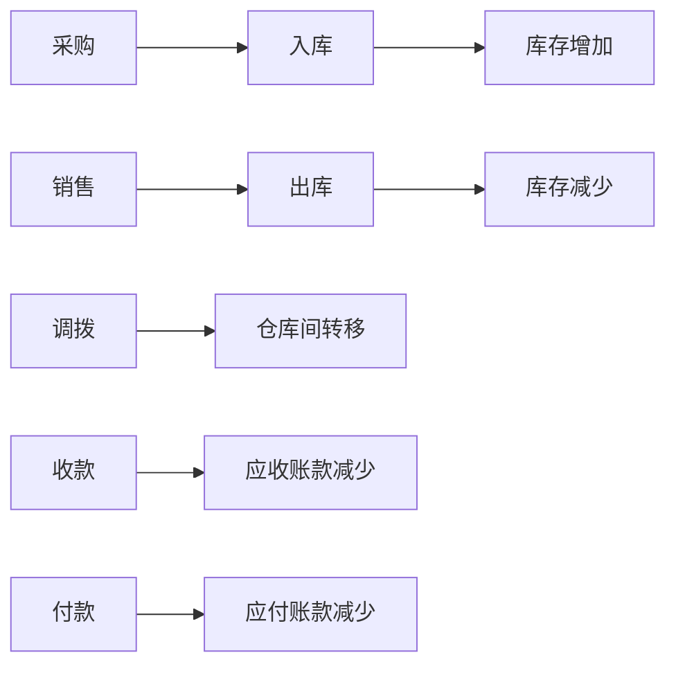

# ERP系统数据库表结构文档

> 本文档详细描述了ERP系统中所有数据表的结构、字段含义及业务说明。
> 
> **数据库名称**: erp  
> **字符集**: utf8mb4  
> **排序规则**: utf8mb4_general_ci  
> **生成日期**: 2026-04-16  
> **表总数**: 37张

---

## 📋 目录

### 一、基础业务模块 (bc - Basic Control)
- [1.1 bc_order - 客户订单表](#11-bc_order---客户订单表)
- [1.2 bc_purchase - 购货单表](#12-bc_purchase---购货单表)
- [1.3 bc_sale - 销售单表](#13-bc_sale---销售单表)

### 二、资金管理模块 (fc - Financial Control)
- [2.1 fc_account_record - 单据账户记录表](#21-fc_account_record---单据账户记录表)
- [2.2 fc_collection - 收款单表](#22-fc_collection---收款单表)
- [2.3 fc_collection_issue - 收款单据明细表](#23-fc_collection_issue---收款单据明细表)
- [2.4 fc_expense - 支出单表](#24-fc_expense---支出单表)
- [2.5 fc_flow_record - 收支记录表](#25-fc_flow_record---收支记录表)
- [2.6 fc_income - 收入单表](#26-fc_income---收入单表)
- [2.7 fc_payable - 应付账款记录表](#27-fc_payable---应付账款记录表)
- [2.8 fc_payment - 付款单表](#28-fc_payment---付款单表)
- [2.9 fc_payment_issue - 付款单据明细表](#29-fc_payment_issue---付款单据明细表)
- [2.10 fc_receivable - 应收账款记录表](#210-fc_receivable---应收账款记录表)

### 三、系统配置模块 (rc - Resource Control)
- [3.1 rc_category - 类别表](#31-rc_category---类别表)
- [3.2 rc_dict - 字典表](#32-rc_dict---字典表)
- [3.3 rc_dict_item - 字典项表](#33-rc_dict_item---字典项表)
- [3.4 rc_key_value - 键值对配置表](#34-rc_key_value---键值对配置表)
- [3.5 rc_log - 系统日志表](#35-rc_log---系统日志表)
- [3.6 rc_menu - 菜单表](#36-rc_menu---菜单表)

### 四、用户中心模块 (uc - User Center)
- [4.1 uc_customer - 客户表](#41-uc_customer---客户表)
- [4.2 uc_customer_contact - 客户联系人表](#42-uc_customer_contact---客户联系人表)
- [4.3 uc_employee - 职员表](#43-uc_employee---职员表)
- [4.4 uc_product - 商品表](#44-uc_product---商品表)
- [4.5 uc_settlement_account - 结算账户表](#45-uc_settlement_account---结算账户表)
- [4.6 uc_supplier - 供应商表](#46-uc_supplier---供应商表)
- [4.7 uc_supplier_contact - 供应商联系人表](#47-uc_supplier_contact---供应商联系人表)
- [4.8 uc_user - 用户表](#48-uc_user---用户表)
- [4.9 uc_warehouse - 仓库表](#49-uc_warehouse---仓库表)

### 五、仓库管理模块 (wc - Warehouse Control)
- [5.1 wc_checkout - 出库单表](#51-wc_checkout---出库单表)
- [5.2 wc_issue_product - 单据商品明细表](#52-wc_issue_product---单据商品明细表)
- [5.3 wc_stock - 库存商品表](#53-wc_stock---库存商品表)
- [5.4 wc_stock_record - 出入库记录表](#54-wc_stock_record---出入库记录表)
- [5.5 wc_store - 入库单表](#55-wc_store---入库单表)
- [5.6 wc_transfer - 调拨单表](#56-wc_transfer---调拨单表)
- [5.7 wc_transfer_product - 调拨商品明细表](#57-wc_transfer_product---调拨商品明细表)

---

## 一、基础业务模块 (bc - Basic Control)

### 1.1 bc_order - 客户订单表

**表说明**: 存储客户的订货和退货订单信息

| 字段名 | 数据类型 | 必填 | 默认值 | 说明 |
|--------|---------|------|--------|------|
| id | VARCHAR(20) | ✅ | - | 主键ID |
| issueDate | VARCHAR(255) | ❌ | NULL | 单据日期 |
| deliveryDate | VARCHAR(255) | ❌ | NULL | 交货日期 |
| code | VARCHAR(255) | ❌ | NULL | 单据编号（如：CO2021121506202128603） |
| businessType | SMALLINT | ❌ | 10 | 业务类型：10=订货，20=退货 |
| customerId | VARCHAR(20) | ❌ | NULL | 客户ID（关联uc_customer.id） |
| totalAmount | DOUBLE | ❌ | NULL | 总金额 |
| discountedAmount | DOUBLE | ❌ | NULL | 优惠后金额 |
| quantity | DOUBLE | ❌ | NULL | 数量 |
| discountRate | DOUBLE | ❌ | NULL | 优惠率 |
| listerId | VARCHAR(20) | ❌ | NULL | 制单人ID（关联uc_user.id） |
| auditorId | VARCHAR(20) | ❌ | NULL | 审核人ID（关联uc_user.id） |
| checked | BIT(1) | ❌ | 0 | 是否已审核：0=未审核，1=已审核 |
| remark | VARCHAR(255) | ❌ | NULL | 备注 |
| createdTime | TIMESTAMP | ❌ | CURRENT_TIMESTAMP | 创建时间 |
| updatedTime | TIMESTAMP | ❌ | CURRENT_TIMESTAMP | 更新时间（自动更新） |

**业务说明**:
- 客户订单 业务类型(businessType)分为：订货(10)和退货(20)两种类型
- 订单需要审核后才能生效
- 订单包含多个商品明细（存储在wc_issue_product表中，businessType='order'或'returned'）

---

### 1.2 bc_purchase - 购货单表

**表说明**: 存储向供应商采购商品的购货和采购退货信息

| 字段名 | 数据类型 | 必填 | 默认值 | 说明 |
|--------|---------|------|--------|------|
| id | VARCHAR(20) | ✅ | - | 主键ID |
| supplierId | VARCHAR(20) | ❌ | NULL | 供应商ID（关联uc_supplier.id） |
| type | VARCHAR(20) | ❌ | NULL | 类型：buy=采购，refund=采购退货 |
| issueDate | VARCHAR(255) | ❌ | NULL | 单据日期 |
| code | VARCHAR(255) | ❌ | NULL | 单据编号（如：PL2021121406484617077） |
| status | SMALLINT | ❌ | 10 | 付/退款状态：10=未付/退款，20=已付/退部分金额，30=全部付/退款 |
| quantity | DOUBLE | ❌ | NULL | 数量 |
| discountAmount | DOUBLE | ❌ | NULL | 折扣额 |
| amount | DOUBLE | ❌ | NULL | 购货金额 |
| preferentialRate | DOUBLE | ❌ | NULL | 优惠率 |
| preferentialAmount | DOUBLE | ❌ | NULL | 优惠金额 |
| preferredAmount | DOUBLE | ❌ | NULL | 优惠后金额 |
| currentAmount | DOUBLE | ❌ | NULL | 本次付/退款金额 |
| contracts | TEXT | ❌ | NULL | 采购合同（JSON格式） |
| debtAmount | DOUBLE | ❌ | NULL | 本次欠款 |
| listerId | VARCHAR(20) | ❌ | NULL | 制单人ID（关联uc_user.id） |
| auditorId | VARCHAR(20) | ❌ | NULL | 审核人ID（关联uc_user.id） |
| checked | BIT(1) | ❌ | 0 | 是否已审核：0=未审核，1=已审核 |
| remark | VARCHAR(255) | ❌ | NULL | 备注 |
| createdTime | TIMESTAMP | ❌ | CURRENT_TIMESTAMP | 创建时间 |
| updatedTime | TIMESTAMP | ❌ | CURRENT_TIMESTAMP | 更新时间（自动更新） |

**业务说明**:
- 购货单 类型(type)分为：采购(buy)和采购退货(refund)两种类型
- 支持分期付款和欠款管理
- 购货单审核后会自动生成入库单(wc_store)和应付账款(fc_payable)
- 商品明细存储在wc_issue_product表中（businessType='buy'或'refund'）

---

### 1.3 bc_sale - 销售单表

**表说明**: 存储向客户销售商品的销货和销售退货信息

| 字段名 | 数据类型 | 必填 | 默认值 | 说明 |
|--------|---------|------|--------|------|
| id | VARCHAR(20) | ✅ | - | 主键ID |
| type | VARCHAR(20) | ❌ | NULL | 类型：sell=销货，returned=销货退货 |
| issueDate | VARCHAR(255) | ❌ | NULL | 单据日期 |
| code | VARCHAR(255) | ❌ | NULL | 单据编号（如：SE2021121607225508117） |
| customerId | VARCHAR(20) | ❌ | NULL | 客户ID（关联uc_customer.id） |
| sellerId | VARCHAR(20) | ❌ | NULL | 销售人ID：职员（关联uc_employee.id） |
| contactName | VARCHAR(20) | ❌ | NULL | 联系人姓名 |
| address | VARCHAR(512) | ❌ | NULL | 地址 |
| phone | VARCHAR(64) | ❌ | NULL | 电话号码 |
| quantity | DOUBLE | ❌ | NULL | 数量 |
| discountAmount | DOUBLE | ❌ | NULL | 折扣额 |
| amount | DOUBLE | ❌ | NULL | 金额 |
| preferentialRate | DOUBLE | ❌ | NULL | 优惠率 |
| preferentialAmount | DOUBLE | ❌ | NULL | 优惠金额 |
| preferredAmount | DOUBLE | ❌ | NULL | 优惠后金额 |
| customerFee | DOUBLE | ❌ | NULL | 客户费用 |
| currentAmount | DOUBLE | ❌ | NULL | 本次收/退款金额 |
| debtAmount | DOUBLE | ❌ | NULL | 本次欠款 |
| status | SMALLINT | ❌ | NULL | 收款状态：10=未收/退款，20=部分收/退款，30=全部收/退款 |
| attachments | TEXT | ❌ | NULL | 销售附件（JSON格式） |
| listerId | VARCHAR(20) | ❌ | NULL | 制单人ID（关联uc_user.id） |
| auditorId | VARCHAR(20) | ❌ | NULL | 审核人ID（关联uc_user.id） |
| checked | BIT(1) | ❌ | 0 | 是否已审核：0=未审核，1=已审核 |
| remark | VARCHAR(255) | ❌ | NULL | 备注 |
| createdTime | TIMESTAMP | ❌ | CURRENT_TIMESTAMP | 创建时间 |
| updatedTime | TIMESTAMP | ❌ | CURRENT_TIMESTAMP | 更新时间（自动更新） |

**业务说明**:
- 销售单 类型(type)分为：销货(sell)和销货退货(returned)两种类型
- 支持收款状态跟踪和欠款管理
- 销售单审核后会自动生成出库单(wc_checkout)和应收账款(fc_receivable)
- 商品明细存储在wc_issue_product表中（businessType='sell'或'returned'）

---

## 二、资金管理模块 (fc - Financial Control)

### 2.1 fc_account_record - 单据账户记录表

**表说明**: 记录每笔业务引起的账户资金变动流水

| 字段名 | 数据类型 | 必填 | 默认值 | 说明 |
|--------|---------|------|--------|------|
| id | VARCHAR(20) | ✅ | - | 主键ID |
| type | VARCHAR(20) | ❌ | NULL | 类型：in=收入，out=支出 |
| issueDate | VARCHAR(20) | ❌ | NULL | 单据日期 |
| businessType | VARCHAR(32) | ❌ | NULL | 业务类型：collection/payment/income/expense/buy/sell等 |
| businessId | VARCHAR(20) | ❌ | NULL | 业务ID（关联对应业务表的主键） |
| accountId | VARCHAR(20) | ❌ | NULL | 账户ID（关联uc_settlement_account.id） |
| amount | DOUBLE | ❌ | 0 | 结算金额 |
| settlementType | VARCHAR(20) | ❌ | NULL | 结算方式ID（关联rc_dict_item.id，字典编码settlement） |
| settlementCode | VARCHAR(255) | ❌ | NULL | 结算号（如支票号、转账单号等） |
| currentAmount | DOUBLE | ❌ | 0 | 当前余额（操作后的账户余额） |
| remark | VARCHAR(255) | ❌ | NULL | 备注 |
| createdTime | TIMESTAMP | ❌ | CURRENT_TIMESTAMP | 创建时间 |
| updatedTime | TIMESTAMP | ❌ | NULL | 更新时间 |

**业务说明**:
- 记录所有引起账户余额变动的操作
- type字段标识是收入(in)还是支出(out)
- businessType标识具体业务类型(collection/payment/income/expense/buy/sell等)，便于追溯
- currentAmount记录操作后的账户余额，方便查询历史余额

---

### 2.2 fc_collection - 收款单表

**表说明**: 记录从客户处收款的单据信息

| 字段名 | 数据类型 | 必填 | 默认值 | 说明 |
|--------|---------|------|--------|------|
| id | VARCHAR(20) | ✅ | - | 主键ID |
| issueDate | VARCHAR(255) | ❌ | NULL | 单据日期 |
| code | VARCHAR(255) | ❌ | NULL | 单据编号（如：CL2021122307414267958） |
| customerId | VARCHAR(20) | ❌ | NULL | 销货单位ID（关联uc_customer.id） |
| collectAmount | DOUBLE | ❌ | NULL | 收款金额 |
| issueAmount | DOUBLE | ❌ | NULL | 单据金额 |
| discountAmount | DOUBLE | ❌ | NULL | 整单折扣 |
| verifiedAmount | DOUBLE | ❌ | NULL | 已核销金额 |
| unverifiedAmount | DOUBLE | ❌ | NULL | 未核销金额 |
| currentVerifiedAmount | DOUBLE | ❌ | NULL | 本次核销金额 |
| advanceCollectAmount | DOUBLE | ❌ | NULL | 预收款 |
| listerId | VARCHAR(20) | ❌ | NULL | 制单人ID（关联uc_user.id） |
| remark | VARCHAR(255) | ❌ | NULL | 备注 |
| createdTime | TIMESTAMP | ❌ | CURRENT_TIMESTAMP | 创建时间 |
| updatedTime | TIMESTAMP | ❌ | NULL | 更新时间 |

**业务说明**:
- 收款单用于记录从客户收取的款项
- 支持核销功能，可以核销多张销售单的应收款
- 核销明细存储在fc_collection_issue表中
- 收款后会生成账户记录(fc_account_record)和应收账款记录(fc_receivable)

---

### 2.3 fc_collection_issue - 收款单据明细表

**表说明**: 记录收款单核销的具体源单信息

| 字段名 | 数据类型 | 必填 | 默认值 | 说明 |
|--------|---------|------|--------|------|
| id | VARCHAR(20) | ✅ | - | 主键ID |
| collectionId | VARCHAR(20) | ❌ | NULL | 收款ID（关联fc_collection.id） |
| sourceCode | VARCHAR(255) | ❌ | NULL | 源单编码（销售单或退货单的code） |
| type | SMALLINT | ❌ | NULL | 类别：10=销货，20=退货 |
| issueDate | VARCHAR(255) | ❌ | NULL | 单据日期 |
| issueAmount | DOUBLE | ❌ | NULL | 单据金额 |
| verifiedAmount | DOUBLE | ❌ | NULL | 已核销金额 |
| unverifiedAmount | DOUBLE | ❌ | NULL | 未核销金额 |
| currentVerifiedAmount | DOUBLE | ❌ | NULL | 本次核销金额 |
| createdTime | TIMESTAMP | ❌ | CURRENT_TIMESTAMP | 创建时间 |
| updatedTime | TIMESTAMP | ❌ | NULL | 更新时间 |

**业务说明**:
- 一条收款单可以核销多条销售单或退货单
- type字段区分是核销销货单(10)还是退货单(20)
- 通过sourceCode关联到具体的bc_sale表记录

---

### 2.4 fc_expense - 支出单表

**表说明**: 记录企业的其他支出（非采购付款）

| 字段名 | 数据类型 | 必填 | 默认值 | 说明 |
|--------|---------|------|--------|------|
| id | VARCHAR(20) | ✅ | - | 主键ID |
| supplierId | VARCHAR(20) | ❌ | NULL | 供应商ID（关联uc_supplier.id，可为空） |
| issueDate | VARCHAR(255) | ❌ | NULL | 单据日期 |
| code | VARCHAR(255) | ❌ | NULL | 单据编号（如：ZC2021122808540257274） |
| amount | DOUBLE | ❌ | NULL | 金额 |
| paidAmount | DOUBLE | ❌ | NULL | 付款金额 |
| listerId | VARCHAR(20) | ❌ | NULL | 制单人ID（关联uc_user.id） |
| remark | VARCHAR(255) | ❌ | NULL | 备注 |
| createdTime | TIMESTAMP | ❌ | CURRENT_TIMESTAMP | 创建时间 |
| updatedTime | TIMESTAMP | ❌ | NULL | 更新时间 |

**业务说明**:
- 支出单用于记录日常经营中的各项支出（如房租、水电费等）
- 可以关联供应商，也可以不关联
- 支出后会生成账户记录(fc_account_record)和收支记录(fc_flow_record)

---

### 2.5 fc_flow_record - 收支记录表

**表说明**: 记录收入和支出的分类明细，用于统计分析

| 字段名 | 数据类型 | 必填 | 默认值 | 说明 |
|--------|---------|------|--------|------|
| id | VARCHAR(20) | ✅ | - | 主键ID |
| issueDate | VARCHAR(20) | ❌ | NULL | 单据日期 |
| businessType | VARCHAR(20) | ❌ | NULL | 业务类型：income=收入，expense=支出 |
| businessId | VARCHAR(20) | ❌ | NULL | 业务ID（关联fc_income.id或fc_expense.id） |
| categoryId | VARCHAR(20) | ❌ | NULL | 类别ID（关联rc_category.id，类别类型为40=支出或50=收入） |
| amount | DOUBLE | ❌ | 0 | 金额 |
| remark | VARCHAR(255) | ❌ | NULL | 备注 |
| createdTime | TIMESTAMP | ❌ | CURRENT_TIMESTAMP | 创建时间 |
| updatedTime | TIMESTAMP | ❌ | NULL | 更新时间 |

**业务说明**:
- 收支记录用于按类别统计收入和支出
- 一条收入单或支出单可能对应多条收支记录（不同类别）
- categoryId关联的类别必须是支出类别(40)或收入类别(50)
- 用于生成"其他收支明细表"等报表

---

### 2.6 fc_income - 收入单表

**表说明**: 记录企业的其他收入（非销售收款）

| 字段名 | 数据类型 | 必填 | 默认值 | 说明 |
|--------|---------|------|--------|------|
| id | VARCHAR(20) | ✅ | - | 主键ID |
| customerId | VARCHAR(20) | ❌ | NULL | 销货单位ID（关联uc_customer.id，可为空） |
| issueDate | VARCHAR(255) | ❌ | NULL | 单据日期 |
| code | VARCHAR(255) | ❌ | NULL | 单据编号（如：SR2021122808300451396） |
| amount | DOUBLE | ❌ | NULL | 金额 |
| collectAmount | DOUBLE | ❌ | NULL | 收款金额 |
| listerId | VARCHAR(20) | ❌ | NULL | 制单人ID（关联uc_user.id） |
| remark | VARCHAR(255) | ❌ | NULL | 备注 |
| createdTime | TIMESTAMP | ❌ | CURRENT_TIMESTAMP | 创建时间 |
| updatedTime | TIMESTAMP | ❌ | NULL | 更新时间 |

**业务说明**:
- 收入单用于记录日常经营中的各项收入（如利息收入、退税等）
- 可以关联客户，也可以不关联
- 收入后会生成账户记录(fc_account_record)和收支记录(fc_flow_record)

---

### 2.7 fc_payable - 应付账款记录表

**表说明**: 记录与供应商的应付账款变动情况

| 字段名 | 数据类型 | 必填 | 默认值 | 说明 |
|--------|---------|------|--------|------|
| id | VARCHAR(20) | ✅ | - | 主键ID |
| supplierId | VARCHAR(20) | ❌ | NULL | 供应商ID（关联uc_supplier.id） |
| issueDate | VARCHAR(20) | ❌ | NULL | 单据日期 |
| businessType | VARCHAR(32) | ❌ | NULL | 业务类型：buy=采购，refund=采购退货，payment=付款 |
| businessId | VARCHAR(20) | ❌ | NULL | 业务ID（关联bc_purchase.id或fc_payment.id） |
| increasedAmount | DOUBLE | ❌ | 0 | 增加应付款金额（正数表示增加，负数表示减少） |
| paidAmount | DOUBLE | ❌ | 0 | 支付应付款金额 |
| createdTime | TIMESTAMP | ❌ | CURRENT_TIMESTAMP | 创建时间 |
| updatedTime | TIMESTAMP | ❌ | NULL | 更新时间 |

**业务说明**:
- 应付账款记录跟踪与每个供应商的往来账务
- increasedAmount为正数表示应付增加（如采购），为负数表示应付减少（如退货）
- paidAmount记录实际支付金额
- 通过累计increasedAmount和paidAmount可计算当前应付余额

---

### 2.8 fc_payment - 付款单表

**表说明**: 记录向供应商付款的单据信息

| 字段名 | 数据类型 | 必填 | 默认值 | 说明 |
|--------|---------|------|--------|------|
| id | VARCHAR(20) | ✅ | - | 主键ID |
| issueDate | VARCHAR(255) | ❌ | NULL | 单据日期 |
| code | VARCHAR(255) | ❌ | NULL | 单据编号（如：FK2021122707520065067） |
| supplierId | VARCHAR(20) | ❌ | NULL | 购货单位ID（关联uc_supplier.id） |
| paidAmount | DOUBLE | ❌ | NULL | 付款金额 |
| issueAmount | DOUBLE | ❌ | NULL | 单据金额 |
| discountAmount | DOUBLE | ❌ | NULL | 整单折扣 |
| verifiedAmount | DOUBLE | ❌ | NULL | 已核销金额 |
| unverifiedAmount | DOUBLE | ❌ | NULL | 未核销金额 |
| currentVerifiedAmount | DOUBLE | ❌ | NULL | 本次核销金额 |
| advancePaidAmount | DOUBLE | ❌ | NULL | 预付款 |
| listerId | VARCHAR(20) | ❌ | NULL | 制单人ID（关联uc_user.id） |
| remark | VARCHAR(255) | ❌ | NULL | 备注 |
| createdTime | TIMESTAMP | ❌ | CURRENT_TIMESTAMP | 创建时间 |
| updatedTime | TIMESTAMP | ❌ | NULL | 更新时间 |

**业务说明**:
- 付款单用于记录向供应商支付的款项
- 支持核销功能，可以核销多张购货单的应付款
- 核销明细存储在fc_payment_issue表中
- 付款后会生成账户记录(fc_account_record)和应付账款记录(fc_payable)

---

### 2.9 fc_payment_issue - 付款单据明细表

**表说明**: 记录付款单核销的具体源单信息

| 字段名 | 数据类型 | 必填 | 默认值 | 说明 |
|--------|---------|------|--------|------|
| id | VARCHAR(20) | ✅ | - | 主键ID |
| paymentId | VARCHAR(20) | ❌ | NULL | 付款ID（关联fc_payment.id） |
| sourceCode | VARCHAR(255) | ❌ | NULL | 源单编码（购货单或采购退货单的code） |
| type | SMALLINT | ❌ | NULL | 类别：10=购货，20=购货退货 |
| issueDate | VARCHAR(255) | ❌ | NULL | 单据日期 |
| issueAmount | DOUBLE | ❌ | NULL | 单据金额 |
| verifiedAmount | DOUBLE | ❌ | NULL | 已核销金额 |
| unverifiedAmount | DOUBLE | ❌ | NULL | 未核销金额 |
| currentVerifiedAmount | DOUBLE | ❌ | NULL | 本次核销金额 |
| createdTime | TIMESTAMP | ❌ | CURRENT_TIMESTAMP | 创建时间 |
| updatedTime | TIMESTAMP | ❌ | NULL | 更新时间 |

**业务说明**:
- 一条付款单可以核销多条购货单或采购退货单
- type字段区分是核销购货单(10)还是采购退货单(20)
- 通过sourceCode关联到具体的bc_purchase表记录

---

### 2.10 fc_receivable - 应收账款记录表

**表说明**: 记录与客户的应收账款变动情况

| 字段名 | 数据类型 | 必填 | 默认值 | 说明 |
|--------|---------|------|--------|------|
| id | VARCHAR(20) | ✅ | - | 主键ID |
| customerId | VARCHAR(20) | ❌ | NULL | 客户ID（关联uc_customer.id） |
| issueDate | VARCHAR(20) | ❌ | NULL | 单据日期 |
| businessType | VARCHAR(32) | ❌ | NULL | 业务类型：sell=销货，returned=销货退货，collection=收款 |
| businessId | VARCHAR(20) | ❌ | NULL | 业务ID（关联bc_sale.id或fc_collection.id） |
| increasedAmount | DOUBLE | ❌ | 0 | 增加应收款金额（正数表示增加，负数表示减少） |
| paidAmount | DOUBLE | ❌ | 0 | 支付应收款金额（实际收款金额） |
| createdTime | TIMESTAMP | ❌ | CURRENT_TIMESTAMP | 创建时间 |
| updatedTime | TIMESTAMP | ❌ | NULL | 更新时间 |

**业务说明**:
- 应收账款记录跟踪与每个客户的往来账务
- increasedAmount为正数表示应收增加（如销货），为负数表示应收减少（如退货）
- paidAmount记录实际收款金额
- 通过累计increasedAmount和paidAmount可计算当前应收余额

---

**第一部分结束**

---

## 三、系统配置模块 (rc - Resource Control)

### 3.1 rc_category - 类别表

**表说明**: 存储各种分类信息，支持树形结构

| 字段名 | 数据类型 | 必填 | 默认值 | 说明 |
|--------|---------|------|--------|------|
| id | VARCHAR(20) | ✅ | - | 主键ID |
| type | SMALLINT | ❌ | NULL | 类型：10=客户，20=供应商，30=商品，40=支出，50=收入 |
| parentId | VARCHAR(20) | ❌ | NULL | 父ID（支持多级分类，NULL表示顶级分类） |
| name | VARCHAR(255) | ❌ | NULL | 名称 |
| sortNumber | INT | ❌ | NULL | 排序号 |
| createdTime | TIMESTAMP | ❌ | CURRENT_TIMESTAMP | 创建时间 |
| updatedTime | TIMESTAMP | ❌ | CURRENT_TIMESTAMP | 更新时间（自动更新） |

**业务说明**:
- 类别表采用树形结构，支持多级分类
- type字段区分类别的用途：
  - 10: 客户分类（关联uc_customer.categoryId）
  - 20: 供应商分类（关联uc_supplier.categoryId）
  - 30: 商品分类（关联uc_product.categoryId）
  - 40: 支出分类（关联fc_flow_record.categoryId）
  - 50: 收入分类（关联fc_flow_record.categoryId）
- 不同模块通过type和parentId进行关联

---

### 3.2 rc_dict - 字典表

**表说明**: 存储系统字典定义

| 字段名 | 数据类型 | 必填 | 默认值 | 说明 |
|--------|---------|------|--------|------|
| id | VARCHAR(20) | ✅ | - | 主键ID |
| name | VARCHAR(255) | ❌ | NULL | 名称 |
| code | VARCHAR(255) | ❌ | NULL | 编码（唯一标识，如：unit、settlement） |
| createdTime | TIMESTAMP | ❌ | CURRENT_TIMESTAMP | 创建时间 |
| updatedTime | TIMESTAMP | ❌ | CURRENT_TIMESTAMP | 更新时间（自动更新） |

**业务说明**:
- 字典表定义系统中的枚举类型
- 常用字典包括：
  - unit: 计量单位（斤、包、盒、把、听、扎等）
  - settlement: 结算方式（现金、转账等）
  - customer_level: 客户等级（零售客户、批发客户、VIP客户、折扣等级一、折扣等级二等）
  - account_type: 账户类别（现金、银行存款等）
- 字典项存储在rc_dict_item表中

---

### 3.3 rc_dict_item - 字典项表

**表说明**: 存储字典的具体选项值

| 字段名 | 数据类型 | 必填 | 默认值 | 说明 |
|--------|---------|------|--------|------|
| id | VARCHAR(20) | ✅ | - | 主键ID |
| dictCode | VARCHAR(255) | ❌ | NULL | 字典编码（关联rc_dict.code） |
| name | VARCHAR(255) | ❌ | NULL | 名称（显示值） |
| sortNumber | INT | ❌ | 0 | 排序号 |
| createdTime | TIMESTAMP | ❌ | CURRENT_TIMESTAMP | 创建时间 |
| updatedTime | TIMESTAMP | ❌ | CURRENT_TIMESTAMP | 更新时间（自动更新） |

**业务说明**:
- 字典项是字典的具体取值
- 通过dictCode关联到对应的字典
- 常用于下拉选择框等场景
- 例如：计量单位字典下的"斤"、"包"、"盒"等

---

### 3.4 rc_key_value - 键值对配置表

**表说明**: 存储系统的键值对配置信息

| 字段名 | 数据类型 | 必填 | 默认值 | 说明 |
|--------|---------|------|--------|------|
| id | VARCHAR(20) | ✅ | - | 主键ID |
| key | VARCHAR(250) | ❌ | NULL | 键（如：system_configuration） |
| value | LONGTEXT | ❌ | NULL | 值（JSON格式的配置内容） |
| code | VARCHAR(50) | ❌ | NULL | 类型（如：settings） |
| reservedInt | INT | ✅ | 0 | 保留的int字段 |
| createdTime | TIMESTAMP | ✅ | CURRENT_TIMESTAMP | 创建时间 |
| updatedTime | TIMESTAMP | ❌ | CURRENT_TIMESTAMP | 更新时间（自动更新） |

**业务说明**:
- 用于存储系统的各种配置项
- 最典型的配置是system_configuration（系统设置），包含：
  - companyName: 公司名称
  - companyPhone: 公司电话
  - companyAddress: 公司地址
  - currency: 货币单位
  - quantityPrecision: 数量精度
  - pricePrecision: 价格精度
  - inventoryValuationMethod: 存货计价方法
  - checkNegativeStock: 是否检查负库存
  - startTime: 启用时间
- 配置以JSON格式存储在value字段中

---

### 3.5 rc_log - 系统日志表

**表说明**: 记录系统的操作日志

| 字段名 | 数据类型 | 必填 | 默认值 | 说明 |
|--------|---------|------|--------|------|
| id | VARCHAR(20) | ✅ | - | 主键ID |
| type | SMALLINT | ❌ | NULL | 日志类型（见下方说明） |
| userId | VARCHAR(20) | ❌ | NULL | 操作用户ID（关联uc_user.id） |
| username | VARCHAR(255) | ❌ | NULL | 操作用户名 |
| name | VARCHAR(255) | ❌ | NULL | 操作用户姓名 |
| content | TEXT | ❌ | NULL | 操作内容（JSON格式） |
| createdTime | TIMESTAMP | ❌ | CURRENT_TIMESTAMP | 创建时间 |
| updatedTime | TIMESTAMP | ❌ | CURRENT_TIMESTAMP | 更新时间（自动更新） |

**业务说明**:
- 记录用户的重要操作行为
- 日志类型(type)包括：
  - 10000: 登录
  - 11010: 新增用户
  - 11020: 启用用户
  - 11030: 停用用户
  - 11040: 重置密码
- content字段以JSON格式存储操作的详细信息
- 用于审计和问题追溯

---

### 3.6 rc_menu - 菜单表

**表说明**: 存储系统的菜单配置，支持树形结构

| 字段名 | 数据类型 | 必填 | 默认值 | 说明 |
|--------|---------|------|--------|------|
| id | VARCHAR(20) | ✅ | - | 主键ID |
| parentId | VARCHAR(20) | ❌ | NULL | 父ID（NULL表示顶级菜单） |
| icon | VARCHAR(255) | ❌ | NULL | 图标（如：el-icon-menu） |
| title | VARCHAR(255) | ❌ | NULL | 标题（菜单显示名称） |
| path | VARCHAR(255) | ❌ | NULL | 路径（前端路由路径） |
| sortNumber | INT | ❌ | 0 | 排序号 |
| createdTime | TIMESTAMP | ❌ | CURRENT_TIMESTAMP | 创建时间 |
| updatedTime | TIMESTAMP | ❌ | CURRENT_TIMESTAMP | 更新时间（自动更新） |

**业务说明**:
- 菜单表采用树形结构，支持多级菜单
- 顶级菜单的parentId为NULL
- path字段对应前端Vue Router的路由路径
- 用于动态生成系统左侧导航菜单
- 主要菜单模块包括：系统、基础、购货、销货、仓库、资金、报表

---

## 四、用户中心模块 (uc - User Center)

### 4.1 uc_customer - 客户表

**表说明**: 存储客户的基本信息

| 字段名 | 数据类型 | 必填 | 默认值 | 说明 |
|--------|---------|------|--------|------|
| id | VARCHAR(20) | ✅ | - | 主键ID |
| code | VARCHAR(255) | ❌ | NULL | 编号（客户编码） |
| name | VARCHAR(255) | ❌ | NULL | 名称（客户名称） |
| categoryId | VARCHAR(20) | ❌ | NULL | 客户类别ID（关联rc_category.id，type=10） |
| level | VARCHAR(20) | ❌ | 10 | 客户等级ID（关联rc_dict_item.id，字典编码customer_level） |
| balanceTime | TIMESTAMP | ❌ | NULL | 余额日期 |
| beginReceivableAmount | BIGINT | ❌ | NULL | 期初应收款 |
| beginPrepaidAmount | BIGINT | ❌ | NULL | 期初预收款 |
| remark | VARCHAR(255) | ❌ | NULL | 备注 |
| active | BIT(1) | ❌ | 1 | 是否启用：0=停用，1=启用 |
| createdTime | TIMESTAMP | ❌ | CURRENT_TIMESTAMP | 创建时间 |
| updatedTime | TIMESTAMP | ❌ | CURRENT_TIMESTAMP | 更新时间（自动更新） |

**业务说明**:
- 客户是销售业务的交易对象
- 支持客户分类和等级管理
- 期初应收款和预收款用于初始化客户账务
- 联系人信息存储在uc_customer_contact表中
- 客户ID被bc_sale、bc_order、fc_collection等表引用

---

### 4.2 uc_customer_contact - 客户联系人表

**表说明**: 存储客户的联系人信息

| 字段名 | 数据类型 | 必填 | 默认值 | 说明 |
|--------|---------|------|--------|------|
| id | VARCHAR(20) | ✅ | - | 主键ID |
| customerId | VARCHAR(20) | ❌ | NULL | 客户ID（关联uc_customer.id） |
| name | VARCHAR(255) | ❌ | NULL | 联系人姓名 |
| mobile | VARCHAR(64) | ❌ | NULL | 手机号 |
| phone | VARCHAR(64) | ❌ | NULL | 座机 |
| qq | VARCHAR(255) | ❌ | NULL | QQ号 |
| email | VARCHAR(255) | ❌ | NULL | 邮箱 |
| address | TEXT | ❌ | NULL | 地址 |
| primary | BIT(1) | ❌ | 0 | 是否首要联系人：0=否，1=是 |
| createdTime | TIMESTAMP | ❌ | CURRENT_TIMESTAMP | 创建时间 |
| updatedTime | TIMESTAMP | ❌ | CURRENT_TIMESTAMP | 更新时间（自动更新） |

**业务说明**:
- 一个客户可以有多个联系人
- primary字段标识主要联系人
- 销售单(bc_sale)中的contactName、phone、address等信息来源于此表

---

### 4.3 uc_employee - 职员表

**表说明**: 存储企业职员信息

| 字段名 | 数据类型 | 必填 | 默认值 | 说明 |
|--------|---------|------|--------|------|
| id | BIGINT | ✅ | - | 主键ID |
| code | VARCHAR(255) | ❌ | NULL | 编号（职员编码） |
| name | VARCHAR(255) | ❌ | NULL | 名称（职员姓名） |
| active | BIT(1) | ❌ | 1 | 是否启用：0=停用，1=启用 |
| createdTime | TIMESTAMP | ❌ | CURRENT_TIMESTAMP | 创建时间 |
| updatedTime | TIMESTAMP | ❌ | CURRENT_TIMESTAMP | 更新时间（自动更新） |

**业务说明**:
- 职员是企业的员工，与销售业务相关
- 销售单(bc_sale)中的sellerId字段关联此表
- 与uc_user表不同，职员不一定有系统账号

---

### 4.4 uc_product - 商品表

**表说明**: 存储商品的基本信息和价格信息

| 字段名 | 数据类型 | 必填 | 默认值 | 说明 |
|--------|---------|------|--------|------|
| id | VARCHAR(20) | ✅ | - | 主键ID |
| code | VARCHAR(255) | ❌ | NULL | 编号（商品编码） |
| name | VARCHAR(255) | ❌ | NULL | 名称（商品名称） |
| barcode | VARCHAR(255) | ❌ | NULL | 条码（商品条形码） |
| spec | VARCHAR(255) | ❌ | NULL | 规格（商品规格型号） |
| categoryId | VARCHAR(20) | ❌ | NULL | 类别ID（关联rc_category.id，type=30） |
| primaryWarehouseId | VARCHAR(20) | ❌ | NULL | 首选仓库ID（关联uc_warehouse.id） |
| unitId | VARCHAR(20) | ❌ | NULL | 计量单位ID（关联rc_dict_item.id，字典编码unit） |
| retailPrice | DOUBLE | ❌ | NULL | 零售价 |
| wholesalePrice | DOUBLE | ❌ | NULL | 批发价 |
| vipPrice | DOUBLE | ❌ | NULL | VIP价格 |
| discountRate1 | DOUBLE | ❌ | NULL | 折扣率1 |
| discountRate2 | DOUBLE | ❌ | NULL | 折扣率2 |
| estimatedPurchasePrice | DOUBLE | ❌ | NULL | 预计采购价 |
| remark | VARCHAR(255) | ❌ | NULL | 备注 |
| minimumStock | DOUBLE | ❌ | NULL | 最低库存（库存预警下限） |
| maximumStock | DOUBLE | ❌ | NULL | 最高库存（库存预警上限） |
| active | BIT(1) | ❌ | 1 | 是否启用：0=停用，1=启用 |
| createdTime | TIMESTAMP | ❌ | CURRENT_TIMESTAMP | 创建时间 |
| updatedTime | TIMESTAMP | ❌ | CURRENT_TIMESTAMP | 更新时间（自动更新） |

**业务说明**:
- 商品是ERP系统的核心基础数据
- 支持多种价格策略（零售价、批发价、VIP价）
- 支持库存预警（最低/最高库存）
- 商品明细出现在所有业务单据中（购货、销售、出入库等）
- 库存信息存储在wc_stock表中

---

### 4.5 uc_settlement_account - 结算账户表

**表说明**: 存储企业的结算账户（银行账户、现金账户等）

| 字段名 | 数据类型 | 必填 | 默认值 | 说明 |
|--------|---------|------|--------|------|
| id | VARCHAR(20) | ✅ | - | 主键ID |
| code | VARCHAR(255) | ❌ | NULL | 账户编号 |
| name | VARCHAR(255) | ❌ | NULL | 账户名称 |
| balanceTime | TIMESTAMP | ❌ | NULL | 余额日期 |
| beginBalance | DOUBLE | ❌ | 0 | 期初余额 |
| currentBalance | DOUBLE | ❌ | 0 | 当前余额 |
| type | VARCHAR(20) | ❌ | NULL | 账户类别（关联rc_dict_item.id，字典编码account_type） |
| createdTime | TIMESTAMP | ❌ | CURRENT_TIMESTAMP | 创建时间 |
| updatedTime | TIMESTAMP | ❌ | CURRENT_TIMESTAMP | 更新时间（自动更新） |

**业务说明**:
- 结算账户用于管理企业的资金账户
- 账户类别包括：现金、银行存款等
- currentBalance会随着业务操作自动更新
- 所有资金变动都会记录在fc_account_record表中
- 收款、付款、收入、支出等操作都需要指定结算账户

---

### 4.6 uc_supplier - 供应商表

**表说明**: 存储供应商的基本信息

| 字段名 | 数据类型 | 必填 | 默认值 | 说明 |
|--------|---------|------|--------|------|
| id | VARCHAR(20) | ✅ | - | 主键ID |
| code | VARCHAR(255) | ❌ | NULL | 编号（供应商编码） |
| name | VARCHAR(255) | ❌ | NULL | 名称（供应商名称） |
| categoryId | VARCHAR(20) | ❌ | NULL | 供应商类别ID（关联rc_category.id，type=20） |
| balanceTime | TIMESTAMP | ❌ | NULL | 余额日期 |
| beginReceivableAmount | BIGINT | ❌ | NULL | 期初应收款 |
| beginPrepaidAmount | BIGINT | ❌ | NULL | 期初预收款 |
| vatRate | SMALLINT | ❌ | NULL | 增值税税率（如：17表示17%） |
| remark | VARCHAR(255) | ❌ | NULL | 备注 |
| active | BIT(1) | ❌ | 1 | 是否启用：0=停用，1=启用 |
| createdTime | TIMESTAMP | ❌ | CURRENT_TIMESTAMP | 创建时间 |
| updatedTime | TIMESTAMP | ❌ | CURRENT_TIMESTAMP | 更新时间（自动更新） |

**业务说明**:
- 供应商是采购业务的交易对象
- 支持供应商分类管理
- 期初应收款和预收款用于初始化供应商务务
- 联系人信息存储在uc_supplier_contact表中
- 供应商ID被bc_purchase、fc_payment等表引用

---

### 4.7 uc_supplier_contact - 供应商联系人表

**表说明**: 存储供应商的联系人信息

| 字段名 | 数据类型 | 必填 | 默认值 | 说明 |
|--------|---------|------|--------|------|
| id | VARCHAR(20) | ✅ | - | 主键ID |
| supplierId | VARCHAR(20) | ❌ | NULL | 供应商ID（关联uc_supplier.id） |
| name | VARCHAR(255) | ❌ | NULL | 联系人姓名 |
| mobile | VARCHAR(64) | ❌ | NULL | 手机号 |
| phone | VARCHAR(64) | ❌ | NULL | 座机 |
| qq | VARCHAR(255) | ❌ | NULL | QQ号 |
| address | TEXT | ❌ | NULL | 地址 |
| primary | BIT(1) | ❌ | 0 | 是否首要联系人：0=否，1=是 |
| createdTime | TIMESTAMP | ❌ | CURRENT_TIMESTAMP | 创建时间 |
| updatedTime | TIMESTAMP | ❌ | CURRENT_TIMESTAMP | 更新时间（自动更新） |

**业务说明**:
- 一个供应商可以有多个联系人
- primary字段标识主要联系人
- 便于采购业务中的联系沟通

---

### 4.8 uc_user - 用户表

**表说明**: 存储系统用户账号信息

| 字段名 | 数据类型 | 必填 | 默认值 | 说明 |
|--------|---------|------|--------|------|
| id | VARCHAR(20) | ✅ | - | 用户ID |
| username | VARCHAR(255) | ❌ | NULL | 用户名（登录名） |
| mobile | VARCHAR(64) | ❌ | NULL | 手机号 |
| password | VARCHAR(255) | ❌ | NULL | 密码（BCrypt加密） |
| name | VARCHAR(255) | ❌ | NULL | 真实姓名 |
| active | BIT(1) | ❌ | 1 | 是否启用：0=停用，1=启用 |
| deleted | BIT(1) | ❌ | 0 | 是否删除：0=未删除，1=已删除 |
| createdTime | TIMESTAMP | ✅ | CURRENT_TIMESTAMP | 创建时间 |
| updatedTime | TIMESTAMP | ✅ | CURRENT_TIMESTAMP | 更新时间（自动更新） |

**业务说明**:
- 用户是系统的使用者，需要登录才能操作系统
- 密码使用BCrypt算法加密存储
- deleted字段实现逻辑删除，不物理删除数据
- 用户的操作会记录在rc_log表中
- 制单人(listerId)、审核人(auditorId)等字段都关联此表

---

### 4.9 uc_warehouse - 仓库表

**表说明**: 存储仓库基本信息

| 字段名 | 数据类型 | 必填 | 默认值 | 说明 |
|--------|---------|------|--------|------|
| id | BIGINT | ✅ | - | 主键ID |
| code | VARCHAR(255) | ❌ | NULL | 编号（仓库编码） |
| name | VARCHAR(255) | ❌ | NULL | 名称（仓库名称） |
| active | BIT(1) | ❌ | 1 | 是否启用：0=停用，1=启用 |
| createdTime | TIMESTAMP | ❌ | CURRENT_TIMESTAMP | 创建时间 |
| updatedTime | TIMESTAMP | ❌ | CURRENT_TIMESTAMP | 更新时间（自动更新） |

**业务说明**:
- 仓库用于管理商品的存放位置
- 商品可以设置首选仓库(primaryWarehouseId)
- 所有出入库操作都需要指定仓库
- 库存信息按仓库分别统计（wc_stock表）

---

## 五、仓库管理模块 (wc - Warehouse Control)

### 5.1 wc_checkout - 出库单表

**表说明**: 记录其他出库业务（盘亏、其他出库等）

| 字段名 | 数据类型 | 必填 | 默认值 | 说明 |
|--------|---------|------|--------|------|
| id | VARCHAR(20) | ✅ | - | 主键ID |
| issueDate | VARCHAR(255) | ❌ | NULL | 单据日期 |
| code | VARCHAR(255) | ❌ | NULL | 单据编号（如：CK2021121711430241164） |
| type | SMALLINT | ❌ | 10 | 类型：10=其他出库，20=盘亏 |
| customerId | VARCHAR(20) | ❌ | NULL | 客户ID（关联uc_customer.id，可为空） |
| amount | DOUBLE | ❌ | NULL | 出库成本 |
| quantity | DOUBLE | ❌ | NULL | 数量 |
| listerId | VARCHAR(20) | ❌ | NULL | 制单人ID（关联uc_user.id） |
| remark | VARCHAR(255) | ❌ | NULL | 备注 |
| createdTime | TIMESTAMP | ❌ | CURRENT_TIMESTAMP | 创建时间 |
| updatedTime | TIMESTAMP | ❌ | CURRENT_TIMESTAMP | 更新时间（自动更新） |

**业务说明**:
- 出库单用于记录非销售类的出库业务
- 类型包括：其他出库(10)、盘亏(20)
- 出库商品明细存储在wc_issue_product表中（businessType='checkout'或'checkout_loss'）
- 出库后会减少库存(wc_stock)并记录出入库流水(wc_stock_record)

---

### 5.2 wc_issue_product - 单据商品明细表

**表说明**: 存储各类业务单据的商品明细（核心关联表）

| 字段名 | 数据类型 | 必填 | 默认值 | 说明 |
|--------|---------|------|--------|------|
| id | VARCHAR(20) | ✅ | - | 主键ID |
| issueDate | VARCHAR(20) | ❌ | NULL | 单据日期 |
| businessType | VARCHAR(20) | ❌ | NULL | 业务类型（见下方说明） |
| businessId | VARCHAR(20) | ❌ | NULL | 业务ID（关联对应业务表的主键） |
| productId | VARCHAR(20) | ❌ | NULL | 商品ID（关联uc_product.id） |
| warehouseId | VARCHAR(20) | ❌ | NULL | 仓库ID（关联uc_warehouse.id） |
| quantity | DOUBLE | ❌ | NULL | 数量 |
| price | DOUBLE | ❌ | NULL | 单价 |
| discountRate | DOUBLE | ❌ | NULL | 折扣率 |
| discountAmount | DOUBLE | ❌ | NULL | 折扣额 |
| amount | DOUBLE | ❌ | NULL | 金额 |
| code | VARCHAR(255) | ❌ | NULL | 序列号 |
| remark | VARCHAR(255) | ❌ | NULL | 备注 |
| createdTime | TIMESTAMP | ❌ | CURRENT_TIMESTAMP | 创建时间 |
| updatedTime | TIMESTAMP | ❌ | CURRENT_TIMESTAMP | 更新时间（自动更新） |

**业务说明**:
- 这是ERP系统中最核心的关联表之一
- businessType标识所属的业务类型：
  - order: 客户订单
  - returned: 销货退货
  - buy: 采购
  - refund: 采购退货
  - sell: 销货
  - store: 入库
  - checkout: 出库
  - checkout_loss: 盘亏出库
  - transfer_out: 调拨出库
  - transfer_in: 调拨入库
- 一条业务单据可以包含多个商品明细
- 通过businessType和businessId可以追溯到具体的业务单据

---

### 5.3 wc_stock - 库存商品表

**表说明**: 存储各仓库中商品的实时库存信息

| 字段名 | 数据类型 | 必填 | 默认值 | 说明 |
|--------|---------|------|--------|------|
| id | VARCHAR(20) | ✅ | - | 主键ID |
| productId | VARCHAR(20) | ❌ | NULL | 商品ID（关联uc_product.id） |
| warehouseId | VARCHAR(20) | ❌ | NULL | 仓库ID（关联uc_warehouse.id） |
| quantity | DOUBLE | ❌ | 0 | 数量（当前库存数量） |
| price | DOUBLE | ❌ | 0 | 单价（库存成本单价） |
| amount | DOUBLE | ❌ | 0 | 成本（库存总成本 = quantity × price） |
| createdTime | TIMESTAMP | ❌ | CURRENT_TIMESTAMP | 创建时间 |
| updatedTime | TIMESTAMP | ❌ | CURRENT_TIMESTAMP | 更新时间（自动更新） |

**业务说明**:
- 库存表按"商品+仓库"维度存储库存信息
- 同一种商品在不同仓库中有不同的库存记录
- quantity可以为负数（允许负库存时）
- 所有出入库操作都会实时更新此表
- 库存变化历史存储在wc_stock_record表中

---

### 5.4 wc_stock_record - 出入库记录表

**表说明**: 记录所有出入库操作的流水账

| 字段名 | 数据类型 | 必填 | 默认值 | 说明 |
|--------|---------|------|--------|------|
| id | VARCHAR(20) | ✅ | - | 主键ID |
| issueDate | VARCHAR(20) | ❌ | NULL | 单据日期 |
| businessType | VARCHAR(20) | ❌ | NULL | 业务类型（同wc_issue_product.businessType） |
| businessId | VARCHAR(20) | ❌ | NULL | 业务ID（关联对应业务表的主键） |
| productId | VARCHAR(20) | ❌ | NULL | 商品ID（关联uc_product.id） |
| warehouseId | VARCHAR(20) | ❌ | NULL | 仓库ID（关联uc_warehouse.id） |
| quantity | DOUBLE | ❌ | 0 | 数量（正数表示入库，负数表示出库） |
| stockType | VARCHAR(20) | ❌ | NULL | 出入库类型：in=入库，out=出库 |
| currentQuantity | VARCHAR(20) | ❌ | 0 | 当前数量（操作后的库存数量） |
| price | DOUBLE | ❌ | 0 | 单价 |
| amount | DOUBLE | ❌ | 0 | 金额 |
| createdTime | TIMESTAMP | ❌ | CURRENT_TIMESTAMP | 创建时间 |
| updatedTime | TIMESTAMP | ❌ | CURRENT_TIMESTAMP | 更新时间（自动更新） |

**业务说明**:
- 出入库记录是库存变动的完整流水账
- 每次库存变动都会生成一条记录
- quantity为正表示入库，为负表示出库
- currentQuantity记录操作后的库存余额，方便追溯历史库存
- 用于生成"收发明细表"、"收发汇总表"、"库存余额表"等报表

---

### 5.5 wc_store - 入库单表

**表说明**: 记录其他入库业务（盘盈、其他入库等）

| 字段名 | 数据类型 | 必填 | 默认值 | 说明 |
|--------|---------|------|--------|------|
| id | VARCHAR(20) | ✅ | - | 主键ID |
| issueDate | VARCHAR(255) | ❌ | NULL | 单据日期 |
| code | VARCHAR(255) | ❌ | NULL | 单据编号（如：ST2021121711140673620） |
| type | SMALLINT | ❌ | 10 | 类型：10=其他入库，20=盘盈 |
| supplierId | VARCHAR(20) | ❌ | NULL | 供应商ID（关联uc_supplier.id，可为空） |
| amount | DOUBLE | ❌ | NULL | 入库金额 |
| quantity | DOUBLE | ❌ | NULL | 数量 |
| listerId | VARCHAR(20) | ❌ | NULL | 制单人ID（关联uc_user.id） |
| remark | VARCHAR(255) | ❌ | NULL | 备注 |
| createdTime | TIMESTAMP | ❌ | CURRENT_TIMESTAMP | 创建时间 |
| updatedTime | TIMESTAMP | ❌ | CURRENT_TIMESTAMP | 更新时间（自动更新） |

**业务说明**:
- 入库单用于记录非采购类的入库业务
- 类型包括：其他入库(10)、盘盈(20)
- 入库商品明细存储在wc_issue_product表中（businessType='store'或'store_profit'）
- 入库后会增加库存(wc_stock)并记录出入库流水(wc_stock_record)

---

### 5.6 wc_transfer - 调拨单表

**表说明**: 记录仓库之间的商品调拨信息

| 字段名 | 数据类型 | 必填 | 默认值 | 说明 |
|--------|---------|------|--------|------|
| id | VARCHAR(20) | ✅ | - | 主键ID |
| issueDate | VARCHAR(255) | ❌ | NULL | 单据日期 |
| code | VARCHAR(255) | ❌ | NULL | 单据编号（如：TF2021121710141980899） |
| quantity | DOUBLE | ❌ | NULL | 数量 |
| checked | BIT(1) | ❌ | 0 | 是否已审核：0=未审核，1=已审核 |
| remark | VARCHAR(255) | ❌ | NULL | 备注 |
| listerId | VARCHAR(20) | ❌ | NULL | 制单人ID（关联uc_user.id） |
| auditorId | VARCHAR(20) | ❌ | NULL | 审核人ID（关联uc_user.id） |
| createdTime | TIMESTAMP | ❌ | CURRENT_TIMESTAMP | 创建时间 |
| updatedTime | TIMESTAMP | ❌ | CURRENT_TIMESTAMP | 更新时间（自动更新） |

**业务说明**:
- 调拨单用于记录商品在不同仓库之间的转移
- 调拨不涉及买卖关系，只是库存位置的变更
- 调拨商品明细存储在wc_transfer_product表中
- 审核后会自动生成调拨出库和调拨入库记录

---

### 5.7 wc_transfer_product - 调拨商品明细表

**表说明**: 记录调拨单中的商品明细信息

| 字段名 | 数据类型 | 必填 | 默认值 | 说明 |
|--------|---------|------|--------|------|
| id | VARCHAR(20) | ✅ | - | 主键ID |
| transferId | VARCHAR(20) | ❌ | NULL | 调拨ID（关联wc_transfer.id） |
| issueDate | VARCHAR(20) | ❌ | NULL | 单据日期 |
| productId | VARCHAR(20) | ❌ | NULL | 商品ID（关联uc_product.id） |
| fromWarehouseId | VARCHAR(20) | ❌ | NULL | 调出仓库ID（关联uc_warehouse.id） |
| toWarehouseId | VARCHAR(20) | ❌ | NULL | 调入仓库ID（关联uc_warehouse.id） |
| quantity | DOUBLE | ❌ | NULL | 数量 |
| remark | VARCHAR(255) | ❌ | NULL | 备注 |
| createdTime | TIMESTAMP | ❌ | CURRENT_TIMESTAMP | 创建时间 |
| updatedTime | TIMESTAMP | ❌ | CURRENT_TIMESTAMP | 更新时间（自动更新） |

**业务说明**:
- 一条调拨单可以包含多个商品的调拨
- fromWarehouseId表示调出仓库，toWarehouseId表示调入仓库
- 调拨审核后：
  - 调出仓库库存减少（生成stockType='out'的记录）
  - 调入仓库库存增加（生成stockType='in'的记录）
- 在wc_issue_product表中会生成两条记录：
  - businessType='transfer_out'（调拨出库）
  - businessType='transfer_in'（调拨入库）

---

## 📊 数据库设计总结

### 表关系统计

| 模块 | 表数量 | 主要功能 |
|------|--------|----------|
| bc - 基础业务 | 3 | 客户订单、购货、销售 |
| fc - 资金管理 | 10 | 收付款、应收应付、收支管理 |
| rc - 系统配置 | 6 | 类别、字典、菜单、日志、配置 |
| uc - 用户中心 | 9 | 客户、供应商、商品、用户、仓库等基础资料 |
| wc - 仓库管理 | 7 | 出入库、调拨、库存管理 |
| **总计** | **35** | **完整的ERP业务闭环** |

### 核心业务流程

### 关键设计特点

1. **统一的ID设计**: 大部分表使用VARCHAR(20)作为主键，支持分布式ID生成
2. **软删除机制**: 关键表使用deleted字段实现逻辑删除
3. **审计追踪**: 所有表都有createdTime和updatedTime字段
4. **树形结构**: 类别、菜单等支持层级关系
5. **业务关联**: 通过businessType和businessId实现跨表关联
6. **库存实时性**: wc_stock表实时反映库存状态，wc_stock_record记录完整流水
7. **财务完整性**: 应收应付、收付款、账户流水形成完整的财务闭环

---

**文档生成完成** ✅

> 本文档涵盖了ERP系统的全部35张数据表，详细说明了每张表的用途、字段含义和业务规则。可作为前端开发、后端开发和数据库设计的参考文档。
