# 星络收银系统 数据库 E-R 图

本文档描述“星络收银系统”的数据库表结构及关系，使用 Mermaid 语法绘制。

## E-R图

```mermaid
erDiagram
    %% ==================== 基础资料模块 ====================
    uc_customer {
        varchar id "ID 主键"
        varchar code "编号"
        varchar name "名称"
        varchar categoryId "客户类别 ID"
        varchar level "客户等级 ID"
        timestamp balanceTime "余额日期"
        bigint beginReceivableAmount "期初应收款"
        bigint beginPrepaidAmount "期初预收款"
        varchar remark "备注"
        bit active "是否启用"
        timestamp createdTime "创建时间"
        timestamp updatedTime "更新时间"
    }
    
    uc_supplier {
        varchar id "ID 主键"
        varchar code "编号"
        varchar name "名称"
        varchar categoryId "供应商类别 ID"
        timestamp balanceTime "余额日期"
        bigint beginReceivableAmount "期初应收款"
        bigint beginPrepaidAmount "期初预收款"
        smallint vatRate "增值税税率"
        varchar remark "备注"
        bit active "是否启用"
        timestamp createdTime "创建时间"
        timestamp updatedTime "更新时间"
    }
    
    uc_product {
        varchar id "ID 主键"
        varchar code "编号"
        varchar name "名称"
        varchar barcode "条码"
        varchar spec "规格"
        varchar categoryId "类别 ID"
        varchar primaryWarehouseId "首选仓库 ID"
        varchar unitId "计量单位 ID"
        double retailPrice "零售价"
        double wholesalePrice "批发价"
        double vipPrice "VIP 价格"
        double discountRate1 "折扣率 1"
        double discountRate2 "折扣率 2"
        double estimatedPurchasePrice "预计采购价"
        varchar remark "备注"
        double minimumStock "最低库存"
        double maximumStock "最高库存"
        bit active "是否启用"
        timestamp createdTime "创建时间"
        timestamp updatedTime "更新时间"
    }
    
    uc_warehouse {
        bigint id "ID 主键"
        varchar code "编号"
        varchar name "名称"
        bit active "是否启用"
        timestamp createdTime "创建时间"
        timestamp updatedTime "更新时间"
    }
    
    uc_employee {
        bigint id "ID 主键"
        varchar code "编号"
        varchar name "名称"
        bit active "是否启用"
        timestamp createdTime "创建时间"
        timestamp updatedTime "更新时间"
    }
    
    uc_settlement_account {
        varchar id "ID 主键"
        varchar code "账户编号"
        varchar name "账户名称"
        timestamp balanceTime "余额日期"
        double beginBalance "期初余额"
        double currentBalance "当前余额"
        varchar type "账户类别"
        timestamp createdTime "创建时间"
        timestamp updatedTime "更新时间"
    }
    
    uc_customer_contact {
        varchar id "ID 主键"
        varchar customerId "客户 ID"
        varchar name "联系人"
        varchar mobile "手机号"
        varchar phone "座机"
        varchar qq "QQ"
        text address "地址"
        bit primary "是否首要联系人"
        timestamp createdTime "创建时间"
        timestamp updatedTime "更新时间"
    }
    
    uc_supplier_contact {
        varchar id "ID 主键"
        varchar supplierId "供应商 ID"
        varchar name "联系人"
        varchar mobile "手机号"
        varchar phone "座机"
        varchar qq "QQ"
        text address "地址"
        bit primary "是否首要联系人"
        timestamp createdTime "创建时间"
        timestamp updatedTime "更新时间"
    }
    
    rc_category {
        varchar id "ID 主键"
        smallint type "类型"
        varchar parentId "父分类 ID"
        varchar name "名称"
        int sortNumber "排序"
        timestamp createdTime "创建时间"
        timestamp updatedTime "更新时间"
    }
    
    rc_dict {
        varchar id "ID 主键"
        varchar name "名称"
        varchar code "编码"
        timestamp createdTime "创建时间"
        timestamp updatedTime "更新时间"
    }
    
    rc_dict_item {
        varchar id "ID 主键"
        varchar dictCode "字典编码"
        varchar name "名称"
        int sortNumber "排序"
        timestamp createdTime "创建时间"
        timestamp updatedTime "更新时间"
    }
    
    %% ==================== 用户管理模块 ====================
    uc_user {
        varchar id "用户 ID"
        varchar username "用户名"
        varchar mobile "手机号"
        varchar password "密码"
        varchar name "真实姓名"
        bit active "是否启用"
        bit deleted "是否删除"
        timestamp createdTime "创建时间"
        timestamp updatedTime "更新时间"
    }
    
    %% ==================== 采购管理模块 ====================
    bc_purchase {
        varchar id "ID 主键"
        varchar supplierId "供应商 ID"
        varchar type "类型 (buy/refund)"
        varchar issueDate "单据日期"
        varchar code "单据编号"
        smallint status "付/退款状态"
        double quantity "数量"
        double discountAmount "折扣额"
        double amount "购货金额"
        double preferentialRate "优惠率"
        double preferentialAmount "优惠金额"
        double preferredAmount "优惠后金额"
        double currentAmount "本次付/退款"
        text contracts "采购合同"
        double debtAmount "本次欠款"
        varchar listerId "制单人 ID"
        varchar auditorId "审核人 ID"
        bit checked "是否已审核"
        varchar remark "备注"
        timestamp createdTime "创建时间"
        timestamp updatedTime "更新时间"
    }
    
    bc_order {
        varchar id "ID 主键"
        varchar issueDate "单据日期"
        varchar deliveryDate "交货日期"
        varchar code "单据编号"
        smallint businessType "业务类型"
        varchar customerId "客户 ID"
        double totalAmount "总金额"
        double discountedAmount "优惠后金额"
        double quantity "数量"
        double discountRate "优惠率"
        varchar listerId "制单人 ID"
        varchar auditorId "审核人 ID"
        bit checked "是否已审核"
        varchar remark "备注"
        timestamp createdTime "创建时间"
        timestamp updatedTime "更新时间"
    }
    
    bc_sale {
        varchar id "ID 主键"
        varchar type "类型 (sell/returned)"
        varchar issueDate "单据日期"
        varchar code "单据编号"
        varchar customerId "客户 ID"
        varchar sellerId "销售人 ID"
        varchar contactName "联系人姓名"
        varchar address "地址"
        varchar phone "电话号码"
        double quantity "数量"
        double discountAmount "折扣额"
        double amount "金额"
        double preferentialRate "优惠率"
        double preferentialAmount "优惠金额"
        double preferredAmount "优惠后金额"
        double customerFee "客户费用"
        double currentAmount "本次收/退款"
        double debtAmount "本次欠款"
        smallint status "收款状态"
        text attachments "销售附件"
        varchar listerId "制单人 ID"
        varchar auditorId "审核人 ID"
        bit checked "是否已审核"
        varchar remark "备注"
        timestamp createdTime "创建时间"
        timestamp updatedTime "更新时间"
    }
    
    %% ==================== 资金管理模块 ====================
    fc_collection {
        varchar id "ID 主键"
        varchar issueDate "单据日期"
        varchar code "单据编号"
        varchar customerId "销货单位 ID"
        double collectAmount "收款金额"
        double issueAmount "单据金额"
        double discountAmount "整单折扣"
        double verifiedAmount "已核销金额"
        double unverifiedAmount "未核销金额"
        double currentVerifiedAmount "本次核销金额"
        double advanceCollectAmount "预收款"
        varchar listerId "制单人 ID"
        varchar remark "备注"
        timestamp createdTime "创建时间"
        timestamp updatedTime "更新时间"
    }
    
    fc_collection_issue {
        varchar id "ID 主键"
        varchar collectionId "收款 ID"
        varchar sourceCode "源单编码"
        smallint type "类别"
        varchar issueDate "单据日期"
        double issueAmount "单据金额"
        double verifiedAmount "已核销金额"
        double unverifiedAmount "未核销金额"
        double currentVerifiedAmount "本次核销金额"
        timestamp createdTime "创建时间"
        timestamp updatedTime "更新时间"
    }
    
    fc_payment {
        varchar id "ID 主键"
        varchar issueDate "单据日期"
        varchar code "单据编号"
        varchar supplierId "购货单位 ID"
        double paidAmount "付款金额"
        double issueAmount "单据金额"
        double discountAmount "整单折扣"
        double verifiedAmount "已核销金额"
        double unverifiedAmount "未核销金额"
        double currentVerifiedAmount "本次核销金额"
        double advancePaidAmount "预付款"
        varchar listerId "制单人 ID"
        varchar remark "备注"
        timestamp createdTime "创建时间"
        timestamp updatedTime "更新时间"
    }
    
    fc_payment_issue {
        varchar id "ID 主键"
        varchar paymentId "付款 ID"
        varchar sourceCode "源单编码"
        smallint type "类别"
        varchar issueDate "单据日期"
        double issueAmount "单据金额"
        double verifiedAmount "已核销金额"
        double unverifiedAmount "未核销金额"
        double currentVerifiedAmount "本次核销金额"
        timestamp createdTime "创建时间"
        timestamp updatedTime "更新时间"
    }
    
    fc_receivable {
        varchar id "ID 主键"
        varchar customerId "客户 ID"
        varchar issueDate "单据日期"
        varchar businessType "业务类型"
        varchar businessId "业务 ID"
        double increasedAmount "增加应收款金额"
        double paidAmount "支付应收款金额"
        timestamp createdTime "创建时间"
        timestamp updatedTime "更新时间"
    }
    
    fc_payable {
        varchar id "ID 主键"
        varchar supplierId "供应商 ID"
        varchar issueDate "单据日期"
        varchar businessType "业务类型"
        varchar businessId "业务 ID"
        double increasedAmount "增加应付款金额"
        double paidAmount "支付应付款金额"
        timestamp createdTime "创建时间"
        timestamp updatedTime "更新时间"
    }
    
    fc_income {
        varchar id "ID 主键"
        varchar customerId "销货单位 ID"
        varchar issueDate "单据日期"
        varchar code "单据编号"
        double amount "金额"
        double collectAmount "收款金额"
        varchar listerId "制单人 ID"
        varchar remark "备注"
        timestamp createdTime "创建时间"
        timestamp updatedTime "更新时间"
    }
    
    fc_expense {
        varchar id "ID 主键"
        varchar supplierId "供应商 ID"
        varchar issueDate "单据日期"
        varchar code "单据编号"
        double amount "金额"
        double paidAmount "付款金额"
        varchar listerId "制单人 ID"
        varchar remark "备注"
        timestamp createdTime "创建时间"
        timestamp updatedTime "更新时间"
    }
    
    fc_account_record {
        varchar id "ID 主键"
        varchar type "类型 (in/out)"
        varchar issueDate "单据日期"
        varchar businessType "业务类型"
        varchar businessId "业务 ID"
        varchar accountId "账户 ID"
        double amount "结算金额"
        varchar settlementType "结算方式"
        varchar settlementCode "结算号"
        double currentAmount "当前余额"
        varchar remark "备注"
        timestamp createdTime "创建时间"
        timestamp updatedTime "更新时间"
    }
    
    fc_flow_record {
        varchar id "ID 主键"
        varchar issueDate "单据日期"
        varchar businessType "业务类型"
        varchar businessId "业务 ID"
        varchar categoryId "类别 ID"
        double amount "金额"
        varchar remark "备注"
        timestamp createdTime "创建时间"
        timestamp updatedTime "更新时间"
    }
    
    %% ==================== 仓库管理模块 ====================
    wc_stock {
        varchar id "ID 主键"
        varchar productId "商品 ID"
        varchar warehouseId "仓库 ID"
        double quantity "数量"
        double price "单价"
        double amount "成本"
        timestamp createdTime "创建时间"
        timestamp updatedTime "更新时间"
    }
    
    wc_issue_product {
        varchar id "ID 主键"
        varchar issueDate "单据日期"
        varchar businessType "业务类型"
        varchar businessId "业务 ID"
        varchar productId "商品 ID"
        varchar warehouseId "仓库 ID"
        double quantity "数量"
        double price "单价"
        double discountRate "折扣率"
        double discountAmount "折扣额"
        double amount "金额"
        varchar code "序列号"
        varchar remark "备注"
        timestamp createdTime "创建时间"
        timestamp updatedTime "更新时间"
    }
    
    wc_stock_record {
        varchar id "ID 主键"
        varchar issueDate "单据日期"
        varchar businessType "业务类型"
        varchar businessId "业务 ID"
        varchar productId "商品 ID"
        varchar warehouseId "仓库 ID"
        double quantity "数量"
        varchar stockType "出入库类型"
        varchar currentQuantity "当前数量"
        double price "单价"
        double amount "金额"
        timestamp createdTime "创建时间"
        timestamp updatedTime "更新时间"
    }
    
    wc_store {
        varchar id "ID 主键"
        varchar issueDate "单据日期"
        varchar code "单据编号"
        smallint type "类型"
        varchar supplierId "供应商 ID"
        double amount "入库金额"
        double quantity "数量"
        varchar listerId "制单人 ID"
        varchar remark "备注"
        timestamp createdTime "创建时间"
        timestamp updatedTime "更新时间"
    }
    
    wc_checkout {
        varchar id "ID 主键"
        varchar issueDate "单据日期"
        varchar code "单据编号"
        smallint type "类型"
        varchar customerId "客户 ID"
        double amount "出库成本"
        double quantity "数量"
        varchar listerId "制单人 ID"
        varchar remark "备注"
        timestamp createdTime "创建时间"
        timestamp updatedTime "更新时间"
    }
    
    wc_transfer {
        varchar id "ID 主键"
        varchar issueDate "单据日期"
        varchar code "单据编号"
        double quantity "数量"
        bit checked "是否已审核"
        varchar remark "备注"
        varchar listerId "制单人 ID"
        varchar auditorId "审核人 ID"
        timestamp createdTime "创建时间"
        timestamp updatedTime "更新时间"
    }
    
    wc_transfer_product {
        varchar id "ID 主键"
        varchar transferId "调拨 ID"
        varchar issueDate "单据日期"
        varchar productId "商品 ID"
        varchar fromWarehouseId "调出仓库 ID"
        varchar toWarehouseId "调入仓库 ID"
        double quantity "数量"
        varchar remark "备注"
        timestamp createdTime "创建时间"
        timestamp updatedTime "更新时间"
    }
    
    %% ==================== 系统管理模块 ====================
    rc_log {
        varchar id "ID 主键"
        smallint type "类型"
        varchar userId "操作用户 ID"
        varchar username "操作用户名"
        varchar name "操作用户姓名"
        text content "操作内容"
        timestamp createdTime "创建时间"
        timestamp updatedTime "更新时间"
    }
    
    rc_menu {
        varchar id "ID 主键"
        varchar parentId "父菜单 ID"
        varchar icon "图标"
        varchar title "标题"
        varchar path "路径"
        int sortNumber "排序"
        timestamp createdTime "创建时间"
        timestamp updatedTime "更新时间"
    }
    
    rc_key_value {
        varchar id "ID 主键"
        varchar key "键"
        longtext value "值"
        varchar code "类型"
        int reservedInt "保留 int 字段"
        timestamp createdTime "创建时间"
        timestamp updatedTime "更新时间"
    }
    
    %% ==================== 表关系定义 ====================
    %% 基础资料关系
    rc_category ||--o{ uc_customer : "1 对多分类"
    rc_category ||--o{ uc_supplier : "1 对多分类"
    rc_category ||--o{ uc_product : "1 对多分类"
    rc_dict ||--o{ rc_dict_item : "1 对多项"
    
    %% 客户相关关系
    uc_customer ||--o{ uc_customer_contact : "1 对多联系人"
    uc_customer ||--o{ bc_order : "1 对多订单"
    uc_customer ||--o{ bc_sale : "1 对多销售"
    uc_customer ||--o{ fc_collection : "1 对多收款"
    uc_customer ||--o{ fc_receivable : "1 对多应收"
    uc_customer ||--o{ fc_income : "1 对多收入"
    uc_customer ||--o{ wc_checkout : "1 对多出库"
    
    %% 供应商相关关系
    uc_supplier ||--o{ uc_supplier_contact : "1 对多联系人"
    uc_supplier ||--o{ bc_purchase : "1 对多采购"
    uc_supplier ||--o{ fc_payment : "1 对多付款"
    uc_supplier ||--o{ fc_payable : "1 对多应付"
    uc_supplier ||--o{ fc_expense : "1 对多支出"
    uc_supplier ||--o{ wc_store : "1 对多入库"
    
    %% 商品和仓库关系
    uc_product ||--o{ wc_issue_product : "1 对多明细"
    uc_product ||--o{ wc_stock : "1 对多库存"
    uc_product ||--o{ wc_stock_record : "1 对多记录"
    uc_product ||--o{ wc_transfer_product : "1 对多调拨"
    
    uc_warehouse ||--o{ wc_issue_product : "1 对多明细"
    uc_warehouse ||--o{ wc_stock : "1 对多库存"
    uc_warehouse ||--o{ wc_stock_record : "1 对多记录"
    uc_warehouse ||--o{ wc_transfer_product : "调出 1 对多"
    uc_warehouse ||--o{ wc_transfer_product : "调入 1 对多"
    
    %% 职员关系
    uc_employee ||--o{ bc_sale : "1 对多销售"
    
    %% 账户关系
    uc_settlement_account ||--o{ fc_account_record : "1 对多流水"
    
    %% 采购业务流程
    bc_purchase ||--o{ wc_issue_product : "1 对多商品"
    bc_purchase ||--o{ fc_payment_issue : "1 对多付款核销"
    bc_purchase ||--o{ wc_stock_record : "1 对多入库记录"
    
    %% 销售业务流程
    bc_order ||--o{ wc_issue_product : "1 对多商品"
    bc_order ||--o{ fc_collection_issue : "1 对多收款核销"
    bc_sale ||--o{ wc_issue_product : "1 对多商品"
    bc_sale ||--o{ fc_collection_issue : "1 对多收款核销"
    bc_sale ||--o{ wc_stock_record : "1 对多出库记录"
    
    %% 收款流程
    fc_collection ||--o{ fc_collection_issue : "1 对多核销"
    fc_collection ||--o{ fc_account_record : "1 对多流水"
    fc_collection ||--o{ fc_receivable : "核销应收"
    
    %% 付款流程
    fc_payment ||--o{ fc_payment_issue : "1 对多核销"
    fc_payment ||--o{ fc_account_record : "1 对多流水"
    fc_payment ||--o{ fc_payable : "核销应付"
    
    %% 收支流程
    fc_income ||--o{ fc_account_record : "1 对多流水"
    fc_income ||--o{ fc_flow_record : "1 对多明细"
    fc_expense ||--o{ fc_account_record : "1 对多流水"
    fc_expense ||--o{ fc_flow_record : "1 对多明细"
    
    %% 仓库业务流程
    wc_store ||--o{ wc_issue_product : "1 对多商品"
    wc_store ||--o{ wc_stock_record : "1 对多入库记录"
    wc_checkout ||--o{ wc_issue_product : "1 对多商品"
    wc_checkout ||--o{ wc_stock_record : "1 对多出库记录"
    wc_transfer ||--o{ wc_transfer_product : "1 对多商品"
    wc_transfer ||--o{ wc_stock_record : "1 对多记录"
    
    %% 系统管理关系
    uc_user ||--o{ rc_log : "1 对多日志"
    rc_menu ||--o{ uc_user : "菜单权限"

```

```mermaid
erDiagram
    %% ========== 基础数据模块 (uc_*) ==========
    uc_customer {
        VARCHAR id PK
        VARCHAR categoryId FK
        VARCHAR level FK
    }
    uc_customer_contact {
        VARCHAR id PK
        VARCHAR customerId FK
    }
    uc_supplier {
        VARCHAR id PK
        VARCHAR categoryId FK
    }
    uc_supplier_contact {
        VARCHAR id PK
        VARCHAR supplierId FK
    }
    uc_product {
        VARCHAR id PK
        VARCHAR categoryId FK
        VARCHAR primaryWarehouseId FK
        VARCHAR unitId FK
    }
    uc_settlement_account {
        VARCHAR id PK
        VARCHAR type FK
    }
    uc_employee {
        BIGINT id PK
    }
    uc_user {
        VARCHAR id PK
    }
    uc_warehouse {
        BIGINT id PK
    }

    %% ========== 业务模块 (bc_*) ==========
    bc_order {
        VARCHAR id PK
        VARCHAR customerId FK
        VARCHAR listerId FK
        VARCHAR auditorId FK
    }
    bc_purchase {
        VARCHAR id PK
        VARCHAR supplierId FK
        VARCHAR listerId FK
        VARCHAR auditorId FK
    }
    bc_sale {
        VARCHAR id PK
        VARCHAR customerId FK
        VARCHAR sellerId FK
        VARCHAR listerId FK
        VARCHAR auditorId FK
    }

    %% ========== 财务模块 (fc_*) ==========
    fc_account_record {
        VARCHAR id PK
        VARCHAR businessId FK
        VARCHAR accountId FK
        VARCHAR settlementType FK
    }
    fc_collection {
        VARCHAR id PK
        VARCHAR customerId FK
    }
    fc_collection_issue {
        VARCHAR id PK
        VARCHAR collectionId FK
    }
    fc_expense {
        VARCHAR id PK
        VARCHAR supplierId FK
    }
    fc_flow_record {
        VARCHAR id PK
        VARCHAR categoryId FK
        VARCHAR businessId FK
    }
    fc_income {
        VARCHAR id PK
        VARCHAR customerId FK
    }
    fc_payable {
        VARCHAR id PK
        VARCHAR supplierId FK
        VARCHAR businessId FK
    }
    fc_payment {
        VARCHAR id PK
        VARCHAR supplierId FK
    }
    fc_payment_issue {
        VARCHAR id PK
        VARCHAR paymentId FK
    }
    fc_receivable {
        VARCHAR id PK
        VARCHAR customerId FK
        VARCHAR businessId FK
    }

    %% ========== 仓库模块 (wc_*) ==========
    wc_checkout {
        VARCHAR id PK
        VARCHAR customerId FK
    }
    wc_issue_product {
        VARCHAR id PK
        VARCHAR productId FK
        VARCHAR warehouseId FK
        VARCHAR businessId FK
    }
    wc_stock {
        VARCHAR id PK
        VARCHAR productId FK
        VARCHAR warehouseId FK
    }
    wc_stock_record {
        VARCHAR id PK
        VARCHAR productId FK
        VARCHAR warehouseId FK
        VARCHAR businessId FK
    }
    wc_store {
        VARCHAR id PK
        VARCHAR supplierId FK
    }
    wc_transfer {
        VARCHAR id PK
    }
    wc_transfer_product {
        VARCHAR id PK
        VARCHAR transferId FK
        VARCHAR productId FK
        VARCHAR fromWarehouseId FK
        VARCHAR toWarehouseId FK
    }

    %% ========== 系统模块 (rc_*) ==========
    rc_category {
        VARCHAR id PK
        VARCHAR parentId FK
    }
    rc_dict {
        VARCHAR id PK
    }
    rc_dict_item {
        VARCHAR id PK
        VARCHAR dictCode FK
    }
    rc_key_value {
        VARCHAR id PK
    }
    rc_log {
        VARCHAR id PK
        VARCHAR userId FK
    }
    rc_menu {
        VARCHAR id PK
        VARCHAR parentId FK
    }

    %% ========== 关系定义 ==========
    uc_customer ||--o{ uc_customer_contact : "联系人"
    uc_customer ||--o{ bc_order : "订单"
    uc_customer ||--o{ bc_sale : "销售"
    uc_customer ||--o{ fc_collection : "收款"
    uc_customer ||--o{ fc_income : "其他收入"
    uc_customer ||--o{ fc_receivable : "应收款"
    uc_customer ||--o{ wc_checkout : "出库"

    uc_supplier ||--o{ uc_supplier_contact : "联系人"
    uc_supplier ||--o{ bc_purchase : "购货"
    uc_supplier ||--o{ fc_expense : "支出"
    uc_supplier ||--o{ fc_payable : "应付款"
    uc_supplier ||--o{ fc_payment : "付款"
    uc_supplier ||--o{ wc_store : "入库"

    uc_product ||--o{ wc_issue_product : "单据商品"
    uc_product ||--o{ wc_stock : "库存"
    uc_product ||--o{ wc_stock_record : "出入库记录"
    uc_product ||--o{ wc_transfer_product : "调拨商品"

    uc_warehouse ||--o{ uc_product : "首选仓库"
    uc_warehouse ||--o{ wc_issue_product : "单据仓库"
    uc_warehouse ||--o{ wc_stock : "库存仓库"
    uc_warehouse ||--o{ wc_stock_record : "出入库仓库"
    uc_warehouse ||--o{ wc_transfer_product : "调出/调入仓库"

    uc_settlement_account ||--o{ fc_account_record : "账户记录"

    uc_employee ||--o{ bc_sale : "销售员"

    uc_user ||--o{ bc_order : "制单人/审核人"
    uc_user ||--o{ bc_purchase : "制单人/审核人"
    uc_user ||--o{ bc_sale : "制单人/审核人"
    uc_user ||--o{ rc_log : "操作日志"

    rc_category ||--o{ uc_customer : "客户类别"
    rc_category ||--o{ uc_supplier : "供应商类别"
    rc_category ||--o{ uc_product : "商品类别"
    rc_category ||--o{ fc_flow_record : "收支类别"
    rc_category ||--o{ rc_category : "父类别"

    rc_dict ||--o{ rc_dict_item : "字典项"

    rc_dict_item ||--o{ uc_customer : "客户等级"
    rc_dict_item ||--o{ uc_product : "计量单位"
    rc_dict_item ||--o{ uc_settlement_account : "账户类别"
    rc_dict_item ||--o{ fc_account_record : "结算方式"

    fc_collection ||--o{ fc_collection_issue : "收款单据"
    fc_payment ||--o{ fc_payment_issue : "付款单据"
    wc_transfer ||--o{ wc_transfer_product : "调拨商品"

    %% 业务表与财务/仓库的关联（通过 businessId）
    bc_order ||--o{ fc_account_record : "账户记录"
    bc_order ||--o{ wc_issue_product : "单据商品"
    bc_order ||--o{ wc_stock_record : "出入库记录"

    bc_purchase ||--o{ fc_account_record : "账户记录"
    bc_purchase ||--o{ fc_payable : "应付款"
    bc_purchase ||--o{ wc_issue_product : "单据商品"
    bc_purchase ||--o{ wc_stock_record : "出入库记录"

    bc_sale ||--o{ fc_account_record : "账户记录"
    bc_sale ||--o{ fc_receivable : "应收款"
    bc_sale ||--o{ wc_issue_product : "单据商品"
    bc_sale ||--o{ wc_stock_record : "出入库记录"

    fc_collection ||--o{ fc_account_record : "账户记录"
    fc_collection ||--o{ fc_receivable : "应收款核销"
    fc_payment ||--o{ fc_account_record : "账户记录"
    fc_payment ||--o{ fc_payable : "应付款核销"
    fc_income ||--o{ fc_account_record : "账户记录"
    fc_income ||--o{ fc_flow_record : "收支记录"
    fc_expense ||--o{ fc_account_record : "账户记录"
    fc_expense ||--o{ fc_flow_record : "收支记录"
```



## 图例说明
- **PK**：主键
- **FK**：外键
- `||--o{`：一对多关系（左侧表为主表，右侧表为从表）
- 颜色分组：
  - **基础数据（蓝绿色）**：客户、供应商、商品、账户、职员、用户、仓库
  - **业务（橙色）**：订单、购货、销售
  - **财务（紫色）**：收款、付款、应收应付、收支记录等
  - **仓库（绿色）**：库存、调拨、出入库
  - **系统（灰色）**：分类、字典、菜单、日志

## 核心业务流
1. **采购流程**：`uc_supplier` → `bc_purchase` → `wc_issue_product`/`wc_stock_record` → `wc_stock`
2. **销售流程**：`uc_customer` → `bc_order`/`bc_sale` → `wc_issue_product`/`wc_stock_record` → `wc_stock`
3. **资金流程**：`uc_settlement_account` → `fc_account_record` ← 关联各类业务单据
4. **库存流程**：`uc_product` + `uc_warehouse` → `wc_stock` ← `wc_stock_record`（来自采购/销售/调拨/入库/出库）

## 表清单
数据库共35张表，按模块分类如下：

| 模块 | 表名 | 中文名 | 说明 |
|------|------|--------|------|
| 基础数据 | uc_customer | 客户 | 客户主表 |
| 基础数据 | uc_customer_contact | 客户联系人 | 客户联系人表 |
| 基础数据 | uc_supplier | 供应商 | 供应商主表 |
| 基础数据 | uc_supplier_contact | 供应商联系人 | 供应商联系人表 |
| 基础数据 | uc_product | 商品 | 商品主表 |
| 基础数据 | uc_settlement_account | 结算账户 | 银行账户、现金账户等 |
| 基础数据 | uc_employee | 职员 | 职员表 |
| 基础数据 | uc_user | 用户 | 系统用户表 |
| 基础数据 | uc_warehouse | 仓库 | 仓库表 |
| 业务 | bc_order | 客户订单 | 客户订货/退货单 |
| 业务 | bc_purchase | 购货 | 采购/采购退货单 |
| 业务 | bc_sale | 销售单 | 销售/销售退货单 |
| 财务 | fc_account_record | 单据账户 | 记录每笔业务的资金流水 |
| 财务 | fc_collection | 收款 | 收款单 |
| 财务 | fc_collection_issue | 收款单据 | 收款单关联的业务单据 |
| 财务 | fc_expense | 支出 | 其他支出单 |
| 财务 | fc_flow_record | 收支记录 | 其他收支记录 |
| 财务 | fc_income | 其他收入 | 其他收入单 |
| 财务 | fc_payable | 应付款 | 应付账款 |
| 财务 | fc_payment | 付款 | 付款单 |
| 财务 | fc_payment_issue | 付款单据 | 付款单关联的业务单据 |
| 财务 | fc_receivable | 应收款 | 应收账款 |
| 仓库 | wc_checkout | 出库 | 其他出库单 |
| 仓库 | wc_issue_product | 单据商品 | 业务单据的商品明细 |
| 仓库 | wc_stock | 库存 | 商品库存表 |
| 仓库 | wc_stock_record | 出入库记录 | 库存变动记录 |
| 仓库 | wc_store | 入库 | 其他入库单 |
| 仓库 | wc_transfer | 调拨 | 仓库调拨单 |
| 仓库 | wc_transfer_product | 调拨商品 | 调拨单商品明细 |
| 系统 | rc_category | 分类 | 多级分类表 |
| 系统 | rc_dict | 字典 | 字典主表 |
| 系统 | rc_dict_item | 字典项 | 字典项表 |
| 系统 | rc_key_value | 键值对 | 系统配置 |
| 系统 | rc_log | 日志 | 操作日志 |
| 系统 | rc_menu | 菜单 | 系统菜单 |

## 备注
- 数据库未定义物理外键约束，表中标注的FK为逻辑外键。
- 所有表均包含`createdTime`和`updatedTime`字段，用于记录创建和更新时间。
- 主键均为字符串类型（VARCHAR(20)），部分表为BIGINT。

此ER图完整反映了收银系统的数据结构，你可以直接复制Mermaid代码到支持Mermaid的编辑器（如Typora、VS Code插件、GitHub Markdown）中查看交互式图表。