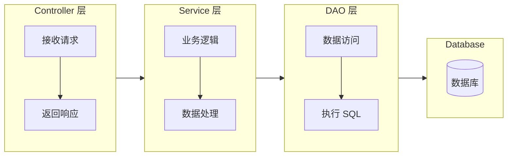

# 星络ERP服务端
基于 SpringBoot + MyBatis 打造

# 📦 erp-api 模块介绍

**erp-api** 是整个 ERP 系统的**后端核心服务模块**，基于 **Spring Boot + MyBatis** 框架开发，提供 RESTful API 接口供前端（erp-web）和小程序（erp-app）调用。

---

## 🎯 核心启动类

**`Application.java`**
- 整个 Spring Boot 应用的入口类
- 使用 `@SpringBootApplication` 扫描 `net.xingluo` 包下的所有组件
- 配置了 MyBatis 的 Mapper 扫描路径和事务管理
- 提供了 BCrypt 密码编码器用于用户密码加密

---

## 📁 主要功能包结构

项目采用**模块化分包设计**，按照业务功能划分为以下几个主要模块：

### 1. bc 包 - 基础数据管理模块 (Basic Data)
负责管理企业的基础数据信息
- **controller/**: 3 个控制器，处理 HTTP 请求
- **service/**: 4 个服务类，业务逻辑处理
- **dao/**: 3 个数据访问对象，数据库操作
- **model/**: 3 个实体模型，对应数据库表
- **command/**: 20 个命令对象，用于封装业务操作参数

### 2. fc 包 - 资金管理模块 (Financial Control)
负责财务相关的核心业务
- **controller/**: 4 个控制器
- **service/**: 11 个服务类
- **dao/**: 10 个数据访问对象
- **model/**: 10 个实体模型
- **command/**: 20 个命令对象

### 3. rc 包 - 收款管理模块 (Receivable Control)
负责应收账款和客户收款管理
- **controller/**: 5 个控制器
- **service/**: 8 个服务类
- **dao/**: 6 个数据访问对象
- **model/**: 6 个实体模型
- **bean/**: 1 个 JavaBean
- **command/**: 13 个命令对象

### 4. sc 包 - 报表管理模块 (Sales Control)
负责销售订单和销售业务管理
- **controller/**: 1 个控制器
- **model/**: 2 个实体模型
- **command/**: 15 个命令对象

### 5. uc 包 - 用户中心模块 (User Center)
负责用户管理、权限控制等核心功能
- **controller/**: 7 个控制器（最多，说明用户相关功能复杂）
- **service/**: 11 个服务类
- **dao/**: 9 个数据访问对象
- **model/**: 9 个实体模型
- **command/**: 39 个命令对象（数量最多，业务操作最复杂）

### 6. wc 包 - 仓库管理模块 (Warehouse Control)
负责库存管理和仓库操作
- **controller/**: 3 个控制器
- **service/**: 8 个服务类
- **dao/**: 7 个数据访问对象
- **model/**: 7 个实体模型
- **command/**: 16 个命令对象

---

## ⚙️ 配置类 (config 包)

- **`InterceptorConfig.java`** - 拦截器配置
- **`MybatisPlusConfig.java`** - MyBatis-Plus 框架配置
- **`WebSecurityConfig.java`** - Spring Security 安全配置

---

## 🔐 拦截器 (interceptor 包)

- **`CorsFilter.java`** - 跨域请求过滤器
- **`CurrentUser.java`** - 当前登录用户注解
- **`LoginInterceptor.java`** - 登录状态拦截器，验证用户是否已登录

---

## 🔧 常量类 (constant 包)

- **`Const.java`** - 通用常量定义
- **`Define.java`** - 系统配置和参数定义（5.8KB，内容最丰富）
- **`KeyValueCode.java`** - 键值对编码常量

---

## 🛠️ 工具类 (util 包)

- **`JwtUtil.java`** - JWT 令牌生成和解析工具
- **`SimpleValidator.java`** - 简单数据验证器

---

## 📄 配置文件 (resources 目录)

- **`application.yml`** - 主配置文件
    - 服务器端口：9090
    - 数据库连接池：Druid
    - MyBatis 配置：映射文件路径、实体类包扫描

- **`application-dev.yml`** - 开发环境配置
- **`application-prod.yml`** - 生产环境配置
- **`lombok.config`** - Lombok 插件配置

---

## 🗂️ Mapper 映射文件 (mapper 目录)

共 **15 个 XML 文件**，定义了 SQL 映射规则：

| 文件名 | 功能说明 |
|--------|---------|
| CheckoutMapper.xml | 结算单 |
| CollectionMapper.xml | 收款单 |
| CustomerMapper.xml | 客户管理 |
| ExpenseMapper.xml | 费用支出 |
| IncomeMapper.xml | 收入管理 |
| IssueProductMapper.xml | 产品出库（10.5KB，最复杂） |
| OrderMapper.xml | 订单管理 |
| PaymentMapper.xml | 付款单 |
| PurchaseMapper.xml | 采购管理 |
| SaleMapper.xml | 销售管理 |
| StockRecordMapper.xml | 库存记录 |
| StoreMapper.xml | 仓库管理 |
| SupplierMapper.xml | 供应商管理 |
| TransferMapper.xml | 调拨管理 |
| UserMapper.xml | 用户管理 |

---

## 📊 Maven 配置 (pom.xml)

### 核心依赖
- **Spring Boot Security** - 安全认证
- **MyBatis** - ORM 框架
- **Lombok** - 简化代码
- **JWT (jjwt)** - 令牌认证
- **JAXB** - XML 解析支持

### 构建插件
- **Spring Boot Maven Plugin** - 打包可执行 JAR
- **Maven Resources Plugin** - 资源文件处理

### 多环境 Profile
- `dev` - 开发环境（默认激活）
- `test` - 测试环境
- `prod` - 生产环境

---

## 🏗️ 分层架构说明

每个业务模块都遵循标准的 **MVC 三层架构**：

**Command 对象**：用于封装复杂的业务操作参数，实现命令模式，便于事务管理和操作审计。

---

## 💡 总结

**erp-api** 是一个典型的企业级 ERP 后端系统，具备：

- ✅ **完整的业务模块**：采购、销售、库存、财务、用户管理
- ✅ **规范的分层设计**：Controller-Service-DAO 清晰分离
- ✅ **安全的认证机制**：JWT + Spring Security
- ✅ **灵活的配置管理**：多环境支持
- ✅ **高效的数据库操作**：MyBatis + MyBatis-Plus
- ✅ **完善的工具支撑**：Lombok、Druid 连接池等

它是整个 ERP 系统的**大脑和心脏**，为前端提供所有数据接口和业务逻辑处理能力。
